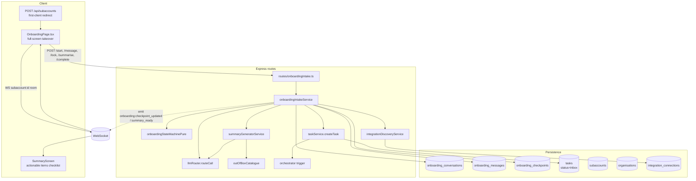

# Ingestive Onboarding Phase 1 — Architecture Plan (Revised)

> **Status:** Revised architect plan. Supersedes the original compiler/simulation-based design.
> **Classification:** Major (new subsystem: conversational intake, task creation, orchestrator integration, new page UX)
> **Scope lock:** First-client-added trigger only. Output = structured business context + actionable tasks routed via the orchestrator. No Playbook compiler. No simulation engine. Three checkpoints (business context / integrations / automation wishes). Summary screen at end (Option B). Soft-cap LLM budget. AUD minor units via `organisations.default_currency_code` (shared with Pulse).
> **Depends on:** Pulse currency migration (Pulse Chunk 1) — `organisations.default_currency_code`. If Pulse has not yet shipped, this plan's schema chunk must add that column itself.
> **Related specs:** `tasks/architect-plan-pulse.md`, `tasks/dev-spec-pulse.md`, `docs/orchestrator-capability-routing-spec.md`, `tasks/deferred-ai-first-features.md` (Section 1 — Onboarding).

---

## Key design decisions (locked)

| # | Decision | Rationale |
|---|----------|-----------|
| D1 | **No Playbook compiler.** Onboarding does not auto-generate Playbooks. | Not feasible in v1 to auto-build playbooks from conversation. The system configures what exists and captures what doesn't. |
| D2 | **No simulation engine.** No pre-commit preview of a compiled Playbook. | Simulation requires a compiled Playbook; removed with compiler. |
| D3 | **Output = tasks, not Playbooks.** Onboarding creates tasks via `taskService` routed to the orchestrator. | Leverages the existing orchestrator as the single routing brain. One pattern to get right. |
| D4 | **Summary screen at end (Option B).** Conversation runs uninterrupted; actionable items presented in a checklist at the end. | Keeps conversation focused on understanding the business. Mirrors a good human onboarding call: listen first, then propose. |
| D5 | **"Address now" vs "Save for later" per item.** Both create tasks. "Address now" also triggers the orchestrator immediately. "Save for later" creates an inbox task visible in Pulse. | User controls urgency. All items flow through the same pipeline. |
| D6 | **Soft-cap LLM budget.** Warn the user at a configurable threshold; let them continue. No hard block. | User asked for soft cap — warn about cost implications but don't prevent progress. |
| D7 | **Three checkpoints: business context → integrations → automation wishes.** | Captures structured context the system needs, discovers what's connected, and surfaces what the user wants automated. |
| D8 | **Orchestrator decides routing.** Onboarding doesn't know about agents, playbooks, or configuration — it just creates tasks. The orchestrator triages. | Single routing brain. Onboarding stays simple. |
| D9 | **Out-of-box items identified by the LLM.** The LLM matches conversation context against a catalogue of pre-built playbooks/capabilities and surfaces them as actionable items in the summary. | The system ships with known capabilities (weekly report, digest, etc.). The LLM identifies which ones apply. |
| D10 | **Saved items appear in Pulse.** No separate backlog UI. Tasks with `status: 'inbox'` appear in Pulse's Internal lane. | Pulse is already the place for "things that need your attention." |

---

## Architecture diagram



---

## Table of contents

1. [Data model](#1-data-model)
2. [Conversation state machine](#2-conversation-state-machine)
3. [LLM integration](#3-llm-integration)
4. [Checkpoint-to-state mapping](#4-checkpoint-to-state-mapping)
5. [Summary screen](#5-summary-screen)
6. [Task creation and orchestrator integration](#6-task-creation-and-orchestrator-integration)
7. [Soft-cap LLM budget](#7-soft-cap-llm-budget)
8. [Trigger and entry UX](#8-trigger-and-entry-ux)
9. [Permissions](#9-permissions)
10. [Real-time updates](#10-real-time-updates)
11. [Integration reads for context](#11-integration-reads-for-context)
12. [Rollback / abandon](#12-rollback--abandon)
13. [Key risks and open questions](#13-key-risks-and-open-questions)
14. [Follow-up questions for the dev spec](#14-follow-up-questions-for-the-dev-spec)
15. [Stepwise implementation plan](#15-stepwise-implementation-plan)

---

## 1. Data model

### 1.1 What's reused

- `subaccounts` — the newly-created first client.
- `organisations` — for `default_currency_code` (shared with Pulse).
- `integration_connections` — read-only source for pipeline/field discovery.
- `tasks` — the canonical output. Onboarding creates tasks with `status: 'inbox'` that appear in Pulse and trigger the orchestrator. Existing schema: `server/db/schema/tasks.ts`.
- `subaccount_onboarding_state` — unchanged. Ingestive Onboarding does **not** write to this table directly; it exists for the module-driven onboarding playbooks and is orthogonal to the conversational intake flow.
- `llm_requests` — all LLM traffic goes through `llmRouter.routeCall`, already persisted with full attribution.
- `agent_triggers` — existing `task_created` event type triggers the orchestrator when onboarding creates tasks.

### 1.2 New tables

Three new tables under `server/db/schema/onboarding/`. All are soft-delete-free and org-scoped on every row.

**`onboarding_conversations`** — one row per intake session. One session per subaccount in v1.

| Column | Type | Notes |
|---|---|---|
| `id` | uuid PK | |
| `organisation_id` | uuid NOT NULL | FK `organisations.id`; filtered on every query. |
| `subaccount_id` | uuid NOT NULL UNIQUE | FK `subaccounts.id`. Unique ensures one session per subaccount. |
| `started_by_user_id` | uuid NOT NULL | FK `users.id`. |
| `status` | text NOT NULL | `'in_progress' \| 'summarising' \| 'reviewing_summary' \| 'completed' \| 'abandoned'`. CHECK constraint. |
| `current_checkpoint` | text NOT NULL DEFAULT `'business_context'` | `'business_context' \| 'integrations' \| 'automation_wishes' \| 'done'`. CHECK. |
| `currency_code` | text NOT NULL | Snapshotted from org at session start; ISO 4217. |
| `summary_json` | jsonb NULL | Generated summary of actionable items. Populated when status transitions to `reviewing_summary`. |
| `llm_cost_minor` | integer NOT NULL DEFAULT 0 | Running total of LLM spend for this conversation in org currency minor units. |
| `budget_warning_shown` | boolean NOT NULL DEFAULT false | True once the soft-cap warning has been displayed to the user. |
| `resumed_count` | integer NOT NULL DEFAULT 0 | Incremented each time user resumes after a gap of > 30 min. |
| `abandoned_reason` | text NULL | `'user_cancelled' \| 'timeout'`. |
| `created_at`, `updated_at` | timestamptz NOT NULL DEFAULT now() | |

Indexes: `(organisation_id, status)`, unique `(subaccount_id)`.

**`onboarding_messages`** — append-only LLM-turn transcript. Used to rebuild conversation context on reload.

| Column | Type | Notes |
|---|---|---|
| `id` | uuid PK | |
| `conversation_id` | uuid NOT NULL | FK cascade-delete on conversation. |
| `organisation_id` | uuid NOT NULL | Denormalised for org scoping. |
| `sequence_number` | integer NOT NULL | Per-conversation monotonic (unique on `(conversation_id, sequence_number)`). |
| `role` | text NOT NULL | `'user' \| 'assistant' \| 'tool'`. |
| `content` | text NOT NULL | Plain text for user/assistant; JSON string for tool turns. |
| `tool_calls` | jsonb NULL | For assistant turns that emit tool calls (checkpoint patches, questions). |
| `llm_request_id` | uuid NULL | FK `llm_requests.id` when role='assistant'. |
| `checkpoint_at_turn` | text NOT NULL | Checkpoint the user was in when this turn landed. |
| `created_at` | timestamptz NOT NULL DEFAULT now() | |

Indexes: `(conversation_id, sequence_number)` unique; `(organisation_id, created_at DESC)`.

**`onboarding_checkpoints`** — the structured output of each checkpoint. One row per `(conversation_id, checkpoint_name)`. Upserted as the conversation fills in fields.

| Column | Type | Notes |
|---|---|---|
| `id` | uuid PK | |
| `conversation_id` | uuid NOT NULL | |
| `organisation_id` | uuid NOT NULL | |
| `checkpoint_name` | text NOT NULL | `'business_context' \| 'integrations' \| 'automation_wishes'`. CHECK. |
| `state_json` | jsonb NOT NULL DEFAULT `{}` | Structured payload; shape enforced by Zod at service boundary (see §4). |
| `locked_at` | timestamptz NULL | Set when user confirms the checkpoint. Once locked, conversation moves to the next. |
| `locked_by_user_id` | uuid NULL | FK `users.id`. |
| `created_at`, `updated_at` | timestamptz NOT NULL DEFAULT now() | |

Unique index `(conversation_id, checkpoint_name)`. Index `(organisation_id, conversation_id)`.

### 1.3 Removed tables (vs original plan)

- **`onboarding_simulations`** — removed. No simulation engine in the revised scope.

### 1.4 Currency column dependency

Onboarding reads `organisations.default_currency_code` (added by Pulse Chunk 1). The dev spec must check migration ordering:

- If Pulse Chunk 1 has shipped before Onboarding lands: no schema change needed on `organisations`.
- If Onboarding lands first: Onboarding's migration adds `organisations.default_currency_code text NOT NULL DEFAULT 'AUD'` with the same CHECK.

### 1.5 Migration summary

One forward-only migration (next free sequence number: **0160**; 0156–0159 are taken by the orchestrator capability-aware routing build). Creates all three new tables with indexes + CHECK constraints. If `organisations.default_currency_code` is absent, adds it with `DEFAULT 'AUD'`. No data backfill required.

---

## 2. Conversation state machine

### 2.1 States and transitions

Persisted in `onboarding_conversations.status` + `onboarding_conversations.current_checkpoint`. The state machine is a pure function in `server/services/onboarding/onboardingStateMachinePure.ts`.

```
                  user adds first client
                           │
                           ▼
                  ┌──────────────────────────┐
                  │ in_progress              │
                  │ checkpoint=business_ctx  │ ◀──── turn messages (no transition)
                  └──────────────────────────┘
                           │ business_context locked
                           ▼
                  ┌──────────────────────────┐
                  │ in_progress              │
                  │ checkpoint=integrations  │
                  └──────────────────────────┘
                           │ integrations locked
                           ▼
                  ┌──────────────────────────────────┐
                  │ in_progress                      │
                  │ checkpoint=automation_wishes     │
                  └──────────────────────────────────┘
                           │ automation_wishes locked
                           ▼
                  ┌──────────────────┐
                  │ summarising      │ (LLM generates summary of actionable items)
                  └──────────────────┘
                           │ summary generated
                           ▼
                  ┌──────────────────────┐
                  │ reviewing_summary    │ (user sees checklist, acts on each item)
                  └──────────────────────┘
                           │ all items actioned
                           ▼
                  ┌────────────┐
                  │ completed  │
                  └────────────┘

         (from any non-terminal state)
                  │ abandon
                  ▼
            ┌────────────┐
            │ abandoned  │
            │ reason=... │
            └────────────┘
```

**Transition events:**

| Event | From | To | Notes |
|---|---|---|---|
| `start` | (new) | `in_progress` / `business_context` | Called during first-client redirect. |
| `messageTurn` | `in_progress` / any | same state | LLM turn; may emit checkpoint patches. |
| `lockCheckpoint` | `in_progress` / `business_context` | `in_progress` / `integrations` | Requires complete Zod-valid state. |
| `lockCheckpoint` | `in_progress` / `integrations` | `in_progress` / `automation_wishes` | |
| `lockCheckpoint` | `in_progress` / `automation_wishes` | `summarising` | Triggers summary generation. |
| `summaryGenerated` | `summarising` | `reviewing_summary` | Summary JSON written to conversation row. |
| `complete` | `reviewing_summary` | `completed` | All items actioned (addressed or saved). |
| `abandon` | any non-terminal | `abandoned` | `reason=user_cancelled`. |

Terminal states: `completed`, `abandoned`.

### 2.2 What's persisted vs LLM-held

- **Persisted:** every user and assistant turn in `onboarding_messages`; every checkpoint patch in `onboarding_checkpoints.state_json`; current checkpoint + status in the conversation row.
- **LLM-held only:** nothing. On every turn, `onboardingIntakeService.processMessage()` rebuilds the full conversation context from persisted state (system prompt + checkpoint state snapshot + last N messages).

On tab close, nothing is lost. Reload re-hydrates identically from the DB.

### 2.3 Interruption and resumption

On reload of `/admin/subaccounts/:id/onboard`, the client calls `GET /api/subaccounts/:id/onboarding/intake`. The service:

1. Looks up the conversation by subaccount ID.
2. If `status ∈ {completed, abandoned}` → redirect to `/admin/subaccounts/:id`.
3. If `status = reviewing_summary` → render the summary screen with the persisted `summary_json`.
4. Otherwise return `{conversation, messages, checkpoints}` and the client resumes at the checkpoint indicated by `current_checkpoint`.

If `updated_at` is more than 30 minutes old, `resumed_count++` and the first assistant turn after resume includes a "where we left off" summary.

---

## 3. LLM integration

### 3.1 Provider posture — model-agnostic

Every LLM call routes through `server/services/llmRouter.ts` → `routeCall()`. Onboarding does **not** name a provider or model. It declares a `taskType`, an `executionPhase`, and a `routingMode = 'ceiling'`; `llmResolver` picks the model.

LLMCallContext fields used:
- `sourceType`: `'onboarding'` (new; must be added to `SOURCE_TYPES` in `server/db/schema/llmRequests.ts` — currently `['agent_run', 'process_execution', 'system', 'iee']`).
- `taskType`: `'intake_conversation'` for chat turns; `'intake_checkpoint_lock'` for the structured-extraction turn; `'intake_summary'` for summary generation and "where we left off." (All three are new values; must be added to `TASK_TYPES` in `server/db/schema/llmRequests.ts`.)
- `executionPhase`: `'planning'` for turn generation; `'post'` for summary generation.
- `organisationId`, `subaccountId`, `userId` — populated from request context.

### 3.2 Prompt composition

The system prompt is assembled from four blocks at the start of every turn:

1. **Role block** — stable description of the onboarding agent's role, the refusal list, and the out-of-box catalogue (see §5.1).
2. **Checkpoint schema block** — the Zod schema for the *current* checkpoint's `state_json`, serialised as TypeScript-interface text. Regenerated per turn based on `current_checkpoint`.
3. **Discovered integration metadata** — output of `integrationDiscoveryService` (see §11): list of connected integrations and their metadata. Bounded to ~2 KB.
4. **Conversation so far** — `{role, content}[]` from `onboarding_messages`, last N turns (N=20 in v1; configurable).

The system prompt uses `{ stablePrefix, dynamicSuffix }` so the router can cache the stable portion.

### 3.3 Tool-calling contract

The assistant interacts through three tools:

1. **`applyCheckpointPatch`** — `{field: string, value: unknown}`. Adds/updates a field on `onboarding_checkpoints.state_json`. Service validates with the partial schema; on validation error, the tool result returned to the LLM is `{ok: false, error}`.
2. **`askClarifyingQuestion`** — `{question: string, suggestedAnswers?: string[]}`. Emitted when the LLM needs disambiguation. UI renders question + optional chips.
3. **`proposeLockCheckpoint`** — `{summary: string}`. Emits a "here's what I have — confirm to lock" preview. Service validates the current checkpoint's state is complete; if yes, the UI shows a Lock button; if not, returns `{ok: false, missingFields}` to the LLM.

No other tools. The LLM cannot mutate anything else during intake — intake is a state-gathering phase.

### 3.4 Parsing and error handling

`routeCall` returns a `ProviderResponse`. The service:

1. Inserts the assistant turn into `onboarding_messages` with `llm_request_id` populated.
2. If the response contains tool calls, dispatches each through `onboardingToolHandlers.ts`.
3. If the tool call fails schema validation, persists the tool result as a `role='tool'` message and re-invokes `routeCall` (bounded to 2 retry turns).
4. If `routeCall` itself throws (provider outage), surfaces a user-facing error and leaves the conversation in place for retry.
5. After each successful turn, increments `llm_cost_minor` on the conversation row with the cost from `llm_requests`.

### 3.5 Safety rails

- **Refusal list in system prompt:** off-topic, promising outcomes, bypassing approval gates, pretending to be another AI.
- **Hard token budget per turn** — `maxTokens` set to 1024 for turn generation.
- **Soft-cap per-session LLM budget** — see §7.
- **No user-provided system prompt injection.** User messages are user turns only; the Role block is stable and not user-controllable.

---

## 4. Checkpoint-to-state mapping

All three checkpoint schemas live in `server/services/onboarding/checkpointSchemas.ts` (Zod, exported as both types and validators).

### 4.1 Checkpoint 1 — Business context

Captures **who the client is**, **what they do**, **what market they're in**, and **what outcomes they care about**. This is the context the orchestrator and downstream agents need to make smart routing decisions.

```ts
export const BusinessContextCheckpointSchema = z.object({
  clientName: z.string().min(1).max(200),
  industry: z.string().min(1).max(100),
  businessDescription: z.string().min(10).max(500),
  targetMarket: z.string().min(5).max(300),
  primaryGoals: z.array(z.string().min(5).max(200)).min(1).max(5),
  currentPainPoints: z.array(z.string().min(5).max(200)).max(5),
  teamSize: z.enum(['solo', 'small_team', 'medium_team', 'large_team', 'unknown']).default('unknown'),
  existingTools: z.array(z.string().max(100)).max(10),
});
```

### 4.2 Checkpoint 2 — Integrations

Captures **what's connected** and **what data is available**. Pre-populated by `integrationDiscoveryService` (§11); the LLM confirms / narrows rather than inventing.

```ts
export const IntegrationsCheckpointSchema = z.object({
  connectedIntegrations: z.array(z.object({
    connectionId: z.string().uuid(),
    providerType: z.enum(['ghl', 'gmail', 'slack', 'hubspot', 'custom', 'calendar']),
    displayName: z.string(),
    status: z.enum(['connected', 'unavailable', 'not_connected']),
    selectedResources: z.array(z.object({
      kind: z.enum(['pipeline', 'pipeline_stage', 'label', 'calendar', 'custom_field', 'form']),
      externalId: z.string(),
      displayName: z.string(),
    })).max(20),
  })).max(10),
  manualDataSources: z.array(z.object({
    description: z.string().min(5).max(200),
    type: z.enum(['spreadsheet', 'email', 'manual_entry', 'other']),
  })).max(5),
  dataReadiness: z.enum(['ready', 'needs_cleanup', 'minimal', 'none']).default('ready'),
});
```

### 4.3 Checkpoint 3 — Automation wishes

Captures the user's **top automation requests** as structured free text. These become the actionable items in the summary screen.

```ts
export const AutomationWishesCheckpointSchema = z.object({
  wishes: z.array(z.object({
    title: z.string().min(5).max(200),
    description: z.string().min(10).max(500),
    priority: z.enum(['high', 'medium', 'low']).default('medium'),
    category: z.enum([
      'lead_management',
      'client_communication',
      'reporting',
      'scheduling',
      'data_entry',
      'monitoring',
      'other',
    ]).default('other'),
  })).min(1).max(5),
  urgency: z.enum(['asap', 'this_week', 'this_month', 'exploring']).default('exploring'),
});
```

### 4.4 Validation behaviour

Each checkpoint schema is applied in two modes:

- **Partial** — on every `applyCheckpointPatch` tool call. Only the touched field is validated; missing fields are acceptable.
- **Complete** — on `proposeLockCheckpoint` / `lockCheckpoint`. Full schema enforced; failure returns `{missingFields: string[]}` to the LLM.

---

## 5. Summary screen

### 5.1 Out-of-box catalogue

A static catalogue in `server/config/outOfBoxCatalogue.ts` enumerates capabilities the system can deliver without building new playbooks. Each entry has:

```ts
export interface OutOfBoxItem {
  slug: string;                    // e.g. 'weekly-intelligence-report'
  displayName: string;             // "Weekly Intelligence Report"
  description: string;             // User-facing one-liner
  category: string;                // 'reporting' | 'communication' | 'monitoring' | ...
  requiredIntegrations: string[];  // e.g. ['ghl'] — empty = no integration needed
  matchHints: string[];            // Keywords the LLM uses to match against conversation context
}
```

v1 ships with a small set (5–10 items): weekly intelligence report, end-of-week digest, lead follow-up reminders, pipeline health monitoring, etc. The exact catalogue is a dev spec decision.

### 5.2 Summary generation

When the user locks the final checkpoint (automation wishes), the conversation transitions to `summarising`. The service calls `summaryGeneratorService.generate()`:

1. **Reads** all three locked checkpoint states.
2. **Matches** the business context and automation wishes against the out-of-box catalogue. For each catalogue item where the required integrations are connected and the `matchHints` overlap with the conversation context, it's flagged as an "out-of-box" item.
3. **Calls the LLM** with a `taskType: 'intake_summary'` to produce a structured summary JSON. The LLM receives:
   - The three checkpoint states
   - The matched out-of-box items
   - The raw automation wishes
   - Instructions to produce a JSON array of actionable items
4. **Validates** the LLM output against a summary schema and persists to `onboarding_conversations.summary_json`.

The summary JSON shape:

```ts
export const SummarySchema = z.object({
  items: z.array(z.object({
    id: z.string().uuid(),                     // Generated; used as key in the UI
    title: z.string().min(1).max(200),
    description: z.string().min(1).max(500),
    source: z.enum(['out_of_box', 'automation_wish']),
    outOfBoxSlug: z.string().nullable(),       // Non-null when source = 'out_of_box'
    wishIndex: z.number().int().nullable(),    // Non-null when source = 'automation_wish'; index into the wishes array
    suggestedPriority: z.enum(['high', 'normal', 'low']),
    feasibility: z.enum(['ready', 'needs_setup', 'needs_support']),
    feasibilityNote: z.string().max(200).nullable(),
  })),
  greeting: z.string().max(300),              // "Here's what I've identified for [client name]..."
});
```

`feasibility` is the LLM's assessment:
- `ready` — can be configured with existing capabilities (out-of-box item matched, integrations connected)
- `needs_setup` — partially matchable but requires integration connection or configuration
- `needs_support` — custom automation that the system can't self-serve yet

### 5.3 Summary screen UX

The summary screen replaces the conversation pane when status = `reviewing_summary`. It shows:

1. **Greeting** — the `greeting` field from the summary.
2. **Actionable items list** — each item rendered as a card with:
   - Title and description
   - Feasibility badge (green "Ready" / yellow "Needs setup" / grey "Needs support")
   - Two buttons: **"Address now"** and **"Save for later"**
3. **Progress tracker** — shows how many items have been actioned vs total.
4. **Complete button** — enabled when all items have been actioned. Transitions to `completed` and redirects to Pulse.

The user must action every item (either "Address now" or "Save for later") before completing. This ensures nothing is silently dropped.

### 5.4 What "Address now" does

1. Creates a task via `taskService.createTask()` with:
   - `title`: the item's title
   - `description`: the item's description + feasibility note + onboarding context reference
   - `status: 'inbox'`
   - `priority`: mapped from `suggestedPriority`
   - `subaccountId`: the onboarding subaccount
   - `organisationId`: from the conversation
   - Metadata in `handoffContext`: `{ source: 'onboarding', conversationId, itemId, outOfBoxSlug?, feasibility }`
2. **Triggers the orchestrator** — creating a task with `status: 'inbox'` fires any `task_created` agent triggers. If the orchestrator has a trigger configured for `task_created`, it wakes up and routes the task.
3. The UI marks the item as "Addressing..." with a spinner, then "Queued" once the task is confirmed created.

### 5.5 What "Save for later" does

1. Creates a task via `taskService.createTask()` with the same shape as "Address now" but:
   - `priority: 'normal'` (regardless of suggested priority — the user chose to defer)
   - Same `handoffContext` metadata
2. **Does not explicitly trigger the orchestrator** — the task sits in Pulse's Internal lane as an inbox item. The user or the orchestrator's next scheduled run can pick it up.
3. The UI marks the item as "Saved" with a checkmark.

---

## 6. Task creation and orchestrator integration

### 6.1 Task shape

All tasks created by onboarding follow a consistent shape:

```ts
const task = await taskService.createTask({
  organisationId,
  subaccountId,
  title: item.title,
  description: buildTaskDescription(item, checkpoints),
  status: 'inbox',
  priority: item.source === 'out_of_box' ? 'normal' : mapPriority(item.suggestedPriority),
  handoffContext: {
    source: 'onboarding',
    conversationId: conversation.id,
    itemId: item.id,
    outOfBoxSlug: item.outOfBoxSlug,
    feasibility: item.feasibility,
    businessContext: checkpoints.business_context.state_json,
  },
});
```

The `handoffContext` gives the orchestrator everything it needs to make routing decisions without reading the full conversation.

### 6.2 Orchestrator routing — how it works now

The orchestrator capability-aware routing system shipped in PR #143 (migrations 0156–0159). When `taskService.createTask()` is called, two things happen:

1. **`task_created` / `org_task_created` triggers fire** — existing agent trigger mechanism.
2. **`enqueueOrchestratorRoutingIfEligible()`** enqueues an async `orchestratorFromTaskJob` — this is the primary routing path.

The orchestrator-from-task job has an **eligibility predicate**:
- `status === 'inbox'` ✓ (onboarding sets this)
- `assignedAgentId === null` ✓ (onboarding leaves tasks unassigned)
- `!isSubTask` ✓ (onboarding tasks are top-level)
- `createdByAgentId === null` ✓ (onboarding is user-initiated, not agent-created)
- **`description.length >= 10`** — onboarding's `buildTaskDescription()` must produce descriptions ≥ 10 characters or the orchestrator won't route the task.

Once eligible, the orchestrator classifies the task using its `check_capability_gap` skill against capability maps, then routes via one of four deterministic paths (A/B/C/D). For onboarding-sourced tasks, the `handoffContext` metadata gives the orchestrator what it needs:

- **`feasibility: 'ready'` + `outOfBoxSlug` set** → route to the configuration agent, which knows how to activate and configure the named capability.
- **`feasibility: 'needs_setup'`** → route to the configuration agent with instructions to guide the user through prerequisite setup (e.g. connecting an integration).
- **`feasibility: 'needs_support'`** → flag for human review. The orchestrator may create a support ticket or escalate to an admin.

Onboarding itself does NOT implement this routing logic. The orchestrator owns it. Onboarding just creates well-structured tasks with enough context for the orchestrator to decide.

### 6.3 Why tasks, not a custom entity

- Tasks already appear in Pulse (Internal lane, `status: 'inbox'`).
- Tasks already trigger the orchestrator via `agent_triggers` (`eventType: 'task_created'`).
- Tasks already have `handoffContext` (jsonb) for structured metadata.
- Tasks already support subtask decomposition (`isSubTask`, `parentTaskId`) if the orchestrator needs to break work down.
- No new schema, no new service, no new trigger wiring.

---

## 7. Soft-cap LLM budget

### 7.1 Design

The LLM budget is a **soft cap** — it warns the user when they've exceeded a configurable threshold but does not prevent them from continuing.

- **Threshold:** configurable per org via `organisations.settings` jsonb (key: `onboarding_budget_minor`). Default: `1000` (AUD $10.00 in minor units).
- **Tracking:** `onboarding_conversations.llm_cost_minor` is incremented after every LLM turn with the cost from the `llm_requests` row.
- **Warning:** when `llm_cost_minor >= threshold` and `budget_warning_shown === false`:
  - The service sets `budget_warning_shown = true`.
  - The next response includes a `budgetWarning` field: `{ currentCostMinor, thresholdMinor, currencyCode, message }`.
  - The UI renders a yellow banner: *"This conversation has used $10.00 in AI costs. You can keep going, but each message will add to the total."*
  - A "Continue" button dismisses the banner. No action required — the user just continues chatting.
- **No hard block.** The conversation continues regardless. The warning is informational.
- **Post-warning:** the banner stays visible (but collapsed to a one-line cost ticker) for the rest of the conversation. Each turn updates the displayed total.

### 7.2 Config

`server/config/onboardingDefaults.ts`:

```ts
export const ONBOARDING_SESSION_BUDGET_MINOR = 1000;  // AUD $10.00
export const ONBOARDING_CONTEXT_TURN_CAP = 20;
export const ONBOARDING_RESUME_GAP_MINUTES = 30;
```

Per-org override reads from `organisations.settings.onboarding_budget_minor` (nullable jsonb path). If null, falls back to the default.

---

## 8. Trigger and entry UX

### 8.1 Entry trigger

`POST /api/subaccounts` already handles subaccount creation. Onboarding hooks in via a new service call at the end of the handler:

```ts
if (req.user?.id) {
  const isFirstClient = await onboardingIntakeService.shouldTriggerForNewSubaccount({
    organisationId, subaccountId: sa.id,
  });
  if (isFirstClient) {
    await onboardingIntakeService.startConversation({
      organisationId, subaccountId: sa.id, startedByUserId: req.user.id,
    });
  }
}
```

`shouldTriggerForNewSubaccount` returns true when the org has exactly one non-org-subaccount (the one just created). The check is a single `count(*)` query.

The route response includes a new field `redirectTo: string | null`. When the trigger fires, `redirectTo = '/admin/subaccounts/:id/onboard'`. The client honours the redirect.

### 8.2 Page shape

`client/src/pages/OnboardingPage.tsx` at `/admin/subaccounts/:subaccountId/onboard`. Full-screen takeover (no sidebar, minimal chrome, logo top-left, "Exit (you can resume later)" top-right).

Three-column layout on desktop, single-column on mobile:

- **Left rail** (25%) — checkpoint progress: Business context ✓ / Integrations (current) / Automation wishes / Summary.
- **Centre** (50%) — conversation transcript and input box.
- **Right rail** (25%) — "What I've captured so far" panel with the structured state of the current checkpoint. Editable inline — edits call the same `applyCheckpointPatch` path the LLM uses.

When status transitions to `reviewing_summary`, the centre pane is replaced by the summary screen (§5.3).

### 8.3 Abandon and resume

- **Exit button** — sets `status = 'abandoned'`, `abandoned_reason = 'user_cancelled'`, redirects to `/admin/subaccounts/:id`.
- **Close tab mid-flow** — nothing lost. On next load of `/admin/subaccounts/:id`, the client checks for an in-progress conversation and redirects back to `/onboard` with a "Welcome back" toast.

### 8.4 Post-completion landing

On completion (status → `completed`), the UI redirects to the subaccount's Pulse page (`/admin/subaccounts/:id/pulse`) with a toast: *"Onboarding complete. Your action items are in Pulse."* If Pulse isn't yet live, fallback is `/admin/subaccounts/:id`.

---

## 9. Permissions

No new permission keys required — onboarding reuses existing permissions.

| Action | Permission | Scope |
|---|---|---|
| Triggering onboarding (creating first subaccount) | `ORG_PERMISSIONS.SUBACCOUNTS_CREATE` | Org |
| Running the conversation (start / message / patch) | `ORG_PERMISSIONS.SUBACCOUNTS_WRITE` | Org |
| Completing onboarding (creating tasks) | `ORG_PERMISSIONS.TASKS_CREATE` | Org |
| Abandoning / resuming | `ORG_PERMISSIONS.SUBACCOUNTS_WRITE` | Org |

All onboarding routes take `:subaccountId` and call `resolveSubaccount(subaccountId, orgId)`. The subaccount must exist in the same org as the user. `system_admin` and `org_admin` bypass all permission checks per existing auth middleware.

---

## 10. Real-time updates

WebSocket updates use the existing `subaccount:<subaccountId>` room. No new room or channel.

Events emitted by `onboardingIntakeService`:

| Event | Trigger | Payload |
|---|---|---|
| `onboarding:checkpoint_updated` | After `applyCheckpointPatch` | `{conversationId, checkpointName, stateJson}` |
| `onboarding:checkpoint_locked` | After `lockCheckpoint` | `{conversationId, checkpointName, nextCheckpoint}` |
| `onboarding:message_appended` | After each LLM turn persisted | `{conversationId, message: {id, role, content, sequenceNumber}}` |
| `onboarding:summary_ready` | After summary generated | `{conversationId, summaryJson}` |
| `onboarding:budget_warning` | When soft cap exceeded | `{conversationId, currentCostMinor, thresholdMinor, currencyCode}` |

The client subscribes to `subaccount:<id>` on page mount (already wired via `useSocket`) and filters events by type.

---

## 11. Integration reads for context

`server/services/onboarding/integrationDiscoveryService.ts` (new) — read-only discovery of integration metadata. Fetched once per checkpoint-2 entry, cached on the checkpoint row until the user locks checkpoint 2.

**Note:** The recently-shipped `list_connections` skill and `integrationReferenceService.ts` (PR #143) provide a machine-readable integration catalogue and connection listing. The discovery service should reuse these where possible instead of building from scratch.

### 11.1 MVP integration set

| Provider | What we read | How |
|---|---|---|
| **GHL** (`provider_type = 'ghl'`) | Pipelines, pipeline stages, custom fields, forms | Reuses existing GHL client. Read-only endpoints with `locations.readonly`, `opportunities.readonly`, and `contacts.readonly` scopes. |
| **Gmail** (`provider_type = 'gmail'`) | Labels list, last 5 thread subjects | Gmail API `labels.list` and `threads.list?maxResults=5`. Read-only. |
| **Calendar** | Calendar names and timezones | Existing OAuth token scopes may need extension; falls back to synthesised shape if token doesn't cover. |

Slack and HubSpot are **out of the MVP discovery set**.

### 11.2 Failure modes

- Token revoked/expired → returns `{provider, status: 'unavailable', reason}`; LLM is told about the gap.
- Rate limit → retries with exponential backoff (max 2); on persistent failure, returns `throttled`.
- No integrations connected → LLM told "no integrations yet"; asks user to describe data sources manually. The checkpoint schema's `manualDataSources` field handles this.

### 11.3 Boundedness

Every discovery call: `maxItems: 20` per entity kind, `maxBytes: 2048` on serialised metadata, `timeout: 5s` per provider. Results cached on the checkpoint row for the life of checkpoint 2.

---

## 12. Rollback / abandon

### 12.1 Mid-flow abandonment

User clicks Exit or closes tab → service sets `status = 'abandoned'`, `abandoned_reason = 'user_cancelled'`, `updated_at = now()`. Messages and checkpoints are kept for analytics on completion rates.

### 12.2 Tasks created during "reviewing_summary"

If the user clicks "Address now" on some items, then abandons before completing all items:
- Tasks already created remain in the system (they're inbox tasks — the orchestrator or user can still action them).
- Remaining items are NOT automatically created as tasks. They're lost unless the user resumes.
- The conversation can be resumed if the user returns to `/admin/subaccounts/:id/onboard` (status is still `reviewing_summary`, not terminal).

Wait — `abandon` from `reviewing_summary` IS terminal. So if the user explicitly clicks Exit during the summary screen, partially-created tasks remain but unactioned items are dropped. This is acceptable: the user made a conscious choice to exit, and the items they didn't act on are captured in the conversation's `summary_json` for reference.

### 12.3 What we do not have

- No partial-resume of the summary screen. If abandoned, re-starting requires a new conversation (or the dev spec may allow re-entering the summary screen).
- No explicit "resume a previously abandoned conversation." Once abandoned, the user can create playbooks through the standard UI. The deferred-features doc captures "multi-turn refinement after first run" for Phase 2.

---

## 13. Key risks and open questions

### 13.1 Risks

| # | Risk | Mitigation |
|---|------|------------|
| R1 | **LLM latency compounds checkpoint friction.** Three checkpoints × multi-turn = many LLM calls. If p95 per turn > 5s, experience feels slow. | Aggressive use of `stablePrefix` prompt caching; keep tool calls structured; consider streaming (Phase 2). |
| R2 | **Out-of-box catalogue mismatch.** LLM matches items that don't actually exist as configurable capabilities yet. | Catalogue is static and explicit. LLM can only surface items from the catalogue. `matchHints` are conservative. |
| R3 | **Orchestrator routing gaps.** Orchestrator may not yet know how to handle every `handoffContext.source === 'onboarding'` task shape. | Dev spec must define the minimum orchestrator-side handling. At worst, tasks sit in Pulse for human action. |
| R4 | **Integration token revocation during a session.** User disconnects GHL mid-flow → discovery data becomes stale. | Discovery service re-validates at checkpoint lock time. If revoked, marks integration as `unavailable`. |
| R5 | **Pulse dependency for post-completion landing.** If Pulse hasn't shipped when Onboarding ships. | Fallback to subaccount detail page. |
| R6 | **Summary generation quality.** LLM may produce poor feasibility assessments or miss relevant out-of-box matches. | Summary schema validation catches structural issues. Feasibility is a hint, not a gate — orchestrator makes the real routing decision. |
| R7 | **Conversation token budget runaway.** Long conversations risk high LLM spend. | Soft cap warns the user. Rolling summary generation when turn count exceeds N=20 prunes older context. |

### 13.2 Open questions

1. **Conversation history cap (`N` turns in context)** — v1 default is 20 turns. Dev spec must confirm the exact value and whether to add rolling-summary generation when exceeded.
2. **Re-entry to onboarding if the first subaccount is deleted then a second is created** — is that still "first client"? Recommended: yes, based on `count(active non-org subaccounts) === 1`.
3. **Summary screen persistence across tab close** — if the user closes the tab during `reviewing_summary`, does the partially-actioned state persist? Recommended: yes, track which items have been actioned in `summary_json` (add an `actioned: boolean` field per item).
4. **Out-of-box catalogue v1 contents** — exact list of 5–10 items. Dev spec to define.
5. **LLM routing defaults** — which ceiling model does `intake_conversation` route to by default?
6. **Currency when `organisations.default_currency_code` is not yet populated** — default to `'AUD'` at migration time.
7. **What happens when the only integration is unsupported** (e.g. HubSpot only)? Recommended: graceful fallback with `manualDataSources` path.

---

## 14. Follow-up questions for the dev spec

1. **Migration ordering with Pulse.** Can we assume Pulse Chunk 1 lands first, or must Onboarding's migration ship `organisations.default_currency_code` defensively? Default: defensive add. Migration number is **0160** (0156–0159 taken by orchestrator).
2. **Rolling-summary generation.** When conversation exceeds N turns, do we generate a summary and prune? Default: yes, N=20, summary via a cheap model taskType `intake_summary`.
3. **Out-of-box catalogue v1.** Enumerate the exact items shipping in v1 with their `matchHints` and `requiredIntegrations`. This is a product decision, not an architecture one.
4. **Summary screen partial-action persistence.** Track which items are actioned across tab closes? Default: yes (add `actioned` field to summary items).
5. **Post-completion routing when Pulse isn't live.** Default: subaccount detail page.
6. **Named-user task assignment.** When creating tasks, should onboarding assign them to a specific user or leave them unassigned for the orchestrator? Default: unassigned (orchestrator-from-task job requires `assignedAgentId === null`).
7. **Test harness for the state machine.** Pure-file convention (`onboardingStateMachinePure.test.ts`). Dev spec confirms coverage matrix.
8. **WebSocket event shape.** The five events in §10 — confirm field naming. Default: five-event granular model as specified.
9. **SOURCE_TYPES + TASK_TYPES extensions.** `'onboarding'` sourceType and three new taskTypes must be added to `server/db/schema/llmRequests.ts`. Dev spec confirms whether this needs a migration or is text-only (no enum type in DB).
9. **Docs update posture.** `architecture.md` gets a new "Ingestive Onboarding" section. `docs/capabilities.md` gets an agency-capabilities entry (vendor-neutral per editorial rules).
10. **Orchestrator minimum handling.** What does the orchestrator's `task_created` handler need to do for onboarding-sourced tasks in v1? Dev spec must specify at least: read `handoffContext.source`, route by `feasibility`.

---

## 15. Stepwise implementation plan

Chunks ordered for minimum in-progress dependencies. Each chunk is independently mergeable and testable.

### Chunk 1 — Schema + config scaffolding

**Scope.** Migration creating three onboarding tables + currency column guard. Drizzle schema files. Config module for onboarding defaults.

**Files to create / modify.**
- `migrations/0160_ingestive_onboarding.sql`
- `server/db/schema/onboarding/onboardingConversations.ts`
- `server/db/schema/onboarding/onboardingMessages.ts`
- `server/db/schema/onboarding/onboardingCheckpoints.ts`
- `server/db/schema/organisations.ts` (edit: guard `defaultCurrencyCode` if not present)
- `server/db/schema/index.ts` (re-exports)
- `server/config/onboardingDefaults.ts` (new)

**Contracts.** Table schemas as §1.2. Config exports `ONBOARDING_SESSION_BUDGET_MINOR`, `ONBOARDING_CONTEXT_TURN_CAP`, `ONBOARDING_RESUME_GAP_MINUTES`.

**Dependencies.** None.

### Chunk 2 — Checkpoint schemas + state machine (pure)

**Scope.** Three Zod schemas. Pure state machine with full branch-coverage tests.

**Files.**
- `server/services/onboarding/checkpointSchemas.ts`
- `server/services/onboarding/onboardingStateMachinePure.ts`
- `server/services/onboarding/__tests__/onboardingStateMachinePure.test.ts`

**Contracts.** `applyEvent(state, event) → nextState | { error }` covering every transition in §2.1.

**Test considerations.** Every transition exercised; invalid transitions reject; partial vs complete schema validation.

**Dependencies.** None (pure).

### Chunk 3 — Integration discovery service

**Scope.** Read-only discovery for GHL, Gmail, Calendar. Bounded, cached, rate-limit-aware.

**Files.**
- `server/services/onboarding/integrationDiscoveryService.ts`
- `server/services/onboarding/__tests__/integrationDiscoveryServicePure.test.ts`

**Contracts.** `discoverForSubaccount(orgId, subaccountId) → DiscoveredMetadata`.

**Dependencies.** Chunk 1.

### Chunk 4 — Out-of-box catalogue + summary generator

**Scope.** Static catalogue. Summary generator service that matches conversation context against catalogue and calls LLM to produce summary JSON.

**Files.**
- `server/config/outOfBoxCatalogue.ts`
- `server/services/onboarding/summaryGeneratorService.ts`
- `server/services/onboarding/__tests__/summaryGeneratorPure.test.ts` (pure tests for matching logic)

**Contracts.** `generate(checkpoints, discoveredMetadata) → SummaryJson`.

**Dependencies.** Chunk 2 (checkpoint types), Chunk 3 (metadata types).

### Chunk 5 — onboardingIntakeService + routes

**Scope.** Full service + route surface. `start`, `message`, `lockCheckpoint`, `summarise`, `actionItem`, `complete`, `abandon`, `get` endpoints. LLM wiring through `routeCall`.

**Files.**
- `server/services/onboarding/onboardingIntakeService.ts`
- `server/services/onboarding/onboardingToolHandlers.ts`
- `server/routes/onboardingIntake.ts`
- `server/routes/index.ts` (mount)

**Route surface:**
- `POST /api/subaccounts/:id/onboarding/intake/start`
- `POST .../message`
- `POST .../checkpoint/:name/lock`
- `POST .../summarise`
- `POST .../item/:itemId/action` (body: `{ action: 'address_now' | 'save_for_later' }`)
- `POST .../complete`
- `POST .../abandon`
- `GET .../intake`

**Errors.** `422 checkpoint_incomplete`, `404`, `409 already_completed`. Standard `{statusCode, message, errorCode}` shape.

**Dependencies.** Chunks 1–4.

### Chunk 6 — Task creation integration

**Scope.** Wire `taskService.createTask()` calls from the `actionItem` endpoint. Build `handoffContext` shape. Verify orchestrator triggers fire.

**Files.**
- `server/services/onboarding/onboardingTaskCreator.ts` (thin wrapper)
- `server/services/onboarding/__tests__/onboardingTaskCreatorPure.test.ts`

**Dependencies.** Chunk 5.

### Chunk 7 — WebSocket emitters + sourceType additions

**Scope.** Add `'onboarding'` sourceType and new taskTypes; emit WS events; wire LLM router attribution.

**Files.**
- `server/db/schema/llmRequests.ts` (add enum values if applicable)
- `server/websocket/emitters.ts` (add emit helpers)
- `server/services/onboarding/onboardingIntakeService.ts` (wire emits)

**Dependencies.** Chunk 5.

### Chunk 8 — First-client trigger + routes/subaccounts wiring

**Scope.** `shouldTriggerForNewSubaccount` + first-client branch in `POST /api/subaccounts`; response `redirectTo` field.

**Files.**
- `server/routes/subaccounts.ts` (edit handler)
- `server/services/onboarding/onboardingIntakeService.ts` (add shouldTrigger)

**Dependencies.** Chunks 1, 5.

### Chunk 9 — OnboardingPage + summary screen

**Scope.** Full client surface. Route, lazy import, three-column layout, transcript, state panel, summary screen.

**Files.**
- `client/src/pages/OnboardingPage.tsx`
- `client/src/components/onboarding/ConversationPane.tsx`
- `client/src/components/onboarding/CheckpointStatePanel.tsx`
- `client/src/components/onboarding/SummaryScreen.tsx`
- `client/src/App.tsx` (route registration)
- `client/src/hooks/useOnboardingConversation.ts`

**UX notes.**
- Loading state on every turn (spinner on pending assistant turn).
- Empty state: "Let's get [client name] set up" + first assistant turn auto-arrives.
- Summary screen replaces conversation pane when status = `reviewing_summary`.
- Each item card shows feasibility badge and action buttons.
- Budget warning banner when soft cap exceeded.

**Dependencies.** Chunks 5, 7.

### Chunk 10 — Docs and capabilities registry

**Scope.** Update `architecture.md`, `docs/capabilities.md` (vendor-neutral per editorial rules), `CLAUDE.md` pointer.

**Dependencies.** Every prior chunk.

### Execution order

Chunks 1 → 2 → 3 ��� 4 → 5 → 6 → 7 → 8 → 9 → 10.

Chunks 2 and 3 can proceed in parallel after Chunk 1. Chunk 4 depends on both. Chunk 5 consolidates. Chunks 6–8 layer on top. Chunk 9 (client) depends on 5 and 7. Chunk 10 runs last.
