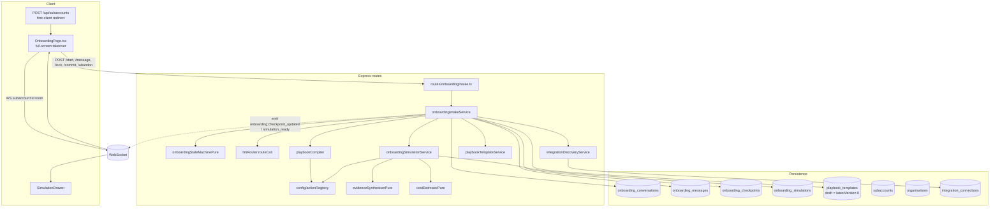

# Ingestive Onboarding Phase 1 — Architecture Plan

> **Status:** Draft v1 architect plan. Unblocks a detailed dev spec.
> **Classification:** Major (new subsystem: conversational intake, shared compiler, simulation engine, new page + drawer UX)
> **Scope lock:** First-client-added trigger only. Output = Playbook draft in existing engine (no intermediate Intent abstraction). First run = synthesised simulation. Three checkpoints (intent / data sources / approval rules). AUD minor units via `organisations.default_currency_code` (shared with Pulse). Shared compiler, with Onboarding-specific input type distinct from future Demo-to-DAG input.
> **Depends on:** Pulse currency migration (Pulse Chunk 1) — `organisations.default_currency_code`. If Pulse has not yet shipped, this plan's schema chunk must add that column itself; see §1.3.
> **Related specs:** `tasks/architect-plan-pulse.md`, `tasks/dev-spec-pulse.md`, `tasks/playbooks-spec.md`, `docs/onboarding-playbooks-spec.md`, `tasks/deferred-ai-first-features.md` (Section 1 — Onboarding).

---

## Executive summary

Ingestive Onboarding Phase 1 is a conversational intake flow that turns a natural-language conversation into a Playbook draft the moment an agency adds their first client. The user lands in a full-screen takeover from the redirect after `POST /api/subaccounts` creates the org's first non-org-subaccount. A three-checkpoint state machine — **Intent**, **Data sources**, **Approval rules** — persists structured state between turns and resumes cleanly if the user closes the tab. Once all three checkpoints are locked, a shared `playbookCompiler` converts the structured state into a validated `PlaybookDefinition`, stored as an org-scoped `playbook_templates` row with `latestVersion = 0` (a draft). A simulation run then executes the draft against synthesised evidence derived from the client's real integration metadata (GHL pipelines, Gmail labels, calendar metadata) and presents the result in a drawer. The user can publish (bumps to v1) or abandon. All LLM calls go through the existing `llmRouter`; the compiler is deterministic and the conversation is LLM-driven with a tool-calling contract that emits checkpoint patches. No new tier, no new permission model — org-level `PLAYBOOK_TEMPLATES_WRITE` gates the commit.

## Architecture diagram



---

## Table of contents

1. [Data model](#1-data-model)
2. [Conversation state machine](#2-conversation-state-machine)
3. [LLM integration](#3-llm-integration)
4. [Checkpoint-to-state mapping](#4-checkpoint-to-state-mapping)
5. [Compiler](#5-compiler)
6. [Simulation engine](#6-simulation-engine)
7. [Trigger and entry UX](#7-trigger-and-entry-ux)
8. [Permissions](#8-permissions)
9. [Real-time updates](#9-real-time-updates)
10. [Integration reads for context](#10-integration-reads-for-context)
11. [Rollback / abandon](#11-rollback--abandon)
12. [Key risks and open questions](#12-key-risks-and-open-questions)
13. [Compiler contract](#compiler-contract)
14. [Follow-up questions for the dev spec](#follow-up-questions-for-the-dev-spec)
15. [Stepwise implementation plan](#stepwise-implementation-plan)

---

## 1. Data model

### 1.1 What's reused

- `subaccounts` — the newly-created first client.
- `organisations` — for `default_currency_code` (shared with Pulse; see §1.3).
- `integration_connections` — read-only source for pipeline/field discovery.
- `playbook_templates` + `playbook_template_versions` — the canonical output. A Playbook draft is a `playbook_templates` row with `latestVersion = 0` and a companion `playbook_template_versions` row with `version = 0` holding the candidate `definitionJson`. Publishing bumps to `version = 1` via the existing `playbookTemplateService.publishOrgTemplate()` path — no new table.
- `subaccount_onboarding_state` — unchanged. Ingestive Onboarding does **not** write to this table directly; it exists for the module-driven onboarding playbooks (Phase F / §10.3) and is orthogonal to the conversational intake flow. Once the draft is published and run, the playbook engine's existing state-transition hook populates it normally.
- `llm_requests` — all LLM traffic goes through `llmRouter.routeCall`, already persisted with full attribution.

### 1.2 New tables

Four new tables under `server/db/schema/onboarding/`. All are soft-delete-free (pre-launch, fresh install) and org-scoped on every row.

**`onboarding_conversations`** — one row per intake session. One session per subaccount in v1 — a subaccount that has already completed intake cannot re-enter the flow (use Playbook Studio to iterate).

| Column | Type | Notes |
|---|---|---|
| `id` | uuid PK | |
| `organisation_id` | uuid NOT NULL | FK `organisations.id`; filtered on every query. |
| `subaccount_id` | uuid NOT NULL UNIQUE | FK `subaccounts.id`. Unique ensures one session per subaccount. |
| `started_by_user_id` | uuid NOT NULL | FK `users.id`. |
| `status` | text NOT NULL | `'in_progress' \| 'ready_to_simulate' \| 'simulating' \| 'simulated' \| 'committed' \| 'abandoned'`. CHECK constraint. |
| `current_checkpoint` | text NOT NULL DEFAULT `'intent'` | `'intent' \| 'data_sources' \| 'approval_rules' \| 'done'`. CHECK. |
| `draft_template_id` | uuid NULL | FK `playbook_templates.id`. Populated when compiler runs (checkpoint 3 locked). |
| `latest_simulation_id` | uuid NULL | FK `onboarding_simulations.id`. |
| `currency_code` | text NOT NULL | Snapshotted from org at session start; ISO 4217. |
| `resumed_count` | integer NOT NULL DEFAULT 0 | Incremented each time user resumes after a gap of > 30 min. |
| `abandoned_reason` | text NULL | `'user_cancelled' \| 'simulation_failed' \| 'timeout'`. |
| `created_at`, `updated_at` | timestamptz NOT NULL DEFAULT now() | |

Indexes: `(organisation_id, status)`, unique `(subaccount_id)`.

**`onboarding_messages`** — append-only LLM-turn transcript. Used to rebuild conversation context on reload.

| Column | Type | Notes |
|---|---|---|
| `id` | uuid PK | |
| `conversation_id` | uuid NOT NULL | FK cascade-delete on conversation. |
| `organisation_id` | uuid NOT NULL | Denormalised for org scoping. |
| `sequence_number` | integer NOT NULL | Per-conversation monotonic (unique on `(conversation_id, sequence_number)`). |
| `role` | text NOT NULL | `'user' \| 'assistant' \| 'tool'`. |
| `content` | text NOT NULL | Plain text for user/assistant; JSON string for tool turns. |
| `tool_calls` | jsonb NULL | For assistant turns that emit tool calls (checkpoint patches, questions). |
| `llm_request_id` | uuid NULL | FK `llm_requests.id` when role='assistant'. |
| `checkpoint_at_turn` | text NOT NULL | Checkpoint the user was in when this turn landed. |
| `created_at` | timestamptz NOT NULL DEFAULT now() | |

Indexes: `(conversation_id, sequence_number)` unique; `(organisation_id, created_at DESC)`.

**`onboarding_checkpoints`** — the structured output of each checkpoint. One row per `(conversation_id, checkpoint_name)`. Upserted as the conversation fills in fields.

| Column | Type | Notes |
|---|---|---|
| `id` | uuid PK | |
| `conversation_id` | uuid NOT NULL | |
| `organisation_id` | uuid NOT NULL | |
| `checkpoint_name` | text NOT NULL | `'intent' \| 'data_sources' \| 'approval_rules'`. CHECK. |
| `state_json` | jsonb NOT NULL DEFAULT `{}` | Structured payload; shape enforced by Zod at service boundary (see §4). |
| `locked_at` | timestamptz NULL | Set when user confirms the checkpoint. Once locked, conversation moves to the next. |
| `locked_by_user_id` | uuid NULL | FK `users.id`. |
| `created_at`, `updated_at` | timestamptz NOT NULL DEFAULT now() | |

Unique index `(conversation_id, checkpoint_name)`. Index `(organisation_id, conversation_id)`.

**`onboarding_simulations`** — one row per simulation run of a draft playbook.

| Column | Type | Notes |
|---|---|---|
| `id` | uuid PK | |
| `conversation_id` | uuid NOT NULL | |
| `organisation_id` | uuid NOT NULL | |
| `draft_template_id` | uuid NOT NULL | FK `playbook_templates.id`. |
| `draft_version_id` | uuid NOT NULL | FK `playbook_template_versions.id` (version 0). |
| `status` | text NOT NULL | `'queued' \| 'running' \| 'succeeded' \| 'failed'`. CHECK. |
| `evidence_seed_json` | jsonb NOT NULL | Snapshot of the integration metadata used to synthesise evidence. |
| `result_json` | jsonb NULL | Per-step: `{stepId, stepName, synthesisedInput, synthesisedOutput, estimatedCostMinor, wouldGate}`. |
| `total_estimated_cost_minor` | integer NULL | Sum over steps in the org's default currency minor units. |
| `currency_code` | text NOT NULL | Snapshot at simulation time. |
| `started_at`, `completed_at` | timestamptz NULL | |
| `error` | text NULL | If failed. |
| `created_at`, `updated_at` | timestamptz NOT NULL DEFAULT now() | |

Indexes: `(organisation_id, draft_template_id)`, `(conversation_id, created_at DESC)`.

### 1.3 Currency column dependency

Onboarding reads `organisations.default_currency_code` (added by Pulse Chunk 1). The dev spec must check migration ordering:

- If Pulse Chunk 1 has shipped before Onboarding lands: no schema change needed on `organisations`.
- If Onboarding lands first: Onboarding's migration adds `organisations.default_currency_code text NOT NULL DEFAULT 'AUD'` with the same CHECK defined in the Pulse plan §1.3a.

The plan assumes the second case may occur and the dev spec must decide coordination. No functional divergence — both paths result in the same column.

### 1.4 Migration summary

One forward-only migration (next free sequence number; currently `0129` is owned by Pulse, Onboarding claims the next available). Creates all four new tables with indexes + CHECK constraints. If `organisations.default_currency_code` is absent, adds it with `DEFAULT 'AUD'` and the ISO 4217 format CHECK. No data backfill required — no existing rows.

---

## 2. Conversation state machine

### 2.1 States and transitions

Persisted in `onboarding_conversations.status` + `onboarding_conversations.current_checkpoint`. The state machine is a pure function that maps `(currentState, event) → nextState`; implemented in `server/services/onboarding/onboardingStateMachinePure.ts` with full branch-coverage tests.

```
                  user adds first client
                           │
                           ▼
                  ┌──────────────────┐
                  │ in_progress      │
                  │ checkpoint=intent│ ◀──── turn messages (no transition)
                  └──────────────────┘
                           │ intent locked
                           ▼
                  ┌──────────────────────────┐
                  │ in_progress              │
                  │ checkpoint=data_sources  │
                  └──────────────────────────┘
                           │ data_sources locked
                           ▼
                  ┌──────────────────────────────┐
                  │ in_progress                  │
                  │ checkpoint=approval_rules    │
                  └──────────────────────────────┘
                           │ approval_rules locked
                           ▼
                  ┌──────────────────────┐
                  │ ready_to_simulate    │ (compiler runs; draft created)
                  └──────────────────────┘
                           │ simulation enqueued
                           ▼
                  ┌──────────────────┐
                  │ simulating       │
                  └──────────────────┘
            success │                 │ failure
                    ▼                 ▼
          ┌────────────────┐     ┌────────────────┐
          │ simulated      │     │ abandoned      │
          └────────────────┘     │ reason=        │
                    │            │ simulation_... │
         commit │   │ abandon    └────────────────┘
                ▼   ▼
  ┌────────────┐  ┌────────────┐
  │ committed  │  │ abandoned  │
  │            │  │ reason=    │
  │            │  │ user_...   │
  └────────────┘  └────────────┘
```

**Transition events** — all routed through `onboardingIntakeService`:

| Event | From | To | Notes |
|---|---|---|---|
| `start` | (new) | `in_progress` / `intent` | Called during first-client redirect. |
| `messageTurn` | `in_progress` / any | same state | LLM turn; may emit checkpoint patches. |
| `lockCheckpoint` | `in_progress` / `intent` | `in_progress` / `data_sources` | Requires complete Zod-valid state. |
| `lockCheckpoint` | `in_progress` / `data_sources` | `in_progress` / `approval_rules` | |
| `lockCheckpoint` | `in_progress` / `approval_rules` | `ready_to_simulate` | Triggers compiler. |
| `compileSucceeded` | `ready_to_simulate` | `simulating` | Enqueues simulation job. |
| `compileFailed` | `ready_to_simulate` | `in_progress` / `approval_rules` | Surfaces compiler errors to the LLM for repair. |
| `simulationCompleted` | `simulating` | `simulated` | |
| `simulationFailed` | `simulating` | `abandoned` | `reason=simulation_failed`; draft template stays for debugging. |
| `commit` | `simulated` | `committed` | Publishes draft (version 0 → version 1). |
| `abandon` | any non-terminal | `abandoned` | `reason=user_cancelled`. |

Terminal states: `committed`, `abandoned`. No transitions out — if the user wants to redo onboarding, the dev spec must decide whether to allow a new conversation row (v1 answer: no — Playbook Studio is the next iteration surface). See §12.

### 2.2 What's persisted vs LLM-held

- **Persisted:** every user and assistant turn in `onboarding_messages`; every checkpoint patch in `onboarding_checkpoints.state_json`; current checkpoint + status in the conversation row.
- **LLM-held only:** nothing. On every turn, `onboardingIntakeService.processMessage()` rebuilds the full conversation context from persisted state (system prompt + checkpoint state snapshot + last N messages). This is the Sprint-3A-crash-resume pattern reused.

Rationale: if the tab closes mid-turn, we lose nothing; reload re-hydrates identically. This costs some tokens on long conversations; the dev spec may decide to cap `N` (e.g. last 20 turns + rolling summary) — see §12.

### 2.3 Interruption and resumption

On reload of `/admin/subaccounts/:id/onboard`, the client calls `GET /api/subaccounts/:id/onboarding/intake`. The service:

1. Looks up the conversation by subaccount ID.
2. If `status ∈ {committed, abandoned}` → redirect to `/admin/subaccounts/:id`.
3. Otherwise return `{conversation, messages, checkpoints, simulation?}` and the client resumes at the checkpoint indicated by `current_checkpoint`.

If `updated_at` is more than 30 minutes old, `resumed_count++` and the first assistant turn after resume includes a one-line "where we left off" summary (generated from the locked checkpoint states, not raw transcript — cheaper and more stable).

### 2.4 Ambiguous input disambiguation

Ambiguity lives in two places and is handled differently:

- **Inside a checkpoint:** the LLM is instructed (via system prompt) to ask a single clarifying question when a field cannot be confidently extracted. The assistant turn emits a `clarifying_question` tool call (see §3.2) rather than attempting to guess. This is identical in shape to the existing `askClarifyingQuestion` tool pattern used elsewhere.
- **Between checkpoints:** when the user tries to lock a checkpoint with incomplete state, the service rejects with `{ statusCode: 422, errorCode: 'checkpoint_incomplete', details: { missingFields } }` and the assistant is given the gap as context for its next turn.

---

## 3. LLM integration

### 3.1 Provider posture — model-agnostic

Every LLM call routes through `server/services/llmRouter.ts` → `routeCall()`. Onboarding does **not** name a provider or model. It declares a `taskType`, an `executionPhase`, and a `routingMode = 'ceiling'`; `llmResolver` picks the model based on the org's routing config. This keeps the feature aligned with the project's model-agnostic posture (`CLAUDE.md` §editorial rule 5).

LLMCallContext fields used:
- `sourceType`: `'onboarding'` (new; must be added to `SOURCE_TYPES` in `server/db/schema/llmRequests.ts` — small, additive).
- `taskType`: `'intake_conversation'` (new enum value) for chat turns; `'intake_checkpoint_lock'` for the structured-extraction turn that emits the lock patch; `'intake_summary'` for the "where we left off" turn.
- `executionPhase`: `'planning'` for turn generation; `'post'` for summary generation.
- `organisationId`, `subaccountId`, `userId` — populated from request context.

The sourceType / taskType additions are declared in the migration and have seeded LLM routing defaults (so the `ceiling` model falls back correctly).

### 3.2 Prompt composition

The system prompt is assembled from four blocks at the start of every turn:

1. **Role block** — a stable 30–50 line description of the onboarding agent's role: "You are Synthetos's onboarding agent. You are running a three-checkpoint intake with a new agency user who just added their first client…" — includes the refusal list (no off-topic, no promising results, no replacing human judgement, no pretending to be another AI).
2. **Checkpoint schema block** — the Zod schema for the *current* checkpoint's `state_json`, serialised as TypeScript-interface text. LLM is told: "emit `applyCheckpointPatch({field, value})` tool calls to fill this shape." Regenerated per turn based on `current_checkpoint`.
3. **Discovered integration metadata** — output of `integrationDiscoveryService` (see §10): list of GHL pipelines, custom fields, Gmail labels, etc. that the user has connected. Bounded to ~2 KB; longer results are summarised.
4. **Conversation so far** — `{role, content}[]` from `onboarding_messages`, last N turns (N=20 in v1; configurable).

The system prompt is passed to `routeCall` as `{ stablePrefix, dynamicSuffix }` so the router can cache the stable portion — significant token savings on a chatty intake.

### 3.3 Tool-calling contract

The assistant interacts through three tools declared to `routeCall` via `ProviderTool[]`:

1. **`applyCheckpointPatch`** — `{field: string, value: unknown}`. Adds/updates a field on `onboarding_checkpoints.state_json`. Service validates with the partial schema; on validation error, the tool result returned to the LLM is `{ok: false, error}` and the conversation continues.
2. **`askClarifyingQuestion`** — `{question: string, suggestedAnswers?: string[]}`. Emitted when the LLM needs disambiguation. UI renders question + optional chips. No state change.
3. **`proposeLockCheckpoint`** — `{summary: string}`. Emits a "here's what I have — confirm to lock" preview. Service validates the current checkpoint's state is complete; if yes, the UI shows a Lock button; if not, returns `{ok: false, missingFields}` to the LLM.

No other tools. All tools are deterministic wrappers over the persisted checkpoint state — the LLM cannot mutate anything else (agents, playbooks, integrations) during intake. This is intentional: intake is a state-gathering phase, not an authoring phase.

### 3.4 Parsing and error handling

`routeCall` returns a `ProviderResponse`. The service:

1. Inserts the assistant turn into `onboarding_messages` with `llm_request_id` populated.
2. If the response contains tool calls, dispatches each through `onboardingToolHandlers.ts` — a pure dispatcher matching the three tools above.
3. If the tool call fails schema validation, persists the tool result as a `role='tool'` message and re-invokes `routeCall` (bounded to 2 retry turns).
4. If `routeCall` itself throws (budget / provider outage), surfaces a user-facing error in the UI and leaves the conversation in place for retry. No state transition.

### 3.5 Safety rails

- **Refusal list in system prompt:** off-topic, promising outcomes, bypassing approval gates, replacing human judgement.
- **Hard token budget per turn** — `maxTokens` set to 1024 for turn generation. Longer responses are an antipattern for intake.
- **Per-session LLM cost ceiling** — `maxCostPerRunCents` semantics already enforced by `routeCall` via the existing budget service; onboarding registers under a new attribution key so its spend is isolated.
- **No user-provided system prompt injection.** User messages are passed as user turns only; the Role block is stable and not user-controllable. This is the existing posture for every other LLM surface in the codebase.

---

## 4. Checkpoint-to-state mapping

All three checkpoint schemas live in `server/services/onboarding/checkpointSchemas.ts` (Zod, exported as both types and validators). The compiler (§5) consumes the *locked* set of all three.

### 4.1 Checkpoint 1 — Intent

Captures **what outcome** the client wants, **for whom**, and **how success is measured**.

```ts
export const IntentCheckpointSchema = z.object({
  outcomeDescription: z.string().min(20).max(500),       // "Book qualified discovery calls with inbound leads"
  successMetric: z.object({
    kind: z.enum(['count', 'conversion_rate', 'time_saved', 'other']),
    description: z.string().min(5).max(200),             // "5 discovery calls booked per week"
    targetValue: z.number().optional(),
    unit: z.string().max(40).optional(),
  }),
  targetAudience: z.object({
    description: z.string().min(5).max(300),             // "Inbound leads from website forms"
    sourceHint: z.enum(['ghl_pipeline', 'form_submissions', 'email_inbox', 'manual_list', 'other']),
  }),
  cadenceHint: z.enum(['continuous', 'daily', 'weekly', 'on_event', 'unclear']).default('unclear'),
});
```

### 4.2 Checkpoint 2 — Data sources and inputs

Captures **where the playbook reads from** and **what fields matter**. Pre-populated by `integrationDiscoveryService` (§10); the LLM confirms / narrows rather than inventing.

```ts
export const DataSourcesCheckpointSchema = z.object({
  integrations: z.array(z.object({
    connectionId: z.string().uuid(),           // integration_connections.id
    providerType: z.enum(['ghl', 'gmail', 'slack', 'hubspot', 'custom', 'calendar']),
    selectedResources: z.array(z.object({
      kind: z.enum(['pipeline', 'pipeline_stage', 'label', 'calendar', 'custom_field', 'form']),
      externalId: z.string(),
      displayName: z.string(),
    })),
  })).min(1).max(5),
  fieldMappings: z.array(z.object({
    role: z.enum(['trigger', 'input', 'output_target']),
    connectionId: z.string().uuid(),
    externalFieldId: z.string(),
    semanticName: z.string().min(1).max(80),   // "lead_email", "company_name"
  })).max(20),
  sampleDataScope: z.enum(['last_7_days', 'last_30_days', 'all_available', 'none']),
});
```

### 4.3 Checkpoint 3 — Approval and escalation rules

Captures **who approves what**, **cost ceilings**, **escalation**. All monetary values in minor units of the org's default currency (§1.3).

```ts
export const ApprovalRulesCheckpointSchema = z.object({
  defaultGateLevel: z.enum(['auto', 'review', 'block']),
  gateOverridesByActionKind: z.array(z.object({
    actionKind: z.enum(['external_send', 'external_write', 'internal_only']),
    gateLevel: z.enum(['auto', 'review', 'block']),
  })).max(5),
  approvers: z.array(z.object({
    role: z.enum(['org_admin', 'subaccount_member', 'named_user']),
    userId: z.string().uuid().optional(),     // required when role = 'named_user'
  })).min(1),
  costCeilings: z.object({
    perActionMinor: z.number().int().min(0).max(1_000_000).nullable(),
    perRunMinor: z.number().int().min(0).max(1_000_000).nullable(),
  }),
  escalation: z.object({
    strategy: z.enum(['email_first', 'in_app_only', 'email_and_in_app']),
    timeoutHours: z.number().int().min(1).max(72).default(24),
    onTimeout: z.enum(['auto_approve', 'auto_reject', 'hold']),
  }),
});
```

### 4.4 Validation behaviour

Each checkpoint schema is applied in two modes:

- **Partial** — on every `applyCheckpointPatch` tool call. Only the touched field is validated; missing fields are acceptable. Enables incremental building.
- **Complete** — on `proposeLockCheckpoint` / `lockCheckpoint`. Full schema enforced; failure returns `{missingFields: string[]}` to the LLM.

Schemas are versioned implicitly (v1 of the schema); if Phase 2 adds checkpoints or fields, Onboarding versions them via a `checkpointSchemaVersion` field on the conversation row (deferred).

---

## 5. Compiler

### 5.1 Location and responsibilities

`server/services/playbook/playbookCompiler.ts` (new) — the shared compiler. Onboarding-specific input typing lives in `server/services/onboarding/compilerInput.ts` (re-exports a narrow type that extends the shared input).

The compiler is **deterministic**, not LLM-assisted. It is a pure function except for resolving `actionSlug` → registry entry, which reads the static `ACTION_REGISTRY` import. Rejected alternative: LLM-assisted compilation (let the LLM emit the DAG directly). Rejected because (a) it gives up validator guarantees, (b) makes Demo-to-DAG reuse fragile, (c) loses determinism that simulation depends on.

Responsibilities:
- Select action types from `server/config/actionRegistry.ts` based on declared intent and data sources.
- Build the `PlaybookStep[]` DAG with correct `dependsOn` wiring.
- Insert approval-gate steps (`type: 'approval'`) where the approval-rules checkpoint dictates.
- Attach cost ceilings to the playbook metadata (playbook-level `paramsJson` for v1; per-step `maxCostMinor` hint on steps declaring an LLM-driven skill).
- Run the existing `validateDefinition()` and return the result alongside the definition. Validation failures propagate to the caller, who surfaces them to the LLM for repair.

### 5.2 Determinism guarantees

Given the same `(intent, dataSources, approvalRules)` triplet, the compiler must return byte-identical `PlaybookDefinition` output (modulo generated UUIDs for step ids — step ids are derived from stable slugs, not UUIDs, so even those are deterministic). This makes simulation reproducible and unit tests trivial. The compiler has no time-dependent or random behaviour.

### 5.3 Action selection heuristics

A small rule set inside the compiler, pure and fully unit-tested:

| Intent signal | Data source | Approval signal | Resulting step shape |
|---|---|---|---|
| `targetAudience.sourceHint = 'ghl_pipeline'` | GHL connection selected | any | Trigger step reading pipeline changes (reuses existing scheduled-task / webhook pattern — compiler emits an `action_call` step invoking a registry action keyed on pipeline polling). |
| `successMetric.kind = 'count'` + `outcomeDescription` mentions email | Gmail connection | `defaultGateLevel = review` | `agent_call` step drafting email + `approval` step + `action_call` with `send_email` slug. |
| `cadenceHint = 'daily'` | — | — | Playbook flagged `autoStartOnOnboarding: false`; schedule handled by a wrapping scheduled task created in a separate follow-up (out of v1 scope if not required). |
| `costCeilings.perRunMinor` set | — | — | Emitted as playbook-level metadata (stored in `paramsJson.costCeilings`). |

The heuristic set is explicitly small in v1 — we ship a narrow range of compilable intents, not "compile anything the user types." If the compiler cannot map a triplet to a known template pattern, it throws `{ statusCode: 422, errorCode: 'intent_not_compilable', message }` and the LLM is told to narrow the intent. See §12.

### 5.4 Approval gates

The compiler reads `ApprovalRulesCheckpointSchema.defaultGateLevel` and `gateOverridesByActionKind`. For each compiled step whose underlying action is `isExternal` and matches a gate override, it inserts an `approval` step *before* the external step, with `humanReviewRequired: true` and `sideEffectType: 'none'` on the approval itself (the downstream step keeps its true sideEffectType).

Cost ceilings are attached at playbook-level (not per-step) — the runtime enforces them via the existing `runCostBreaker`. The compiler ensures that if the summed `estimated_cost_minor` of compiled steps exceeds `costCeilings.perRunMinor`, it returns `{ warnings: ['cost_ceiling_low'] }` so the UI can flag before committing.

### 5.5 Draft template persistence

On successful compile, the compiler's caller (`onboardingIntakeService`) creates:

1. A `playbook_templates` row with `latestVersion = 0`, `organisationId`, `slug = 'onb-{subaccountSlug}-{timestamp}'`, `createdByUserId`.
2. A `playbook_template_versions` row with `version = 0` and `definitionJson` = the compiled definition.

Version 0 is the draft convention. Publishing (on commit) bumps via `playbookTemplateService.publishOrgTemplate()` which validates against `previousVersion = 0` and writes `version = 1`.

### 5.6 Reuse posture for Demo-to-DAG

The compiler exposes a single public entry point:

```ts
export async function compile(input: CompilerInput, opts: CompileOpts): Promise<CompileResult>;
```

where `CompilerInput` is a union:

```ts
type CompilerInput =
  | { kind: 'onboarding_intake'; intent: IntentCheckpoint; dataSources: DataSourcesCheckpoint; approvalRules: ApprovalRulesCheckpoint }
  | { kind: 'outcome_description'; description: string; /* Demo-to-DAG future shape */ };
```

The shared internals — action selection, DAG assembly, gate insertion, cost attachment, validator call — are **type-parametric on the narrowed intent shape**. The Onboarding path and the Demo-to-DAG path share every internal helper but keep their input types distinct. This satisfies the scope-lock requirement: shared compiler, distinct input types.

See the full contract in the [Compiler contract](#compiler-contract) section.

---

## 6. Simulation engine

### 6.1 Architectural posture

Simulation is **not** a real execution of the playbook. The playbook engine's tick loop is not invoked. Instead, `onboardingSimulationService` walks the compiled DAG in topological order and synthesises plausible step outputs from the evidence seed. This is a one-shot preview, not a replay engine (the deferred-features doc explicitly scopes Onboarding to simulation, not dry-run).

Reasons:
- Real integration calls would mutate external systems (email sends, CRM writes) — unsafe for a pre-commit preview.
- The action registry doesn't have sandbox modes for most integrations.
- We want deterministic output the UI can render immediately, not a 30-second real run.

### 6.2 Evidence seed

`evidenceSynthesiserPure.ts` takes `(dataSourcesCheckpoint, discoveredMetadata) → EvidenceSeed`:

```ts
interface EvidenceSeed {
  selectedIntegrations: Array<{
    connectionId: string;
    providerType: string;
    sampleRecords: Array<Record<string, unknown>>;   // 1–5 real records if fetched; otherwise synthesised from field metadata
  }>;
  fieldMappings: Record<string, { semanticName: string; sampleValue: unknown }>;
  generatedAt: string;
}
```

Sample records come from `integrationDiscoveryService` where the integration permits a low-cost read (e.g. GHL pipeline's first 3 opportunities). Where no real read is available, a deterministic synthesiser produces plausible fakes from field metadata (field name → typical value).

The seed is snapshotted into `onboarding_simulations.evidence_seed_json` so the simulation is reproducible.

### 6.3 Walking the DAG

For each step in topological order:

| Step type | Synthesis behaviour |
|---|---|
| `action_call` | Look up action in registry. Emit a canned output matching the action's declared output shape (from `parameterSchema` / `mcp.annotations`). Cost = action's `estimated_cost_minor` if present else registry default else 0. |
| `agent_call` | Estimate token usage at a fixed heuristic (~2K input, ~1K output) and cost via `pricingService.estimateCost()` without calling an LLM. Output = a placeholder string keyed on the step's purpose. |
| `prompt` | Same as `agent_call`, treated as an LLM turn. |
| `approval` | Mark `wouldGate: true` with gate reason; no cost. |
| `conditional` / `agent_decision` | Pick the default branch (or first branch) deterministically; record which branch was picked and why. |
| `user_input` | Synthesised as "user would be asked: …"; no cost. |

Total estimated cost = sum of per-step costs. Persisted to `onboarding_simulations.total_estimated_cost_minor`.

### 6.4 Result presentation

The UI renders the simulation in a **drawer** opened on top of the conversation page. Rationale: keeps the conversation visible so the user can go back and refine any checkpoint without losing context. The drawer shows:

1. **Summary banner** — "If you run this, it would …" + total estimated cost in the org's currency (via `Intl.NumberFormat`).
2. **Step-by-step timeline** — for each step: name, synthesised input, synthesised output, cost, whether it would gate for approval.
3. **Primary actions** — "Commit this playbook" (enabled only if status=`simulated`) and "Refine" (returns to the conversation, checkpoint state preserved).

The drawer is **not** the Pulse Attention preview. Pulse is for live-run items; simulations are a pre-commit artefact with their own shape. This follows the Pulse architect plan's lane/scope isolation.

### 6.5 Where simulation runs

The simulation service runs **synchronously** in the `POST .../simulate` request handler in v1. Typical walk is < 500 ms (no external calls, pure synthesis). Dev spec may decide to move to a pg-boss job if we add real read-backed samples that push latency beyond 2s — see §12.

### 6.6 Failure modes

- Compiler output fails validator (shouldn't happen — compiler validates before returning, but defensive). → Sets `status = 'failed'`, `error = 'invalid_dag'`; conversation moves to `abandoned` with `reason = 'simulation_failed'`.
- Evidence synthesis throws. → Same as above with `error = 'evidence_synth_failed'`.
- Cost estimation throws. → Same.

On failure, the draft template is **kept** (not deleted) for debugging, but the UI surfaces the failure and offers "Start over" — which creates a new conversation row (subaccount is no longer eligible for first-client-flow, so this is only from Playbook Studio later). Dev spec: see §12 for whether a failed simulation should allow re-attempting simulation without a new conversation.

---

## 7. Trigger and entry UX

### 7.1 Entry trigger

`POST /api/subaccounts` already handles subaccount creation. Onboarding hooks in via a new service call at the end of the handler, *after* the existing `autoStartOwedOnboardingPlaybooks` call:

```ts
if (req.user?.id) {
  const isFirstClient = await onboardingIntakeService.shouldTriggerForNewSubaccount({
    organisationId, subaccountId: sa.id,
  });
  if (isFirstClient) {
    await onboardingIntakeService.startConversation({
      organisationId, subaccountId: sa.id, startedByUserId: req.user.id,
    });
  }
}
```

`shouldTriggerForNewSubaccount` returns true when the org has exactly one non-org-subaccount (the one just created). The check is a single `count(*)` query — cheap.

The route response includes a new field `redirectTo: string | null`. When the trigger fires, `redirectTo = '/admin/subaccounts/:id/onboard'`. The client honours the redirect on subaccount creation. Rejected alternative: starting the conversation lazily on the onboarding page load; rejected because it races with the redirect and complicates the "landing experience."

### 7.2 Page shape

`client/src/pages/OnboardingPage.tsx` at `/admin/subaccounts/:subaccountId/onboard`. Full-screen takeover (no sidebar, minimal chrome, Synthetos-logo top-left, "Exit (you can resume later)" top-right). Rejected: drawer (too cramped for checkpoint-by-checkpoint extraction) and dedicated page under the main nav (dilutes the "first big moment" feel).

Three-column layout on desktop, single-column on mobile:

- **Left rail** (25%) — checkpoint progress: Intent ✓ / Data sources (current) / Approval rules / Simulate.
- **Centre** (50%) — conversation transcript and input box.
- **Right rail** (25%) — "What I've captured so far" panel with the structured state of the current checkpoint, rendered from `onboarding_checkpoints.state_json`. Editable inline — edits call the same `applyCheckpointPatch` path the LLM uses.

### 7.3 Abandon and resume

- **Exit button** — sets `status = 'abandoned'`, `abandoned_reason = 'user_cancelled'`, redirects to `/admin/subaccounts/:id`. Draft template (if any) is kept for debugging and auto-cleaned by a nightly job after 7 days (see §11).
- **Close tab mid-flow** — nothing persisted beyond what's already in the DB. On next load of `/admin/subaccounts/:id`, the client checks for an in-progress conversation and redirects back to `/onboard` with a "Welcome back" toast. Rejected: auto-abandon after N minutes — feels punitive for a high-stakes form.

### 7.4 Post-commit landing

On commit (status → `committed`), the UI redirects to the subaccount's Pulse page (`/admin/subaccounts/:id/pulse`) with a toast "Your first Playbook is ready to review in Pulse." This assumes Pulse has shipped. If Pulse isn't yet live when Onboarding ships, the fallback is `/admin/subaccounts/:id` (subaccount detail). See §12.

---

## 8. Permissions

Two-tier permission model (per `architecture.md`). No new permission keys required — onboarding reuses existing playbook permissions plus subaccount-create.

| Action | Permission | Scope |
|---|---|---|
| Triggering onboarding (creating first subaccount) | `ORG_PERMISSIONS.SUBACCOUNTS_CREATE` | Org |
| Running the conversation (start / message / patch) | `ORG_PERMISSIONS.PLAYBOOK_TEMPLATES_WRITE` | Org — required because conversation authors a draft template |
| Committing the playbook | `ORG_PERMISSIONS.PLAYBOOK_TEMPLATES_PUBLISH` | Org |
| Abandoning / resuming | `ORG_PERMISSIONS.PLAYBOOK_TEMPLATES_WRITE` | Org |
| Viewing the simulation result | `ORG_PERMISSIONS.PLAYBOOK_TEMPLATES_READ` | Org |

All onboarding routes take `:subaccountId` and call `resolveSubaccount(subaccountId, orgId)` in the route handler. The subaccount must exist in the same org as the user. No subaccount-level permission required because onboarding is an org-tier authoring activity — the draft is stored at org level and applied to the subaccount.

`system_admin` and `org_admin` bypass all permission checks per the existing auth middleware.

Rejected alternative: a new `org.onboarding.run` permission key. Rejected because (a) it fragments the permission model for a one-shot feature, (b) the actions it gates — author and publish a playbook — already have precise permissions. Adding a separate key would let an admin see "onboarding allowed but playbook write denied" — incoherent.

---

## 9. Real-time updates

WebSocket updates use the existing `subaccount:<subaccountId>` room. No new room or channel.

Events emitted by `onboardingIntakeService`:

| Event | Trigger | Payload |
|---|---|---|
| `onboarding:checkpoint_updated` | After `applyCheckpointPatch` | `{conversationId, checkpointName, stateJson}` |
| `onboarding:checkpoint_locked` | After `lockCheckpoint` | `{conversationId, checkpointName, nextCheckpoint}` |
| `onboarding:message_appended` | After each LLM turn persisted | `{conversationId, message: {id, role, content, sequenceNumber}}` |
| `onboarding:simulation_ready` | After simulation completes | `{conversationId, simulationId, status}` |

Rationales:
- **Multi-tab** — user may open the onboarding page in a second tab; both stay in sync.
- **Long LLM operations** — 2–5 second turn generation latency. Emitting `onboarding:message_appended` lets the UI render the assistant turn the moment the service persists it.
- **Simulation readiness** — simulation is fast (< 500ms) but still async from the client's perspective; the event lets the drawer open the instant the result is ready without client polling.

The client subscribes to `subaccount:<id>` on page mount (already wired for other subaccount features via `useSocket`) and filters events by type. No new socket middleware needed.

---

## 10. Integration reads for context

`server/services/onboarding/integrationDiscoveryService.ts` (new) — read-only discovery of integration metadata the user has connected. Fetched once per checkpoint-2 entry, cached on the conversation row (in `state_json.discoveredMetadata`) until the user locks checkpoint 2.

### 10.1 MVP integration set

| Provider | What we read | How |
|---|---|---|
| **GHL** (`provider_type = 'ghl'`) | Pipelines, pipeline stages, custom fields, forms | Reuses existing GHL client in the codebase (`server/routes/ghl.ts` already stubs `/api/ghl/locations`). The discovery service calls GHL's read-only endpoints with `locations.readonly`, `opportunities.readonly`, and `contacts.readonly` scopes already requested on OAuth. |
| **Gmail** (`provider_type = 'gmail'`) | Labels list, last 5 thread subjects (for semantic sampling) | Gmail API `labels.list` and `threads.list?maxResults=5`. Read-only. |
| **Calendar** (inside Gmail OAuth token, or standalone) | Calendar names and timezones | Existing OAuth token scopes may need extension; out of MVP if token doesn't cover. Fall back to "calendar events" being a synthesised shape only. |

Slack and HubSpot are **out of the MVP discovery set** — they're in `integration_connections.provider_type` enum but don't yet have server-side read methods the onboarding flow can call without stubbing. Dev spec may add them.

### 10.2 Failure modes

- Connection exists but token is revoked / expired → discovery service returns `{provider, status: 'unavailable', reason}`; the LLM is told about the gap and asks the user to reconnect (out-of-flow).
- API rate limit hit → returns `{provider, status: 'throttled'}`; the discovery service retries with exponential backoff at most twice; on persistent failure, returns synthesised-only metadata.
- No integrations connected at all → discovery returns empty; the LLM is told "this client has no integrations yet" and either asks the user to connect one or to describe the data sources manually. In the manual case, the checkpoint 2 schema still applies but `connectionId` references are skipped and the synthesiser in §6 produces fully synthetic samples.

### 10.3 Boundedness

Every discovery call is bounded:
- `maxItems: 20` per entity kind (pipelines, labels, fields).
- `maxBytes: 2048` on the serialised metadata blob passed into the LLM system prompt.
- `timeout: 5s` per provider.

Results are cached on the conversation row for the life of checkpoint 2. Locking checkpoint 2 does **not** re-fetch — the snapshot is authoritative for the session.

---

## 11. Rollback / abandon

### 11.1 Mid-flow abandonment

User clicks Exit or closes the tab → service sets:
- `onboarding_conversations.status = 'abandoned'`
- `abandoned_reason = 'user_cancelled'`
- `updated_at = now()`

No cleanup of messages or checkpoints — they're kept for analytics on onboarding completion rates.

Draft template (if created, i.e. user reached checkpoint 3 lock but abandoned at simulation / commit):
- Kept in `playbook_templates` with `latestVersion = 0` for 7 days.
- Nightly cleanup job (new: `server/jobs/onboardingDraftCleanupJob.ts`) deletes templates where `latestVersion = 0` AND the referencing `onboarding_conversations.status IN ('abandoned','committed')` AND `updated_at < now() - 7 days`. "Committed" drafts are kept transiently so the commit flow can reference them; they're deleted because once committed, the v1+ version is canonical.

### 11.2 Simulation failure

If the simulation throws, the conversation transitions to `abandoned` / `simulation_failed`. The draft template is kept for 7 days (cleaned by the same job). The UI surfaces "Onboarding couldn't preview your playbook — contact support with code `onb-sim-<conversationId>`." A failed simulation is a defect signal — dev spec should ensure it's alertable via the existing Health Finding framework (out of scope for v1 but noted).

### 11.3 Compiler failure

If the compiler throws `intent_not_compilable` on checkpoint 3 lock, the conversation stays at checkpoint 3 and the LLM is given the compiler's error as context for its next turn. The user is asked a clarifying question that narrows intent to a compilable shape. This is a first-class retry path, not a rollback.

### 11.4 What we do not have

- No partial-commit. If commit succeeds but a downstream follow-up fails, the playbook is live and Pulse handles any issues. Onboarding does not try to un-commit.
- No explicit "resume a previously abandoned conversation." Once abandoned, a new subaccount + new intake would be required — or the user uses Playbook Studio (the intended Phase 2 iteration surface).

---

## 12. Key risks and open questions

Risks that the dev spec must decide explicitly. All items here are decisions the architect plan is unwilling to take unilaterally.

### 12.1 Risks

- **Compiler coverage is narrow.** If the user's intent doesn't match one of the v1 compile heuristics (§5.3), the flow cold-stalls. Mitigation: a "compile fallback" that emits a minimal two-step scaffold (a `user_input` collecting details + an `approval` gate) so the user always gets *some* draft. Dev spec to decide whether this is shipped or the flow explicitly fails with "we can't build this automation yet."
- **Evidence synthesis quality.** If the synthesiser produces unrealistic samples (e.g. "John Doe / test@example.com"), the simulation loses its persuasive effect — the "oh I see what would happen" moment. Bias toward real samples where integration reads allow it; dev spec should enumerate the fallback heuristics per field type.
- **LLM latency compounds checkpoint friction.** Three checkpoints × multi-turn = many LLM calls. If p95 per turn is > 5s, the experience feels slow. Mitigation: aggressive use of `stablePrefix` prompt caching; keep tool calls structured to minimise round-trips; consider streaming responses (not in v1 but the tool-calling contract doesn't preclude it).
- **Integration token revocation during a session.** User disconnects GHL mid-flow → discovery data becomes stale. Mitigation: discovery service re-validates token at simulation time; if revoked, simulation degrades to fully synthetic and flags the user.
- **Pulse dependency for post-commit landing.** If Pulse hasn't shipped when Onboarding ships, §7.4 fallback is needed. Dev spec must confirm the Pulse shipping order.
- **Conversation token budget runaway.** Long conversations risk blowing the per-session LLM cost ceiling. Mitigation: enforce per-session budget at `routeCall`; the service returns `{statusCode: 402, errorCode: 'onboarding_budget_exhausted'}` and the UI offers "send a summary and continue" (generates a rolling summary, prunes old turns).

### 12.2 Open questions

These need explicit answers before the dev spec is complete:

1. **Simulation retry after failure** — can the user re-run the simulation without a new conversation? Recommended: yes, from the `abandoned`/`simulation_failed` state, offer a "Retry simulation" action that re-enters `simulating`. The dev spec should decide whether this re-uses the existing draft or rebuilds.
2. **Conversation history cap (`N` turns in context)** — v1 default is 20 turns. Dev spec must confirm the exact value and whether to add rolling-summary generation when exceeded.
3. **"Committed" draft cleanup window** — 7 days (§11.1). Is that right? Too short and we lose debug breadcrumbs; too long and we leak storage. Dev spec to confirm.
4. **LLM routing defaults** — which ceiling model does `intake_conversation` route to by default? This is a routing config decision, not an architecture one, but dev spec must specify it so ops can seed it.
5. **Currency when `organisations.default_currency_code` is not yet populated** — if Onboarding lands before Pulse, default to `'AUD'` at migration time. Dev spec should confirm the migration idempotency strategy when both features land in the same release.
6. **What happens when the only integration is unsupported** (e.g. HubSpot only, no MVP coverage)? Fail gracefully with "manual data sources only" path, or block onboarding and ask the user to connect a supported integration? Recommended: graceful fallback.
7. **Cost-ceiling defaults in the approval-rules checkpoint** — what sensible defaults does the LLM propose when the user hasn't specified? Recommended: mirror the Pulse Major threshold defaults (`perActionMinor: 5_000`, `perRunMinor: 50_000`) for consistency. Dev spec to confirm.
8. **Named-user approvers** — how does the UI help the user pick from their org's users? Suggested: a typeahead against `GET /api/users`. Dev spec to confirm the UX surface and whether subaccount-user-assignments gate visibility.
9. **Simulation async vs sync** — §6.5 says sync in v1. Dev spec must confirm timings hold with real evidence synthesis and call it out explicitly.
10. **Re-entry to onboarding if the first subaccount is deleted then a second is created** — is that still "first client"? Recommended: yes, based on `count(active non-org subaccounts) === 1`. Dev spec to confirm.

---

## Compiler contract

The exact TypeScript surface Demo-to-DAG must reuse. Lives in `server/services/playbook/playbookCompiler.ts`.

```ts
import type { PlaybookDefinition } from '../../lib/playbook/types.js';
import type { ValidationError } from '../../lib/playbook/types.js';

/** Input discriminated union — extend with new `kind` entries for future consumers. */
export type CompilerInput =
  | OnboardingIntakeInput
  | OutcomeDescriptionInput;  // Demo-to-DAG (Phase 1, next spec)

export interface OnboardingIntakeInput {
  kind: 'onboarding_intake';
  intent: IntentCheckpoint;
  dataSources: DataSourcesCheckpoint;
  approvalRules: ApprovalRulesCheckpoint;
}

export interface OutcomeDescriptionInput {
  kind: 'outcome_description';
  /** Placeholder shape — Demo-to-DAG will refine this in its own spec. */
  description: string;
  targetSubaccountId: string;
}

/** Opts that apply to every input kind. */
export interface CompileOpts {
  organisationId: string;
  subaccountId: string;
  userId: string;
  /** ISO 4217 — snapshotted into the draft's paramsJson for downstream cost display. */
  currencyCode: string;
  /** Registry to select actions from. Default: the shared import. Swappable for tests. */
  actionRegistry?: typeof import('../../config/actionRegistry.js').ACTION_REGISTRY;
}

export type CompileResult =
  | {
      ok: true;
      definition: PlaybookDefinition;
      /** Slug the caller should use when creating the playbook_templates row. */
      suggestedSlug: string;
      warnings: CompileWarning[];
      /** Sum of per-step estimated_cost_minor; 0 if none have cost hints. */
      totalEstimatedCostMinor: number;
    }
  | {
      ok: false;
      errorCode: 'intent_not_compilable' | 'dag_invalid' | 'unsupported_integration';
      message: string;
      details?: ValidationError[];
    };

export type CompileWarning =
  | { kind: 'cost_ceiling_low'; estimatedMinor: number; ceilingMinor: number }
  | { kind: 'integration_partially_discovered'; providerType: string; reason: string }
  | { kind: 'default_gate_applied'; stepId: string };

/**
 * Compile structured input into a validated PlaybookDefinition.
 * Deterministic given identical inputs — no I/O, no randomness, no time dependency
 * beyond the action registry lookup.
 */
export function compile(input: CompilerInput, opts: CompileOpts): CompileResult;
```

The Onboarding caller persists the result (§5.5); Demo-to-DAG will persist in its own flow. Neither caller mutates the returned definition.

**Invariants the compiler enforces**:
1. `compile()` never throws on bad inputs — always returns a `CompileResult`. Infrastructure errors (registry missing, etc.) are the only exceptions permitted, and they should not occur in normal operation.
2. On `ok: true`, `validateDefinition(definition)` returns `{ok: true}`. The compiler runs the validator before returning.
3. On `ok: false`, no persistence side-effects have been taken by the compiler (it doesn't persist — only its caller does).

---

## Follow-up questions for the dev spec

A checklist the dev spec must address with explicit decisions. Each one has a recommended default; the spec either confirms or overrides.

1. **Migration ordering with Pulse.** Can we assume Pulse Chunk 1 lands first, or must Onboarding's migration ship `organisations.default_currency_code` defensively? Default: defensive add with no-op if column exists.
2. **Exact compile heuristic catalogue.** Enumerate the full set of (intent pattern × data source × approval signal) → step-sequence mappings the compiler supports in v1. Spec must ship this as an appendix table.
3. **Rolling-summary generation.** When conversation exceeds N turns, do we generate a summary and prune? Default: yes, N=20, summary via a cheap model taskType `intake_summary`.
4. **Per-session LLM budget ceiling.** Hard max spend per onboarding conversation. Default: AUD $5.00 minor equivalent = 500 cents.
5. **Sim retry after failure.** Allowed from `abandoned / simulation_failed`? Default: yes; UI offers "Retry simulation".
6. **Cleanup job window.** Abandoned drafts kept for N days. Default: 7.
7. **LLM routing defaults.** Explicit provider/model defaults for the three new taskTypes (`intake_conversation`, `intake_checkpoint_lock`, `intake_summary`). Default: routing config decides; ceiling = mid-tier. Dev spec adds the seed config migration.
8. **Draft template slug format.** Proposed: `onb-{subaccountSlug}-{YYYYMMDD}`. Dev spec confirms and handles collision strategy (append `-2`, `-3`…).
9. **Post-commit routing when Pulse isn't live.** Default: subaccount detail page. Spec must check Pulse ship order.
10. **UX for named-user approver pick list.** Typeahead? Dropdown of active org users? Spec to decide and wire.
11. **Test harness for the compiler.** The pure-file convention (`playbookCompilerPure.test.ts`) is assumed; spec confirms the golden-file strategy for DAG snapshot tests.
12. **WebSocket event shape.** The four events in §9 — confirm field naming and whether we emit an aggregated `onboarding:state_changed` event instead. Default: four-event granular model as specified.
13. **Health-finding detector for failed simulations.** Add a new detector in `server/services/workspaceHealth/detectors/` that flags conversations with `status='abandoned'/'simulation_failed'`? Default: yes, low priority — can defer to Phase 2 without blocking.
14. **Docs update posture.** `architecture.md` gets a new "Ingestive Onboarding" section. `docs/capabilities.md` gets an agency-capabilities entry (vendor-neutral per editorial rules). Spec to confirm.

---

## Stepwise implementation plan

Chunks ordered for minimum in-progress dependencies. Each chunk is independently mergeable and independently testable.

### Chunk 1 — Schema + config scaffolding

**Scope.** One migration creating the four onboarding tables + the currency column guard. Drizzle schema files. Config module for onboarding defaults (budget, cleanup window, context cap).

**Files to create / modify.**
- `migrations/013X_ingestive_onboarding.sql`
- `server/db/schema/onboarding/onboardingConversations.ts`
- `server/db/schema/onboarding/onboardingMessages.ts`
- `server/db/schema/onboarding/onboardingCheckpoints.ts`
- `server/db/schema/onboarding/onboardingSimulations.ts`
- `server/db/schema/organisations.ts` (edit: guard `defaultCurrencyCode` if not present)
- `server/db/schema/index.ts` (re-exports)
- `server/config/onboardingDefaults.ts` (new)

**Contracts.** Table schemas as §1.2. Config exports `ONBOARDING_CONTEXT_TURN_CAP`, `ONBOARDING_SESSION_BUDGET_MINOR`, `ONBOARDING_DRAFT_CLEANUP_DAYS`.

**Errors.** Migration must be forward-only. CHECK constraints on `status`, `current_checkpoint`, `checkpoint_name` enums.

**Test considerations.** Reviewer confirms: migration idempotency with Pulse; constraints match spec; no cross-org FK leakage.

**Dependencies.** None.

### Chunk 2 — Checkpoint schemas + state machine (pure)

**Scope.** Three Zod schemas (`IntentCheckpointSchema`, `DataSourcesCheckpointSchema`, `ApprovalRulesCheckpointSchema`). Pure state machine.

**Files.**
- `server/services/onboarding/checkpointSchemas.ts`
- `server/services/onboarding/onboardingStateMachinePure.ts`
- `server/services/onboarding/__tests__/onboardingStateMachinePure.test.ts`

**Contracts.** `applyEvent(state, event) → nextState | { error }` covering every transition in §2.1.

**Test considerations.** Every transition in the §2.1 table exercised; invalid transitions reject; partial vs complete schema validation modes.

**Dependencies.** None (pure).

### Chunk 3 — Compiler (shared, deterministic)

**Scope.** `playbookCompiler.ts` implementing the contract in §Compiler contract. Heuristic catalogue for v1.

**Files.**
- `server/services/playbook/playbookCompiler.ts`
- `server/services/playbook/__tests__/playbookCompilerPure.test.ts`
- `server/services/onboarding/compilerInput.ts` (onboarding-specific input typing)

**Contracts.** Public `compile()` function per §Compiler contract.

**Test considerations.** Golden-file DAG snapshots for each intent pattern; validator always passes; determinism (same input → byte-identical output); warning emission paths.

**Dependencies.** Chunk 2 (imports checkpoint types).

### Chunk 4 — Integration discovery service

**Scope.** Read-only discovery for GHL, Gmail, Calendar. Bounded, cached, rate-limit-aware.

**Files.**
- `server/services/onboarding/integrationDiscoveryService.ts`
- `server/services/onboarding/__tests__/integrationDiscoveryServicePure.test.ts` (for the cache + bounding logic)

**Contracts.** `discoverForSubaccount(orgId, subaccountId) → DiscoveredMetadata`.

**Errors.** Token revocation → `{status: 'unavailable'}` per provider; rate limit → retry then `throttled`. No throws for provider-level failures.

**Test considerations.** Pure-test the cache + bounding; impure-test (mocked) against one provider (GHL preferred).

**Dependencies.** Chunk 1.

### Chunk 5 — Evidence synthesiser + cost estimator (pure)

**Scope.** Pure synthesis from `(checkpoints, discoveredMetadata)` to `EvidenceSeed`; cost estimator over a compiled DAG.

**Files.**
- `server/services/onboarding/evidenceSynthesiserPure.ts`
- `server/services/onboarding/costEstimatorPure.ts`
- `server/services/onboarding/__tests__/*.test.ts`

**Contracts.** `synthesise(input) → EvidenceSeed` and `estimate(dag, registry) → {perStepMinor, totalMinor}`.

**Dependencies.** Chunk 3 (DAG type), Chunk 4 (metadata type).

### Chunk 6 — onboardingIntakeService + routes

**Scope.** Full service + route surface. `start`, `message`, `lockCheckpoint`, `abandon`, `simulate`, `commit`, `get` endpoints. LLM wiring through `routeCall`.

**Files.**
- `server/services/onboarding/onboardingIntakeService.ts`
- `server/services/onboarding/onboardingToolHandlers.ts`
- `server/services/onboarding/onboardingSimulationService.ts`
- `server/routes/onboardingIntake.ts`
- `server/routes/index.ts` (mount)

**Contracts.** Route surface: `POST /api/subaccounts/:id/onboarding/intake/start`, `POST .../message`, `POST .../checkpoint/:name/lock`, `POST .../simulate`, `POST .../commit`, `POST .../abandon`, `GET .../intake`.

**Errors.** `422 checkpoint_incomplete`, `422 intent_not_compilable`, `404`, `402 onboarding_budget_exhausted`, `409 already_committed`. Standard `{statusCode, message, errorCode}` shape.

**Test considerations.** Pure-test the service's state-reducer (via the state machine); impure-test one happy path and one failure path per endpoint.

**Dependencies.** Chunks 1–5.

### Chunk 7 — WebSocket emitters + sourceType / taskType additions

**Scope.** Add `'onboarding'` sourceType and three new taskTypes; emit the four WS events; hook LLM router attribution.

**Files.**
- `server/db/schema/llmRequests.ts` (add enum values)
- `server/websocket/emitters.ts` (add four emit helpers)
- `server/services/onboarding/onboardingIntakeService.ts` (wire emits)
- Migration to add enum values (if Drizzle enum; else simple text so no migration)

**Dependencies.** Chunk 6.

### Chunk 8 — First-client trigger + routes/subaccounts wiring

**Scope.** Add `shouldTriggerForNewSubaccount` + first-client branch to `POST /api/subaccounts`; response `redirectTo` field.

**Files.**
- `server/routes/subaccounts.ts` (edit handler)
- `server/services/onboarding/onboardingIntakeService.ts` (add shouldTrigger)

**Test considerations.** First subaccount triggers; second does not; deleted-then-new-first edge case per §12 Q10.

**Dependencies.** Chunks 1, 6.

### Chunk 9 — OnboardingPage + drawer

**Scope.** Full client surface. Route, lazy import, three-column layout, transcript, state panel, simulation drawer.

**Files.**
- `client/src/pages/OnboardingPage.tsx`
- `client/src/components/onboarding/ConversationPane.tsx`
- `client/src/components/onboarding/CheckpointStatePanel.tsx`
- `client/src/components/onboarding/SimulationDrawer.tsx`
- `client/src/App.tsx` (route registration)
- `client/src/hooks/useOnboardingConversation.ts`

**UX notes.**
- Loading state on every turn (spinner on the pending assistant turn row).
- Empty state (new conversation): "Let's get [client name] set up" + the first assistant turn auto-arrives on page mount.
- Error states: per-turn error toast with "Retry"; simulation failure surfaces in the drawer.
- Visibility gated on `ORG_PERMISSIONS.PLAYBOOK_TEMPLATES_WRITE` via `/api/my-permissions`; users without it see a "You don't have access to onboarding" page with a link to request access from an admin.
- Active tab/page emits `onboarding:message_appended` → appends inline without full refetch.

**Dependencies.** Chunks 6, 7.

### Chunk 10 — Draft cleanup job

**Scope.** `onboardingDraftCleanupJob.ts` — nightly sweep of abandoned/committed drafts older than the cleanup window.

**Files.**
- `server/jobs/onboardingDraftCleanupJob.ts`
- `server/jobs/index.ts` (register)

**Dependencies.** Chunks 1, 6.

### Chunk 11 — Docs and capabilities registry

**Scope.** Update `architecture.md` (new section on Ingestive Onboarding); update `docs/capabilities.md` (agency-capabilities + customer-facing entries, vendor-neutral per editorial rules).

**Files.**
- `architecture.md`
- `docs/capabilities.md`
- `CLAUDE.md` "Current focus" pointer (only during the build window)

**Dependencies.** Every prior chunk (this is the last step).

### Execution order

Chunks 1 → 2 → 3 → 4 → 5 → 6 → 7 → 8 → 9 → 10 → 11.

Chunks 2, 3, 4, 5 can proceed in parallel after Chunk 1 lands. Chunk 6 consolidates them; Chunks 7–10 layer on top. Chunk 11 (docs) runs alongside 9–10 as code stabilises.
