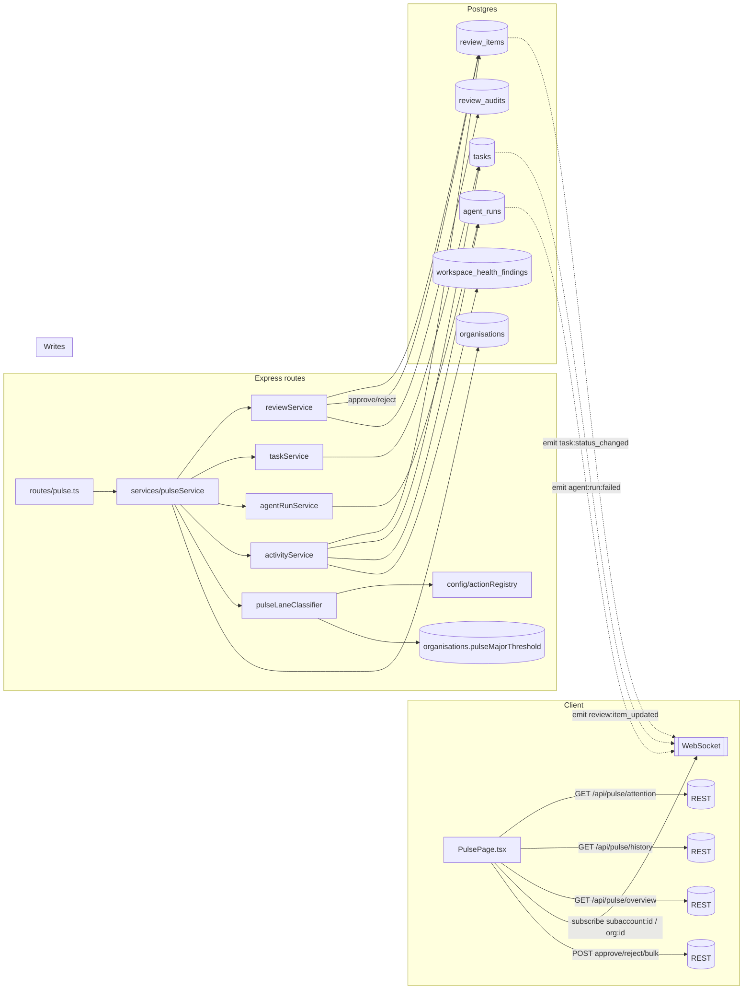

# The Pulse — Architecture Plan

> **Status:** Draft · v1 plan for subagent-driven build
> **Classification:** Major (new subsystem, replaces four existing pages)
> **Scope lock:** Org + Subaccount scopes only. No per-user read state. History replaces ActivityPage with 301 redirects. Major-lane ack threshold is org-configurable (defaults £50/action, £500/run). No ranking engine. WebSocket real-time. Pre-launch — delete the four old pages when Pulse ships.
> **Prototype:** `prototypes/pulse/index.html`

---

## Table of contents

1. [Executive summary](#1-executive-summary)
2. [Architecture diagram](#2-architecture-diagram)
3. [Section 1 — Data model](#section-1--data-model)
4. [Section 2 — Route surface](#section-2--route-surface)
5. [Section 3 — Service layer](#section-3--service-layer)
6. [Section 4 — Lane assignment logic](#section-4--lane-assignment-logic)
7. [Section 5 — Real-time model](#section-5--real-time-model)
8. [Section 6 — Action handlers](#section-6--action-handlers)
9. [Section 7 — History tab](#section-7--history-tab)
10. [Section 8 — Permissions](#section-8--permissions)
11. [Section 9 — Cost acknowledgment on the Major lane](#section-9--cost-acknowledgment-on-the-major-lane)
12. [Section 10 — Deletions](#section-10--deletions)
13. [Section 11 — Key risks and open questions](#section-11--key-risks-and-open-questions)
14. [Follow-up questions for the dev spec](#follow-up-questions-for-the-dev-spec)
15. [Implementation chunking](#implementation-chunking)

---

## 1. Executive summary

Pulse replaces the dashboard, review queue, inbox, and activity pages with a single supervision surface: the daily-use home for staff running AI agents on behalf of clients. It has two tabs — **Attention** (what needs human input right now) and **History** (what has happened) — and two scopes — Org (`/admin/pulse`) and Subaccount (`/admin/subaccounts/:subaccountId/pulse`). The Attention tab groups open items into three lanes: **Client-facing** (rose), **Major** (amber, explicit ack required), and **Internal** (slate, bulk-approvable). Lane assignment is deterministic — derived from action-registry metadata (`isExternal`, `defaultGateLevel`, MCP `destructiveHint`/`openWorldHint`) plus a per-org cost threshold that promotes an item to Major. No ranking engine, no per-user read state, no archive — if an item needs attention it is in Attention; once resolved it moves to History.

Pulse is built as a thin aggregation layer over existing services: `reviewService`, `taskService`, `agentRunService`, `activityService`. The client subscribes to existing WebSocket rooms (`subaccount:<id>` and `org:<orgId>`) for live updates and falls back to a single REST resync on reconnect. New code on the server is confined to one service (`pulseService`), one route module (`server/routes/pulse.ts`), one new column (`organisations.pulseMajorThreshold` — jsonb `{perActionPence, perRunPence}`), and light tagging of action-registry definitions where required. History is the existing activity feed rendered inside Pulse; legacy activity URLs return **301 → Pulse/history**. When Pulse ships, the four legacy pages and the per-user `inbox_read_states` table are deleted in the same commit.

## 2. Architecture diagram



The diagram shows the flow: Pulse is read-mostly on the server (one new service, one new route), and its writes flow through the existing `reviewService` approve/reject/bulk handlers. The WebSocket fan-out uses the rooms already emitted by those services — Pulse does not introduce a new broadcast channel.

## Section 1 — Data model

### 1.1 What's reused, what's new

Pulse reuses the existing tables; it does not introduce its own "pulse items" table. An item in Pulse is always a projection of an existing row.

| Entity | Table | Used by |
|---|---|---|
| Review item (pending / edited_pending) | `review_items` + `actions` | Attention — Client-facing, Major, Internal (depending on lane) |
| Task (status=inbox) | `tasks` | Attention — Internal (task created / completed) |
| Agent run (failed / timeout / budget_exceeded) | `agent_runs` | Attention — Internal (failed run), History |
| Workspace health finding (unresolved) | `workspace_health_findings` | Attention — Internal (system-surfaced issue), History |
| Audit of review decision | `review_audits` | History (decided/rejected/edited) |
| Playbook run | `playbook_runs` | History only |
| Workflow execution | `executions` | History only |

### 1.2 New persistence

**One new column on `organisations`** — `pulse_major_threshold` (`jsonb`, nullable):

```ts
// server/db/schema/organisations.ts
pulseMajorThreshold: jsonb('pulse_major_threshold').$type<{
  perActionPence: number;   // default 5000 (£50.00)
  perRunPence: number;      // default 50000 (£500.00)
}>(),
```

- NULL → fall back to `PULSE_MAJOR_THRESHOLD_DEFAULTS` in `server/config/limits.ts`.
- Stored as integer pence to avoid floating-point drift.
- Editable via existing org settings UI (requires `ORG_PERMISSIONS.SETTINGS_EDIT`).
- **Rejected alternative:** putting the threshold inside the generic `organisations.settings` jsonb. Dedicated column wins because (a) it's referenced on every Attention fetch and (b) explicit columns beat nested JSON when the value gates a user-facing behaviour.

**One new constant module** — `server/config/pulseThresholds.ts`:

```ts
export const PULSE_MAJOR_THRESHOLD_DEFAULTS = {
  perActionPence: 5000,   // £50.00
  perRunPence: 50_000,    // £500.00
} as const;
```

### 1.3 Cost signal on actions

Lane assignment needs a monetary cost per action. The current `actions.payloadJson` and `actions.metadataJson` already carry skill-specific cost hints (e.g. `send_email` → 1 send; `update_record` → enrichment cost). To keep lane-assignment deterministic, we add:

```ts
// server/db/schema/actions.ts
estimatedCostPence: integer('estimated_cost_pence'),  // nullable
```

- Populated by `skillExecutor` when it materialises the action (from MCP tool annotations or skill-level cost hints). NULL = unknown → treated as zero for threshold checks but surfaces in UI as "cost unknown".
- `agent_runs` already has `budgetSpentCents`; Pulse reads that to evaluate the per-run threshold.
- **Rejected alternative:** computing cost on-the-fly inside `pulseService` by inspecting `payloadJson`. Rejected because it re-parses skill payloads on every fetch and couples Pulse to every new skill. Making the skill declare the cost at action-creation time is cleaner and is a one-line change per skill.

### 1.4 What's deleted

- Table `inbox_read_states` — dropped (migration).
- All rows in `inbox_read_states` go with the table.
- No backfill — Pulse has no per-user read concept.

### 1.5 Migration

One migration file (next free sequence number) that:
1. Adds `organisations.pulse_major_threshold` (nullable jsonb).
2. Adds `actions.estimated_cost_pence` (nullable integer).
3. Drops `inbox_read_states` table.
4. Drops the three inbox indexes on `inbox_read_states`.

Migration is forward-only; the four legacy pages are deleted in the same PR so there is no rollback window that requires the old tables.

## Section 2 — Route surface

All routes live in a new file: `server/routes/pulse.ts`. Standard conventions apply — `authenticate` first, permission guard second, `asyncHandler` wraps every handler, service errors shaped `{ statusCode, message, errorCode? }`, `resolveSubaccount(subaccountId, orgId)` in every route with `:subaccountId`.

### 2.1 Read surface

| Method | Path | Scope | Permission | Returns |
|---|---|---|---|---|
| GET | `/api/pulse/attention` | Org | `ORG_PERMISSIONS.REVIEW_VIEW` | `{ lanes: { client, major, internal }, counts }` |
| GET | `/api/subaccounts/:subaccountId/pulse/attention` | Subaccount | `SUBACCOUNT_PERMISSIONS.REVIEW_VIEW` (org-admin bypass) | Same shape, scoped to one subaccount |
| GET | `/api/pulse/history` | Org | `ORG_PERMISSIONS.EXECUTIONS_VIEW` | `{ items, total, cursor }` |
| GET | `/api/subaccounts/:subaccountId/pulse/history` | Subaccount | `SUBACCOUNT_PERMISSIONS.EXECUTIONS_VIEW` | Same shape, scoped |
| GET | `/api/pulse/overview` | Org | `ORG_PERMISSIONS.EXECUTIONS_VIEW` | 4 metric cards + sparkline series |
| GET | `/api/subaccounts/:subaccountId/pulse/overview` | Subaccount | `SUBACCOUNT_PERMISSIONS.EXECUTIONS_VIEW` | Same shape, scoped |
| GET | `/api/pulse/counts` | Org | `ORG_PERMISSIONS.REVIEW_VIEW` | `{ attention: number, byLane: {...} }` — lightweight, for nav badge |
| GET | `/api/subaccounts/:subaccountId/pulse/counts` | Subaccount | `SUBACCOUNT_PERMISSIONS.REVIEW_VIEW` | Same shape, scoped |

**Response shape — `GET /api/pulse/attention`:**

```ts
type PulseAttentionResponse = {
  lanes: {
    client: PulseItem[];    // lane assignment rule in §4
    major:  PulseItem[];
    internal: PulseItem[];
  };
  counts: { client: number; major: number; internal: number; total: number };
  generatedAt: string;      // ISO; used for resync dedupe
};

type PulseItem = {
  id: string;               // review_item.id | task.id | agent_run.id | finding.id
  kind: 'review' | 'task' | 'failed_run' | 'health_finding';
  lane: 'client' | 'major' | 'internal';
  title: string;
  reasoning: string | null; // from action.metadataJson.reasoning or review_item.notes
  evidence: PulseEvidence | null;  // see §6
  costSummary: string;      // "1 email send · Reversible: no" — derived server-side
  estimatedCostPence: number | null;
  reversible: boolean;
  ackText: string | null;   // Major lane only — generated server-side, rendered in modal
  subaccountId: string;
  subaccountName: string;
  agentId: string | null;
  agentName: string | null;
  actionType: string | null;    // e.g. 'send_email'
  createdAt: string;
  updatedAt: string;
  ageLabel: string;             // "8m", "1h" — computed server-side for diff-stability
};
```

**Response shape — `GET /api/pulse/history`:**

Identical to the current `listActivityItems` response shape (from `server/services/activityService.ts`). Pulse delegates to `activityService` unchanged — no new normalisation. Query params: `type[]`, `status[]`, `severity[]`, `subaccountId`, `from`, `to`, `q`, `sort` (`newest`|`oldest`|`severity`|`attention_first`), `limit`, `offset`.

**Response shape — `GET /api/pulse/overview`:**

```ts
type PulseOverviewResponse = {
  activeAgents: { value: number; delta: number; spark: number[] };
  runs7d:       { value: number; delta: number; spark: number[] };
  successRate:  { value: number; delta: number; spark: number[] };  // 0–1
  itemsCreated: { value: number; delta: number; spark: number[] };  // created items (tasks, reports, updates) in last 7d
};
```

### 2.2 Write surface

Pulse does not introduce new write endpoints. All writes reuse existing handlers:

| User action | Existing endpoint | Notes |
|---|---|---|
| Approve review item | `POST /api/review-items/:id/approve` | Unchanged. Pulse passes through `{ edits?, comment? }`. |
| Reject review item | `POST /api/review-items/:id/reject` | Unchanged. Comment still required (400 if missing). |
| Bulk approve | `POST /api/review-items/bulk-approve` | Unchanged. |
| Bulk reject | `POST /api/review-items/bulk-reject` | Unchanged. |
| Major approve (with ack) | `POST /api/review-items/:id/approve` | **Server-side threshold check** added (see §9). Body gains optional `{ majorAcknowledgment: true }`. Without ack on a Major-lane item, returns 412 Precondition Failed. |

**One new server concept:** the approve handler gains a pre-check that loads the action's lane using the same classifier the read path uses; if lane is `major` and `req.body.majorAcknowledgment !== true`, it throws `{ statusCode: 412, message: 'Major-lane approval requires acknowledgment', errorCode: 'MAJOR_ACK_REQUIRED' }`. The check happens before `reviewService.approveItem` is called — no service-level change needed.

### 2.3 Redirect surface

Legacy URLs return **301 Moved Permanently**:

| From | To |
|---|---|
| `/` (DashboardPage) | `/admin/pulse` |
| `/inbox` | `/admin/pulse` |
| `/admin/activity` | `/admin/pulse?tab=history` |
| `/system/activity` | `/admin/pulse?tab=history&systemWide=1` (then the Pulse UI uses `/api/system/activity` if user is system admin) |
| `/admin/subaccounts/:id/review-queue` | `/admin/subaccounts/:id/pulse` |
| `/admin/subaccounts/:id/inbox` | `/admin/subaccounts/:id/pulse` |
| `/admin/subaccounts/:id/activity` | `/admin/subaccounts/:id/pulse?tab=history` |
| `/portal/:subaccountId/review-queue` | Deleted — not replaced (portal users keep a separate, minimal review UI; out of scope here). |

Redirects are defined in the client router (`client/src/App.tsx`) using `<Navigate to=… replace />` with `status={301}` where applicable. Server-side 301s for crawler-caught pages are added to `server/index.ts` for `/admin/activity`, `/system/activity`, and `/admin/subaccounts/:id/activity` — these three are the only ones that may have been shared as links; the dashboard and inbox were only ever reachable while logged in.

## Section 3 — Service layer

One new service module: `server/services/pulseService.ts`. It is an aggregator that fans out to existing services and applies lane classification. It does not own persistence.

### 3.1 Public surface

```ts
// server/services/pulseService.ts

export type PulseScope =
  | { type: 'subaccount'; subaccountId: string; orgId: string }
  | { type: 'org'; orgId: string };

export const pulseService = {
  getAttention(scope: PulseScope): Promise<PulseAttentionResponse>;
  getHistory(scope: PulseScope, filters: ActivityFilters): Promise<ActivityListResponse>;
  getOverview(scope: PulseScope): Promise<PulseOverviewResponse>;
  getCounts(scope: PulseScope): Promise<{ attention: number; byLane: { client: number; major: number; internal: number } }>;
};
```

### 3.2 Internal structure

`pulseService.getAttention` runs these fetchers in parallel and then applies lane classification:

| Fetcher | Source service | Query |
|---|---|---|
| `fetchPendingReviews(scope)` | `reviewService.getReviewQueue` / `getOrgReviewQueue` | Pending + edited_pending review items with their `action` joined |
| `fetchInboxTasks(scope)` | `taskService.listTasks({ status: 'inbox' })` | Tasks awaiting attention |
| `fetchFailedRuns(scope)` | `agentRunService.listRecent({ statuses: ['failed','timeout','budget_exceeded'], sinceDays: 7 })` | Failed runs from last 7d |
| `fetchUnresolvedFindings(scope)` | `workspaceHealthService.listUnresolved(scope)` | System-surfaced issues |

Each fetcher returns a `PulseItemDraft` (same shape as `PulseItem` but without `lane`, `costSummary`, `ackText`). The aggregator then runs `pulseLaneClassifier.classify(draft, orgThresholds)` on each draft, producing the final `PulseItem` with lane assigned. See §4 for classifier internals.

**Hard limits per source:** 50 items per fetcher × 4 fetchers = 200 drafts maximum. This matches `activityService`'s existing cap and prevents runaway queries.

### 3.3 History delegation

`pulseService.getHistory` is a thin wrapper that calls `activityService.listActivityItems(filters, activityScope)` with the right scope translation. Pulse adds no additional normalisation — History is the existing activity feed, re-branded. This is deliberate: if you can sort and filter activity today, you can do so in History tomorrow, without parallel code paths.

### 3.4 Overview derivation

`pulseService.getOverview` runs four parallel count queries:

1. **Active agents** — `agents` where `isActive=true` and `deletedAt IS NULL`, scoped.
2. **Runs (7d)** — `agent_runs` where `createdAt >= now() - interval '7 days'`, scoped. Delta = current 7d vs previous 7d window.
3. **Success rate** — `agent_runs` where `status='completed'` / total non-cancelled, last 7d. Delta in percentage points.
4. **Items created** — `tasks` created in last 7d plus `actions` where `status='executed'` and `actionType in (approved set)`, scoped. Delta = today vs yesterday.

**Sparkline series** — 12 buckets at 1-day granularity for the 7d metrics; 12 buckets at 1-hour granularity for intraday metrics. All buckets computed via a single `date_trunc` + `generate_series` CTE per metric.

### 3.5 Error shape

All service errors follow the project convention:

| Condition | Shape |
|---|---|
| Scope missing / unauthorised | `{ statusCode: 403, message: '…', errorCode: 'FORBIDDEN' }` |
| Subaccount not found or wrong org | handled by `resolveSubaccount` (existing 404) |
| Threshold config malformed | `{ statusCode: 500, message: 'Invalid org Pulse threshold config', errorCode: 'PULSE_CONFIG_INVALID' }` — should never fire; defaults apply if NULL |
| Fetcher timeout | `{ statusCode: 504, message: 'Pulse timed out aggregating attention items' }` — 2s hard timeout per fetcher via `Promise.race` |

### 3.6 What pulseService is not

- Not a data source — all reads go through existing services.
- Not a write path — all writes go through `reviewService`, `taskService`, `agentRunService`.
- Not a cache — v1 is on-demand. A read-through cache for Overview is a v2 concern if the four count queries prove too slow.
- Not a filter/sort engine — Attention is always deterministic (lane, then age desc). History inherits `activityService` filter support.

## Section 4 — Lane assignment logic

Lane is derived deterministically — no ML, no ranking engine, no "smart" heuristic. Given the same input, the same lane is always assigned. Lane classification lives in one pure function: `pulseLaneClassifier.classify(draft, orgThresholds)`.

### 4.1 Classifier inputs

For each `PulseItemDraft`, the classifier has access to:

| Input | Source |
|---|---|
| `draft.kind` | `'review' \| 'task' \| 'failed_run' \| 'health_finding'` |
| `draft.actionType` | e.g. `send_email` — present for `review` kind only |
| `draft.estimatedCostPence` | From `actions.estimatedCostPence` (§1.3) |
| `draft.runTotalCostPence` | Sum of `estimatedCostPence` across all pending actions in the same agent run |
| `draft.evidenceMeta` | `{ affectsMultipleSubaccounts?: boolean }` — derived from payload inspection at fetch time |
| Action registry lookup | `actionRegistry[draft.actionType]` → `{ isExternal, defaultGateLevel, mcp.annotations: { readOnlyHint, destructiveHint, idempotentHint, openWorldHint } }` |
| Org thresholds | `organisations.pulseMajorThreshold` or `PULSE_MAJOR_THRESHOLD_DEFAULTS` |

### 4.2 The rule

```ts
// server/services/pulseLaneClassifier.ts

export function classify(draft: PulseItemDraft, thresholds: {
  perActionPence: number;
  perRunPence: number;
}): 'client' | 'major' | 'internal' {

  // Rule 1 — Major lane first (highest-severity classification wins)
  if (draft.kind === 'review') {
    const costExceedsPerAction =
      (draft.estimatedCostPence ?? 0) > thresholds.perActionPence;
    const costExceedsPerRun =
      (draft.runTotalCostPence ?? 0) > thresholds.perRunPence;
    const affectsMultipleSubaccounts =
      draft.evidenceMeta?.affectsMultipleSubaccounts === true;
    const isIrreversible =
      actionRegistry[draft.actionType!]?.mcp.annotations.destructiveHint === true &&
      actionRegistry[draft.actionType!]?.mcp.annotations.idempotentHint !== true;

    if (costExceedsPerAction || costExceedsPerRun || affectsMultipleSubaccounts || isIrreversible) {
      return 'major';
    }
  }

  // Rule 2 — Client-facing: anything external
  if (draft.kind === 'review') {
    const def = actionRegistry[draft.actionType!];
    const isExternal = def?.isExternal === true;
    const openWorld  = def?.mcp.annotations.openWorldHint === true;
    if (isExternal || openWorld) return 'client';
  }

  // Rule 3 — Everything else is Internal
  return 'internal';
}
```

### 4.3 Lane-by-kind matrix

| `kind` | Default lane | Can be upgraded to Major? | Notes |
|---|---|---|---|
| `review` with external action (e.g. `send_email`, `update_record`, `post_social`) | `client` | Yes — by cost, cross-subaccount, or irreversibility | Most common case |
| `review` with internal action (e.g. `create_task`, `update_memory`) | `internal` | Rare — only if cost threshold exceeded (edge case for paid internal work) | |
| `task` (status=inbox) | `internal` | No | Tasks are always reviewer-internal work items |
| `failed_run` | `internal` | No | Operator issue, not an agent decision |
| `health_finding` | `internal` | No | System-surfaced issue |

### 4.4 Why deterministic

- **Rejected: ML ranking.** Ranking engines need training data, produce non-reproducible orderings, and are the wrong investment for a v1 surface where a user can eyeball ten items and decide.
- **Rejected: rule priority with user override.** Per-user lane preferences increase surface area without evidence anyone wants them. Out of scope for v1.
- **Accepted: pure function + registry metadata.** Reads the same signals the action registry already exposes for HITL gating, which makes Pulse's lane choice and the existing gate decision trivially auditable against each other.

### 4.5 Acknowledgment text generation

When `lane === 'major'`, the classifier also produces `ackText`:

```ts
// In pulseLaneClassifier
function buildAckText(draft: PulseItemDraft, reason: MajorReason): string {
  // reason is one of: 'cost_per_action' | 'cost_per_run' | 'cross_subaccount' | 'irreversible'
  switch (reason) {
    case 'cost_per_action':
      return `I understand this action will spend approximately ${formatCurrency(draft.estimatedCostPence)} on ${draft.subaccountName}.`;
    case 'cost_per_run':
      return `I understand this run's total spend exceeds ${formatCurrency(thresholds.perRunPence)} across its actions.`;
    case 'cross_subaccount':
      return `I understand this change affects more than one client and will be visible across accounts.`;
    case 'irreversible':
      return `I understand this action is not reversible once approved.`;
  }
}
```

Text is generated server-side so that the string the user acknowledges is exactly the string the audit record captures. This also means changes to ack wording are a single-point change.

### 4.6 Ordering within a lane

Within each lane: newest first (`createdAt desc`). No priority scoring. No "attention_first" re-ordering. If a lane gets noisy, it is because too many items need attention — that is a real signal, not a UX bug.

## Section 5 — Real-time model

Pulse is real-time over WebSocket. No polling (the activity page's 10-second `setInterval` is removed with the page).

### 5.1 Rooms subscribed

Pulse client subscribes to the rooms that already exist for each scope:

| Scope | Room | Existing emitters |
|---|---|---|
| Subaccount (`/admin/subaccounts/:id/pulse`) | `subaccount:<subaccountId>` | `reviewService`, `reviewItems` route, `taskService`, `agentRunService` |
| Org (`/admin/pulse`) | `org:<orgId>` | `reviewService` (cross-subaccount), `emitOrgUpdate` callers |

The Org view subscribes to `org:<orgId>` **and** to every `subaccount:<id>` the user has access to, since some events only fire on the subaccount room. Client-side dedupe via the existing bounded LRU in `useSocket` prevents double-render.

### 5.2 Events consumed

Pulse subscribes to these events — **none are new**. All already exist in the codebase:

| Event | Fires when | Pulse behaviour |
|---|---|---|
| `review:item_created` | Review item appears | Insert into correct lane (re-classify on client using server-returned `lane`) |
| `review:item_updated` | Item approved/rejected/edited | Remove from Attention; if `state='resolved'` append to History |
| `task:created` | Task created with status=inbox | Insert into Internal lane |
| `task:status_changed` | Task moves from inbox | Remove from Internal if new status ≠ inbox |
| `agent:run:failed` | Run ends in failed/timeout/budget_exceeded | Insert into Internal lane |
| `agent:run:completed` | Run completes | Remove matching failed-run entry if present; append to History |
| `health_finding:created` | New unresolved finding | Insert into Internal lane |
| `health_finding:resolved` | Finding resolved | Remove from Internal; append to History |
| `execution:status_changed` | Playbook / workflow run state change | History only — append if terminal state |

### 5.3 Event payloads

For items that insert into a lane, the server emits **just the id and kind**, and the client follows up with a targeted REST fetch:

```ts
// Emitted payload (unchanged for existing events)
{ eventId, type: 'review:item_created', entityId: '<uuid>', timestamp, payload: { subaccountId, agentId } }
```

On receipt, the client calls `GET /api/pulse/item/:id?kind=review` (a thin lookup route) to fetch the fully-hydrated `PulseItem` and applies classification server-side. **Why:** the existing emitters don't have enough context to emit a full `PulseItem` without knowing the classifier rules. Keeping the emitter payload minimal and doing one REST lookup avoids coupling every emitter to the classifier.

New thin endpoint required:

| Method | Path | Scope | Permission |
|---|---|---|---|
| GET | `/api/pulse/item/:kind/:id` | Org/subaccount (inferred from item) | Corresponds to item kind (REVIEW_VIEW for review/task, EXECUTIONS_VIEW for run) |

Response: `PulseItem` (full shape from §2).

### 5.4 Reconnect behaviour

Uses the existing `useSocketRoom(room, roomId, handlers, onReconnectSync)` hook:

- On reconnect, the `onReconnectSync` callback fires once.
- It calls `GET /api/pulse/attention` and replaces the entire Attention state.
- Same behaviour on initial mount.
- History tab is on-demand paginated, so reconnect resets page 1 but preserves filter state in URL params.

### 5.5 Overview strip

Overview metrics are not live. They refresh:

- On initial mount.
- On explicit user "Refresh" button click.
- Every 60 seconds via a background `setInterval` while the tab is visible (`document.visibilityState === 'visible'`). Pauses when hidden.

Rationale: four count queries at 10s cadence is wasteful. Minute-level granularity is fine for "last 7 days" metrics, and the explicit Refresh button handles urgency.

### 5.6 No new server-side infrastructure

- No new room types.
- No new event names.
- No new emitter calls from existing services (they already fire the events Pulse needs).
- Only additive work: the thin `GET /api/pulse/item/:kind/:id` lookup endpoint.

## Section 6 — Action handlers

Pulse's action handlers are thin wrappers around the existing review endpoints. The user-facing vocabulary is **Approve** / **Reject** / **Bulk approve** / **Bulk reject** — same verbs as the existing review queue, because that's what the server already supports.

### 6.1 Approve (Client-facing or Internal lane)

```ts
// Client-side
await api.post(`/api/review-items/${item.id}/approve`, { edits?, comment? });
```

- Maps 1:1 to the existing endpoint.
- Edits: if the user modified the action draft in the inline edit view, pass `edits` as the edited payload. `reviewService.approveItem` rewrites `actions.payloadJson` before executing.
- On success: WebSocket emits `review:item_updated { action: 'approved' }` → Pulse removes from lane.

### 6.2 Approve (Major lane)

```ts
// Client-side
await api.post(`/api/review-items/${item.id}/approve`, {
  edits?,
  comment?,
  majorAcknowledgment: true,
});
```

- Client gates this by an explicit checkbox in the confirmation modal whose label is `item.ackText` (server-provided).
- Server re-classifies the item; if `lane === 'major'` and `majorAcknowledgment !== true`, returns **412 Precondition Failed** with `errorCode: 'MAJOR_ACK_REQUIRED'`.
- On success: `reviewAuditService.record` already captures `decidedBy`, `rawFeedback`. Extend the audit record shape to also capture `ackText: string | null` so audit history shows the exact wording the user agreed to. See §9 for the audit extension.

### 6.3 Reject

```ts
await api.post(`/api/review-items/${item.id}/reject`, { comment });
```

- Comment required (server already enforces 400 if missing).
- On success: WebSocket emits `review:item_updated { action: 'rejected' }` → Pulse removes from lane.

### 6.4 Bulk approve / reject

```ts
await api.post('/api/review-items/bulk-approve', { ids: string[] });
await api.post('/api/review-items/bulk-reject',  { ids: string[], comment: string });
```

- **Pulse-side constraint:** the UI only allows bulk approve/reject within the **Internal lane**. Client-facing and Major are one-at-a-time by design (each needs its own evidence/ack review).
- Enforcement is client-side for UX, but the server also applies the Major-lane 412 guard per-item inside `bulkApprove` — any Major item in a bulk set causes the whole batch to fail with `{ statusCode: 412, errorCode: 'MAJOR_IN_BULK' }`.

### 6.5 Edit-then-approve

The prototype shows an inline "Edit" affordance on the email body. Contract:

```ts
type ApproveEdits =
  | { kind: 'email'; subject?: string; body?: string }
  | { kind: 'record_update'; fields: Record<string, unknown> }
  | { kind: 'replace_payload'; payloadJson: Record<string, unknown> };
```

- Client infers `kind` from the evidence type.
- Server (`reviewService.approveItem`) already accepts `edits` and merges into `actions.payloadJson` before execution. **No contract change required** — but the evidence-kind → edits-kind mapping is codified so the UI and server agree on shape.
- The audit record captures the edit: `decision: 'edited'` and `editedArgs: edits` (already wired by `reviewItems.ts` line 98).

### 6.6 Failed-run Internal-lane actions

Internal lane items that are failed runs don't have approve/reject — they have:

| Action | Behaviour |
|---|---|
| "View run" | Opens existing agent-run detail drawer |
| "Retry" | Calls existing `POST /api/agent-runs/:id/retry` (whatever currently exists) |
| "Dismiss" | Calls `POST /api/agent-runs/:id/acknowledge-failure` — **new endpoint**, see below |

New endpoint required:

| Method | Path | Scope | Permission |
|---|---|---|---|
| POST | `/api/agent-runs/:id/acknowledge-failure` | Subaccount (derived from run) | `SUBACCOUNT_PERMISSIONS.EXECUTIONS_MANAGE` |

- Sets `agent_runs.failureAcknowledgedAt` (new nullable timestamp column — but: if this already exists under a different name, reuse it instead; verify before migration).
- Dismisses the item from Internal lane.
- Emits `agent:run:acknowledged` on `subaccount:<id>`.

### 6.7 Task actions

Internal-lane tasks (status=inbox):

| Action | Behaviour |
|---|---|
| "Open task" | Navigates to existing task detail route |
| "Mark done" | Calls existing `PATCH /api/tasks/:id` with `{ status: 'done' }` |
| "Dismiss" | Calls existing `PATCH /api/tasks/:id` with `{ status: 'archived' }` (or equivalent — verify existing taxonomy) |

No new endpoints. Pulse reuses task-service mutations.

### 6.8 Error handling

All client-side handlers:

- On 412 `MAJOR_ACK_REQUIRED` — open the Major modal with the ack checkbox (should never fire if UI is correct; defensive).
- On 400 with `errorCode: 'COMMENT_REQUIRED'` — focus the comment field, surface inline error.
- On 403 — toast "You don't have permission to do that" and refetch Pulse state.
- On 404 — the item was deleted or already acted on; remove from local state and toast "That item is no longer available".
- On 5xx — toast "Something went wrong" and leave the item in place.

## Section 7 — History tab

History is the existing `activityService` feed rendered inside Pulse. It replaces `ActivityPage` entirely.

### 7.1 What History shows

A flat, filterable, paginated list of every finalised activity item:

- Approved / rejected / edited review items (from `review_audits` and `review_items` where `state != 'pending'`)
- Completed / failed / cancelled agent runs
- Resolved workspace-health findings
- Completed / failed playbook runs
- Completed / failed workflow executions
- Tasks that have left inbox (completed, archived, or dismissed)

All sourced via `activityService.listActivityItems(filters, scope)` — no parallel code.

### 7.2 UI contract

Uses the **ColHeader pattern** (from `SystemSkillsPage.tsx`) — Google Sheets-style column headers with sort + filter dropdowns. Columns:

| Column | Sort | Filter |
|---|---|---|
| When (updatedAt) | ✓ asc/desc | No |
| Type | ✓ A–Z | ✓ (categorical: review, agent_run, task, health_finding, playbook_run, workflow_execution) |
| Status | ✓ A–Z | ✓ (categorical: active, attention_needed, completed, failed, cancelled) |
| Severity | ✓ A–Z | ✓ (categorical: critical, warning, info, —) |
| Subaccount | ✓ A–Z | ✓ (categorical: all subaccounts the user can see) |
| Subject | No | No |
| Actor | No | No |

- Active sort → `↑` or `↓` next to column label.
- Active filter → indigo dot on column header.
- "Clear all" button appears in page header when any sort or filter is active (matches existing pattern).
- Server-side sort: `newest | oldest | severity | attention_first` — already supported by `activityService`. The client maps column-header clicks to the right `sort` parameter.
- Server-side filtering on `type[]`, `status[]`, `severity[]`, `subaccountId` — already supported.

### 7.3 Pagination

- Server-side, cursor-less: `limit` + `offset` (matches existing `activityService` contract — 1–200, default 50).
- Infinite scroll with a "Load more" button at the bottom (same UX as the current ActivityPage).
- URL params hold filter + sort state so deep links work.

### 7.4 Scope switching

Matches the current scope rule on `ActivityPage`:

| Scope | API | Permission |
|---|---|---|
| Subaccount (`/admin/subaccounts/:id/pulse?tab=history`) | `GET /api/subaccounts/:id/pulse/history` | `SUBACCOUNT_PERMISSIONS.EXECUTIONS_VIEW` |
| Org (`/admin/pulse?tab=history`) | `GET /api/pulse/history` | `ORG_PERMISSIONS.EXECUTIONS_VIEW` |
| System (`/admin/pulse?tab=history&systemWide=1`) | `GET /api/system/activity` (existing) | `requireSystemAdmin` |

System scope is a power-user view — it reuses the existing system activity endpoint unchanged. Pulse only provides the UI shell around it.

### 7.5 Deep link from History → detail

Each row has a "View" link. Behaviour mirrors `ActivityItem.detailUrl` from the existing service:

- `review` → `/admin/subaccounts/:id/review/:id` (existing detail page survives; it's not one of the four pages being deleted).
- `agent_run` → `/admin/subaccounts/:id/runs/:id` (existing).
- `task` → `/admin/subaccounts/:id/tasks/:id` (existing).
- `health_finding` → `/admin/subaccounts/:id/health?finding=:id` (existing).
- `playbook_run` → existing route.
- `workflow_execution` → existing route.

### 7.6 What History does not do

- No mutations from History. It's read-only.
- No export in v1 (CSV export is a v2 add-on that sits behind a permission gate).
- No saved filter presets in v1.
- No per-user visibility rules beyond the existing permission model.

## Section 8 — Permissions

Pulse does not introduce new permission keys. It composes existing ones.

### 8.1 Org scope (`/admin/pulse`)

| Capability | Required permission |
|---|---|
| View Attention tab | `ORG_PERMISSIONS.REVIEW_VIEW` |
| View History tab | `ORG_PERMISSIONS.EXECUTIONS_VIEW` |
| View Overview strip | `ORG_PERMISSIONS.EXECUTIONS_VIEW` |
| Approve / reject review items | `ORG_PERMISSIONS.REVIEW_APPROVE` |
| Edit org-level Major threshold | `ORG_PERMISSIONS.SETTINGS_EDIT` |
| Manage failed runs (dismiss / retry) | `ORG_PERMISSIONS.EXECUTIONS_MANAGE` (verify key exists — if not, use `EXECUTIONS_VIEW` + a new `EXECUTIONS_MANAGE` key; see §11) |

### 8.2 Subaccount scope (`/admin/subaccounts/:subaccountId/pulse`)

| Capability | Required permission |
|---|---|
| View Attention / History / Overview | `SUBACCOUNT_PERMISSIONS.REVIEW_VIEW` (Attention), `SUBACCOUNT_PERMISSIONS.EXECUTIONS_VIEW` (History + Overview) |
| Approve / reject | `SUBACCOUNT_PERMISSIONS.REVIEW_APPROVE` |
| Manage failed runs | `SUBACCOUNT_PERMISSIONS.EXECUTIONS_MANAGE` (verify) |

**Bypass rules** (consistent with project-wide policy):

- `system_admin` users bypass all checks.
- `org_admin` users bypass all org and subaccount checks within their org.
- Both bypass thresholds for viewing; **neither bypasses Major-lane acknowledgment** — the ack is a UX intent check, not an authorisation check, so everyone including org admins must tick the checkbox.

### 8.3 Lane-visibility nuances

A user who can see Attention but cannot approve (`REVIEW_VIEW` without `REVIEW_APPROVE`):

- Sees all three lanes with their items.
- Sees action buttons disabled with a tooltip: "You can view review items but not approve them. Ask an admin."
- Can still open evidence and see reasoning.
- Can still Dismiss failed runs **only if** they have `EXECUTIONS_MANAGE`.

### 8.4 Cross-subaccount visibility (Org scope)

On the Org Pulse page, the Attention and History lists include items from **every subaccount the user has access to**, determined by:

- Org admins / system admins → all subaccounts in the org.
- Other users → subaccounts where they have an assignment in `subaccount_user_assignments` with a permission set that includes `SUBACCOUNT_PERMISSIONS.REVIEW_VIEW` (for Attention) or `EXECUTIONS_VIEW` (for History).

`pulseService` computes this set once per request using the existing `listAccessibleSubaccounts(userId, orgId)` helper (verify name; if not present, add it to `server/services/permissionService.ts`). The aggregator passes the allowed-subaccount filter into each fetcher.

### 8.5 Threshold editing UI

Major-lane threshold config lives in existing org settings (`/admin/settings/governance` — or wherever `requireAgentApproval` lives). Pulse adds two input fields:

- "Per-action cost ceiling" (currency input, defaults to £50.00, stored in pence)
- "Per-run cost ceiling" (currency input, defaults to £500.00, stored in pence)

Change takes effect on the next `GET /api/pulse/attention` fetch — no cache, no invalidation.

### 8.6 Permission-check placement

Per project convention, every route uses middleware:

```ts
router.get(
  '/api/subaccounts/:subaccountId/pulse/attention',
  authenticate,
  requireSubaccountPermission(SUBACCOUNT_PERMISSIONS.REVIEW_VIEW),
  asyncHandler(async (req, res) => {
    const sub = await resolveSubaccount(req.params.subaccountId, req.orgId!);
    const data = await pulseService.getAttention({ type: 'subaccount', subaccountId: sub.id, orgId: req.orgId! });
    res.json(data);
  }),
);
```

No permission logic in the service layer. Service trusts the scope it's given.

## Section 9 — Cost acknowledgment on the Major lane

The Major lane exists to make high-impact approvals feel different from routine approvals. The UX is a second-confirm modal with an acknowledgment checkbox.

### 9.1 Flow

1. User clicks "Approve" on a Major-lane card.
2. Modal opens — contents:
   - Title: "Confirm major action"
   - Item summary (title + subaccount + agent)
   - Cost summary (e.g. `+£500/mo recurring · Irreversible during the month`)
   - Evidence block (same as card, re-rendered)
   - **Acknowledgment checkbox** labelled with `item.ackText` (server-provided, see §4.5). Example: `I understand this action will spend approximately £75.00 on Acme Corp.`
   - Optional comment textarea (`comment`)
   - Primary button: **"Approve"** — disabled until checkbox is ticked.
   - Secondary button: **"Cancel"** — closes modal, no state change.
3. On submit → `POST /api/review-items/:id/approve` with `{ majorAcknowledgment: true, comment? }`.
4. Server re-classifies (authoritative source of truth). If still Major and ack missing → 412.
5. Audit record captures `ackText` and the fact that `decision='approved'` with `majorAcknowledgment=true`.

### 9.2 Server-side enforcement

The ack check lives in the approve route, not the service:

```ts
// server/routes/reviewItems.ts  (addition)
router.post(
  '/api/review-items/:id/approve',
  authenticate,
  requireOrgPermission(ORG_PERMISSIONS.REVIEW_APPROVE),
  asyncHandler(async (req, res) => {
    const item = await reviewService.getReviewItem(req.params.id, req.orgId!);
    const action = await actionService.getAction(item.actionId, req.orgId!);

    // Pulse lane re-classification
    const thresholds = await pulseConfigService.getMajorThresholds(req.orgId!);
    const laneDraft = await pulseService.buildDraftFromAction(action);
    const lane = pulseLaneClassifier.classify(laneDraft, thresholds);

    if (lane === 'major' && req.body.majorAcknowledgment !== true) {
      throw { statusCode: 412, message: 'Major-lane approval requires acknowledgment', errorCode: 'MAJOR_ACK_REQUIRED' };
    }

    // ... existing approve flow
  }),
);
```

The approve route is the single point of enforcement. Bulk-approve route has the same check applied per-item: if any item in the batch is Major, the whole batch fails with `MAJOR_IN_BULK`.

### 9.3 Threshold configuration

Two values, both per-org, both integer pence:

| Key | Default | Meaning |
|---|---|---|
| `perActionPence` | 5000 (£50.00) | If this single action's `estimatedCostPence > perActionPence`, lane = Major |
| `perRunPence` | 50000 (£500.00) | If the containing agent run's pending-action total exceeds this, lane = Major |

Stored on `organisations.pulseMajorThreshold` (jsonb, nullable). NULL falls back to `PULSE_MAJOR_THRESHOLD_DEFAULTS`.

**Editor UI** (in existing org settings page):

- Two currency inputs labelled "Approve-before-spend cost per action" and "Approve-before-spend cost per run".
- Minimum 0 (zero disables the rule effectively — everything becomes Major above zero, which is probably not desired; we do not impose a lower bound).
- Maximum 1,000,000 pence = £10,000 (arbitrary sanity cap; can be lifted).
- Help text: "Approvals above this amount require explicit acknowledgment before they go through. Applies to all subaccounts unless overridden per-subaccount (future)."
- "Reset to default" button.
- **Validation:** `perRunPence >= perActionPence` (enforced client + server). Reject with 400 if violated.

### 9.4 Audit extension

The `review_audits` table already captures `decision`, `rawFeedback`, `editedArgs`. For Major approvals we add two columns:

```ts
// server/db/schema/reviewAudits.ts
majorAcknowledged: boolean('major_acknowledged').notNull().default(false),
ackText: text('ack_text'),  // NULL for non-major, exact text shown at approve time for major
```

`reviewAuditService.record(...)` takes two new optional fields and writes them. Population:

- For non-Major approvals: `majorAcknowledged=false`, `ackText=null`.
- For Major approvals: `majorAcknowledged=true`, `ackText=item.ackText`.

### 9.5 Why not a per-subaccount threshold?

- **Deferred:** v1 is per-org. A per-subaccount override is easy to add later (new column on `subaccounts` that shadows the org value) but introduces a settings UI question right now.
- **Rejected for v1:** agents that span subaccounts (portfolio agent) would need a "whose threshold applies?" rule. Keep it simple — org threshold — and iterate.

### 9.6 Why not "require MFA" or "require a named approver"?

- **Deferred.** Both are valid for regulated industries. Neither is the right investment for v1. If we need them, they layer on top of the existing ack check.

### 9.7 Edge cases

| Case | Behaviour |
|---|---|
| `estimatedCostPence` is NULL | Treated as 0 for threshold. Item stays Client-facing or Internal unless another Major rule triggers. UI surfaces "cost unknown" in the cost summary. |
| Action cost below ceiling but affects multiple subaccounts | Major (rule triggers on `affectsMultipleSubaccounts`). |
| Destructive, non-idempotent action with cost = 0 | Major (irreversible rule triggers regardless of cost). Example: `delete_record`. |
| User changes threshold mid-session | Affects next fetch only. An item shown as Client-facing may become Major on refresh. Not a bug — threshold is a live config. |

## Section 10 — Deletions

Pulse is pre-launch. When it ships, the four legacy pages and their supporting infrastructure are deleted in the same PR. No feature flag, no strangler, no migration window.

### 10.1 Client files to delete

| File | Why |
|---|---|
| `client/src/pages/DashboardPage.tsx` | Replaced by Pulse landing (`/admin/pulse`). |
| `client/src/pages/ReviewQueuePage.tsx` | Replaced by Pulse Attention tab. |
| `client/src/pages/InboxPage.tsx` | Replaced by Pulse Attention tab. |
| `client/src/pages/ActivityPage.tsx` | Replaced by Pulse History tab. |
| Any unique child components in those four pages | Delete if no other importer (scan with `grep -R 'from.*<component>'` first). |

### 10.2 Client route removals

In `client/src/App.tsx`:

- Remove `lazy(() => import('./pages/DashboardPage'))` and its `<Route path="/" ... />`.
- Remove all four ReviewQueuePage mounts (admin + portal).
- Remove both InboxPage mounts.
- Remove all three ActivityPage mounts (subaccount + org + system).
- Add Pulse mounts: `<Route path="/admin/pulse" ... />` and `<Route path="/admin/subaccounts/:subaccountId/pulse" ... />`.
- Add 301 redirects (via `<Navigate to=… replace />`) for each legacy path.

### 10.3 Server routes to delete

| File | Why |
|---|---|
| `server/routes/inbox.ts` | Unused once InboxPage is gone. |
| `server/services/inboxService.ts` | Unused once inbox route is gone. Grep for other importers first — **must confirm zero references** before deletion. |
| Parts of `server/routes/activity.ts` | **Keep** the file — Pulse History delegates to it. Only remove the mount if redundant; the three routes (`/api/activity`, `/api/subaccounts/:id/activity`, `/api/system/activity`) are still needed as raw activity endpoints and for the system-scope History view. |

Server-side 301 redirects for shareable legacy paths (`/admin/activity`, `/system/activity`, `/admin/subaccounts/:id/activity`) are added in `server/index.ts` so that bookmarked or external links continue to resolve.

### 10.4 Database deletions

In a single migration:

- Drop `inbox_read_states` table.
- Drop its indexes.
- Leave `review_items`, `tasks`, `agent_runs`, `workspace_health_findings`, `review_audits`, `executions`, `playbook_runs`, `actions` untouched.

### 10.5 Navigation cleanup

- Sidebar: replace "Dashboard", "Inbox", "Review queue", "Activity" with a single "Pulse" entry.
- Any deep-link sources (email notifications, Slack alerts, task links) — grep for `admin/activity`, `/inbox`, `/review-queue` in `server/services/notifications/` and `server/services/emailTemplates/` (or equivalent) and update them to point at Pulse. Redirects cover the rest.

### 10.6 Verification checklist for the deletion PR

- [ ] No import of DashboardPage / ReviewQueuePage / InboxPage / ActivityPage anywhere.
- [ ] `npm run build` (client) succeeds.
- [ ] `npm run typecheck` succeeds.
- [ ] `npm run lint` succeeds.
- [ ] Every legacy path in `client/src/App.tsx` is either removed or replaced with a 301 redirect to the correct Pulse route.
- [ ] Visiting `/`, `/inbox`, `/admin/activity`, `/system/activity` redirects to the correct Pulse view.
- [ ] `inbox_read_states` migration applied; table no longer exists in `\dt`.
- [ ] All existing WebSocket rooms still work (no unrelated regressions from the cleanup).
- [ ] `pr-reviewer` then `dual-reviewer` run cleanly.

### 10.7 Rollback posture

Because Pulse is pre-launch, rollback is "redeploy the previous commit". No data migration reversal. No "Pulse-disabled" mode. If Pulse has a critical bug that must be fixed and can't be, the fix is to revert the PR — not to toggle a flag.

## Section 11 — Key risks and open questions

### 11.1 Risks

**R1. Cost data not populated for older actions.**
Every skill must declare `estimatedCostPence` at action-creation time. Backfill is not possible — old skills never captured cost. Mitigation: Pulse treats NULL as "cost unknown" and shows that string in the UI. Lane classifier treats NULL as 0 for the threshold check, so historical items never trip Major-by-cost. Risk accepted.

**R2. Aggregated Attention fetch can grow slow at scale.**
Four parallel fetchers × 50 items each, plus N joins to the action registry. If a user has 1,000+ pending reviews across many subaccounts, the page load slows. Mitigation: hard cap of 50/source, 2-second timeout per fetcher, `Promise.race`. Long term: index audit on pending-state queries and optional read-through cache on `/api/pulse/counts` (nav badge).

**R3. WebSocket event storm on busy orgs.**
A burst of 100 review items in a minute means 100 WebSocket events, each triggering a targeted REST lookup. Mitigation: client-side debounce on lane-recompute (max 1 recompute per 300ms). Server-side: existing LRU dedup absorbs duplicate events.

**R4. Classifier drift from HITL gate logic.**
The action registry's `defaultGateLevel` decides *whether* to gate; Pulse's lane classifier decides *how severely* to surface a gated item. Two code paths could diverge if registry metadata changes. Mitigation: classifier is a pure function imported by both the Pulse service and (as a secondary consistency check) the HITL gate when it writes the review item. If lane and gate level disagree, log a warning via `logger.warn('pulse_lane_mismatch', ...)` for offline analysis.

**R5. Major-lane ack text shown to user vs audited diverges.**
If client caches an old `ackText` but server classifier updates the string, the user agrees to one thing and audit records another. Mitigation: always use the server-returned `ackText` on the approve request (client sends `ackTextHash`; server compares to a hash of its own generated text; on mismatch, returns 409 and client refreshes). **Optional hardening** — skipped in v1 if the ack string is stable over short lifespans.

**R6. System-scope History embedded in an org-scoped Pulse page.**
Mixing scopes in the same UI chrome increases cognitive load. Mitigation: a conspicuous "System-wide" banner at the top of History when `systemWide=1` is set, plus a coloured scope chip on every row. System scope is a power-user mode.

**R7. Deletion of four pages is a wide blast radius.**
A missed import elsewhere in the codebase breaks the build. Mitigation: the deletion PR is its own chunk, run after Pulse ships green. Use the dependency graph (pre-flight `npm run build`) to identify any residual importers before committing the deletions.

**R8. Portal review queue (`/portal/:subaccountId/review-queue`) is in scope for deletion.**
If portal users have external links or bookmarks, removing it breaks them. Clarify with product whether portal keeps a separate minimal review UI or inherits Pulse's.

### 11.2 Open questions (require answers before spec)

| Q | Impact |
|---|---|
| **Q1.** Does `EXECUTIONS_MANAGE` already exist as a permission key? | §8 — failed-run dismissal |
| **Q2.** Does a `listAccessibleSubaccounts(userId, orgId)` helper already exist in `server/services/permissionService.ts`? | §8.4 — Org Pulse fan-out |
| **Q3.** Does a "retry" endpoint for failed agent runs already exist? Path, permission? | §6.6 — failed-run actions |
| **Q4.** Does a `failureAcknowledgedAt` (or equivalent) column already exist on `agent_runs`? | §6.6 — dismiss failed run |
| **Q5.** Which skill modules need their `estimatedCostPence` wiring updated — is the set `{send_email, update_record, create_calendar_event, post_social, ...}` or wider? | §1.3 — cost signal on actions |
| **Q6.** Do portal users stay on a separate review UI, or lose the review queue entirely? | §10.1 — portal deletion |
| **Q7.** Does the org settings page have a "governance" section where the threshold UI can live, or does Pulse need to add one? | §9.3 — threshold editor UI |
| **Q8.** Is currency locale per-org configurable, or always GBP in v1? (The prototype mixes $ and £ — decide one.) | §4.5, §9.3 — ack text and UI |
| **Q9.** What counts as "affects multiple subaccounts" for Rule 1 of the classifier? Inspect `action.payloadJson` for a subaccount array? A flag on the action row? | §4.1 — classifier input `evidenceMeta.affectsMultipleSubaccounts` |
| **Q10.** What happens to `inboxReadStates` audit usage if anything downstream reads it (e.g. reporting, analytics)? Grep before drop. | §1.4, §10.4 |

## Follow-up questions for the dev spec

These are concrete product/architecture decisions the dev spec must nail down before a subagent-driven build starts. Grouped by urgency.

### Must-answer before spec starts

1. **Portal review queue fate** — keep a minimal portal UI, or remove entirely? Decides whether `ReviewQueuePage.tsx` stays as portal-only or is deleted outright.
2. **Currency and locale** — GBP only in v1? Prototype uses mixed $/£, which is fine for a mockup but not for ack text. Confirm GBP, pence storage, and UK locale formatting.
3. **Cost-signal backfill strategy** — accept "cost unknown" forever on old actions, or run a one-time sweep where we can derive cost? Expected answer: accept unknown. Confirm.
4. **`EXECUTIONS_MANAGE` permission** — exists, or new? If new, add to `server/lib/permissions.ts` and seed into default roles.
5. **Multiple-subaccount action detection** — payload inspection vs explicit flag. Expected answer: an explicit `subaccountScope: 'single' | 'multiple'` field set by skill at action creation time.

### Should-answer before chunk 4 (lane classifier)

6. **Definition of "irreversible"** — does `destructiveHint && !idempotentHint` capture every case? What about `send_email` (destructive=false but not reversible)? Tighten the rule: probably external + destructive, or external + non-idempotent + cost-above-threshold.
7. **Default thresholds in GBP** — £50 / £500 fixed, or regional? Confirm £50/£500 as the only default in v1.
8. **Major threshold applied to rejection too?** — No — rejections don't cost money. Confirm the ack is approval-only.

### Should-answer before chunk 7 (History tab)

9. **System-scope access in Pulse** — system admins only, or also org owners with a toggle? Expected: system admins only.
10. **History retention** — does the existing `DEFAULT_RUN_RETENTION_DAYS` (90) also bound History? Users asking "what happened three months ago" will see a cutoff.
11. **Per-item detail drawer vs full-page detail** — Pulse shows items inline with expandable evidence. For "View run" links, open in drawer or navigate away? Expected: drawer for review/run/task, navigate for playbook/workflow.

### Can-answer during build

12. **Empty-state design** — what does Attention show when there are zero items? (Design mock needed.)
13. **Error-state design** — 500 on `/api/pulse/attention`, what does the user see? (Design mock needed.)
14. **Overview sparkline edge cases** — what if the 7-day window has fewer data points than buckets? (Render what we have, don't pad zeros.)
15. **Major ack string with zero cost** — if only the "irreversible" rule triggered, what exact text do we show? (Proposed wording in §4.5 handles it; confirm.)

## Implementation chunking

Chunks are ordered so each is independently testable and the fleet can implement them serially without cross-chunk merge hazards.

### Chunk 1 — Schema + config scaffolding

**Scope:**
- Drizzle migration: `organisations.pulse_major_threshold jsonb NULL`, `actions.estimated_cost_pence integer NULL`, add `review_audits.major_acknowledged bool NOT NULL DEFAULT false`, `review_audits.ack_text text`.
- Create `server/config/pulseThresholds.ts` with `PULSE_MAJOR_THRESHOLD_DEFAULTS`.
- Create `server/services/pulseConfigService.ts` with `getMajorThresholds(orgId)` that reads org column and falls back to defaults.

**Not in scope:** lane classifier, routes, UI.
**Testable:** migration runs clean on a fresh DB; `pulseConfigService.getMajorThresholds` returns defaults when column is NULL and stored value when set; unit-tested as a pure service.
**Dependencies:** none.

### Chunk 2 — Lane classifier

**Scope:**
- `server/services/pulseLaneClassifier.ts` pure module. Exports `classify(draft, thresholds): { lane, majorReason? }` and `buildAckText(draft, reason, thresholds)`.
- Snapshot tests covering: external+cheap, external+expensive, internal+cheap, internal+destructive+irreversible, multi-subaccount, NULL cost.
- `__tests__/pulseLaneClassifierPure.test.ts` following the project's pure-test pattern.

**Not in scope:** aggregator, routes, UI.
**Testable:** pure function, no DB. 100% branch coverage achievable.
**Dependencies:** Chunk 1 (types for thresholds).

### Chunk 3 — Skill wiring for `estimatedCostPence`

**Scope:**
- For each external-acting skill in `server/skills/`, populate `estimatedCostPence` on action creation.
- `send_email` → 0 (unless carrier charge applies).
- `update_record` → enrichment price.
- `post_social` → 0.
- `paid_ads_*` skills → the actual spend delta.
- Any skill marked `isExternal: true` in the registry must at minimum write NULL explicitly (not undefined) so the column is unambiguously "unknown", not "not set".

**Not in scope:** skills that don't cost money and aren't external — they leave the column NULL.
**Testable:** per-skill unit test asserts the action row is written with the expected `estimatedCostPence`.
**Dependencies:** Chunk 1.

### Chunk 4 — `pulseService` + thin lookup route

**Scope:**
- `server/services/pulseService.ts` with `getAttention`, `getHistory`, `getOverview`, `getCounts`.
- `getAttention` fans out to `reviewService` + `taskService` + `agentRunService` + `workspaceHealthService`, maps to `PulseItemDraft`, applies classifier, returns grouped by lane.
- `getHistory` delegates to `activityService.listActivityItems`.
- `getOverview` runs the four metric queries.
- `GET /api/pulse/item/:kind/:id` thin lookup endpoint (for WebSocket follow-up fetch).
- Route module `server/routes/pulse.ts` mounted in `server/index.ts`.
- All 6 read routes implemented (Org + Subaccount × Attention/History/Overview + Counts).

**Not in scope:** writes, client UI.
**Testable:** integration tests for each route shape; scope isolation (subaccount scope never returns org-wide items); permission bypass rules.
**Dependencies:** Chunks 1–3.

### Chunk 5 — Approve-route Major-ack enforcement

**Scope:**
- Extend `server/routes/reviewItems.ts` approve + bulk-approve handlers with the lane re-check.
- Extend `reviewAuditService.record` to persist `majorAcknowledged` and `ackText`.
- 412 `MAJOR_ACK_REQUIRED` on single approve without ack; 412 `MAJOR_IN_BULK` on bulk containing a Major item.

**Not in scope:** client UI for the ack modal.
**Testable:** approve a Major item without ack → 412; with ack → 200 and audit row correct; bulk with one Major item → 412.
**Dependencies:** Chunks 2, 4.

### Chunk 6 — Pulse page shell + Attention tab

**Scope:**
- `client/src/pages/PulsePage.tsx` with sidebar/header/tabs from the prototype.
- Scope detection (`/admin/pulse` vs `/admin/subaccounts/:id/pulse`).
- Attention tab: three lanes, cards with evidence-hidden-by-default.
- Approve / Reject / Edit flows for Client-facing and Internal.
- Bulk-approve / bulk-reject for Internal only.
- WebSocket subscription via `useSocketRoom`; dedup and reconnect resync.
- Empty / loading / error states.
- 60-second Overview refresh timer.

**Not in scope:** Major modal (Chunk 7), History tab (Chunk 8), admin redirects (Chunk 10).
**Testable:** Vitest component tests for lane rendering and action dispatch; e2e happy path (approve a review item and see it disappear).
**Dependencies:** Chunk 4.

### Chunk 7 — Major-lane confirmation modal

**Scope:**
- `<MajorApprovalModal>` component triggered from Major-lane card.
- Renders `item.ackText` with a checkbox that disables the Approve button until ticked.
- Calls approve endpoint with `majorAcknowledgment: true`.
- Handles 412 `MAJOR_ACK_REQUIRED` and 409 `ACK_TEXT_MISMATCH` (if R5 hardening is adopted).

**Not in scope:** threshold editor UI.
**Testable:** modal locks submit until checkbox ticked; server 412 surfaces as a clear error; audit record contains the exact ack text.
**Dependencies:** Chunks 5, 6.

### Chunk 8 — History tab

**Scope:**
- History tab on `PulsePage.tsx` with the ColHeader sort/filter pattern.
- Server-side sort and filter wired via query params.
- Pagination with "Load more".
- Scope switching (subaccount / org / system).
- URL-param persistence of filters + sort.

**Not in scope:** export, saved presets.
**Testable:** sort and filter combinations produce expected server requests; deep-linked URL restores state.
**Dependencies:** Chunk 4 (for `/api/pulse/history`).

### Chunk 9 — Threshold editor UI

**Scope:**
- Add two currency inputs to the org settings governance section.
- `PUT /api/org/pulse-threshold` route (already allowed under `ORG_PERMISSIONS.SETTINGS_EDIT`) — actually: reuse the existing org settings PATCH endpoint if one exists; verify and add if not.
- Validation: `perRunPence >= perActionPence`.
- "Reset to default" button clears the column back to NULL.

**Not in scope:** per-subaccount thresholds.
**Testable:** edit, refresh, see the new ceiling reflected in a Pulse fetch; invalid values rejected with 400.
**Dependencies:** Chunk 1.

### Chunk 10 — Legacy page deletions + redirects

**Scope:**
- Delete `DashboardPage.tsx`, `ReviewQueuePage.tsx`, `InboxPage.tsx`, `ActivityPage.tsx`.
- Delete `server/routes/inbox.ts` and `server/services/inboxService.ts` after verifying zero references.
- Drop `inbox_read_states` table in a migration.
- Add client `<Navigate>` 301s and server-side 301s for shareable paths.
- Update sidebar nav.
- Grep notification templates for legacy paths; update.
- Run full `pr-reviewer` and `dual-reviewer` loop before merge.

**Not in scope:** anything that might break the Pulse page itself.
**Testable:** `npm run build`, `npm run typecheck`, `npm run lint` all clean; every legacy URL redirects to the correct Pulse view; DB no longer has `inbox_read_states`.
**Dependencies:** Chunks 6–9 (Pulse must be fully functional before deletions).

### Chunk 11 — Docs and capabilities registry

**Scope:**
- Update `docs/capabilities.md` to describe Pulse as the supervision surface (customer-facing language — generic, no internal table names).
- Update `architecture.md` if any convention is extended (e.g. Major-lane ack pattern).
- Append to `KNOWLEDGE.md` any lessons from the build.

**Not in scope:** the implementation itself.
**Testable:** docs-in-sync review; capabilities registry editorial rules respected (no LLM vendor names in customer-facing sections).
**Dependencies:** Chunk 10 (ship state).

---

**Build order summary:** 1 → 2 → 3 → 4 → 5 → 6 → 7 → 8 → 9 → 10 → 11. Each chunk is mergeable on its own (the four legacy pages remain live alongside Pulse until Chunk 10 ships), so the blast radius of any individual chunk failing code review is contained.
