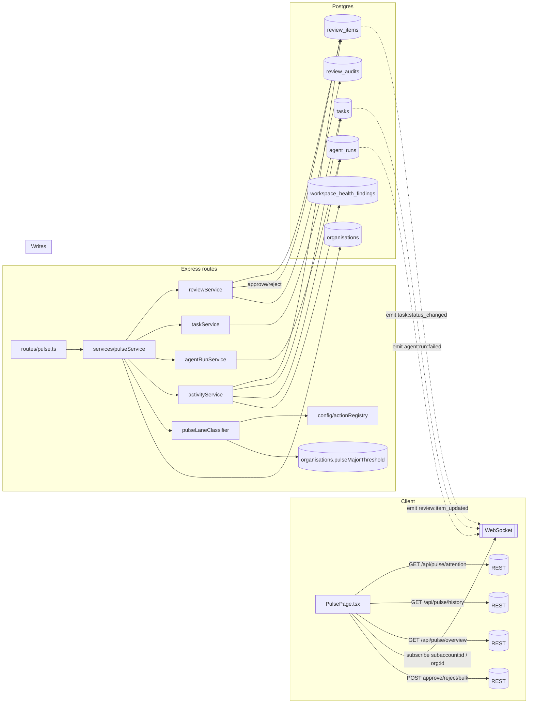

# Dev Spec — The Pulse

> **Status:** Draft — ready for spec-reviewer loop (local dev)
> **Classification:** Major (new subsystem; replaces three admin-scope pages)
> **Prototype:** `prototypes/pulse/index.html` — UX source of truth
> **Branch:** `claude/evaluate-ai-strategy-gHP7t`
> **Note:** This document is self-contained. It incorporates design decisions from the architect plan (`tasks/architect-plan-pulse.md`) as a preamble — no need to read the architect plan separately.

---

## Table of contents

0. [Design decisions (from architect plan)](#0-design-decisions)
1. [Architecture overview](#1-architecture-overview)
2. [Decision summary](#decision-summary)
3. [Scope overview](#scope-overview)
4. [Architecture constraints](#architecture-constraints)
5. [Execution order](#execution-order)
6. [Dependencies](#dependencies)
7. [Chunk 1 — Schema + config scaffolding](#chunk-1--schema--config-scaffolding)
8. [Chunk 2 — Lane classifier](#chunk-2--lane-classifier)
9. [Chunk 3 — Skill wiring](#chunk-3--skill-wiring)
10. [Chunk 4 — pulseService + routes](#chunk-4--pulseservice--routes)
11. [Chunk 5 — Major-ack enforcement](#chunk-5--major-ack-enforcement)
12. [Chunk 6 — PulsePage + Attention tab](#chunk-6--pulsepage--attention-tab)
13. [Chunk 7 — Major-lane confirmation modal](#chunk-7--major-lane-confirmation-modal)
14. [Chunk 8 — History tab](#chunk-8--history-tab)
15. [Chunk 9 — Threshold editor UI](#chunk-9--threshold-editor-ui)
16. [Chunk 9b — Per-subaccount retention override](#chunk-9b--per-subaccount-retention-override)
17. [Chunk 10 — Legacy page deletions](#chunk-10--legacy-page-deletions)
18. [Chunk 11 — Docs and capabilities registry](#chunk-11--docs-and-capabilities-registry)
19. [File impact summary](#file-impact-summary)
20. [Risk assessment](#risk-assessment)
21. [Rollout and verification](#rollout-and-verification)
22. [Out of scope](#out-of-scope)

---

## 0. Design decisions

Locked decisions from the architecture phase. These supersede any contradictions elsewhere in this document.

| # | Decision | Rationale |
|---|----------|-----------|
| A1 | **Currency: AUD in v1. Multi-currency-ready backend.** `organisations.default_currency_code text NOT NULL DEFAULT 'AUD'` (ISO 4217). All monetary amounts stored as integer **minor units** (cents for AUD). `pulse_major_threshold` jsonb becomes `{perActionMinor, perRunMinor}` with currency inherited from the org. `actions.estimated_cost_minor` integer NULL. `review_audits.ack_amount_minor` + `review_audits.ack_currency_code` snapshot both at approve time for audit integrity. Display: `Intl.NumberFormat(locale, { style: 'currency', currency: code })`. Phase 2 adds per-subaccount override and FX table. | AUD is the target market; moving to multi-currency later is cheap if minor-units + currency-code are baked in from day one. |
| A2 | **Irreversible rule for Major lane:** `external && (destructive \|\| !idempotent)`. | Catches `send_email` and other send-and-forget actions that are external, not marked destructive, but not reversible. |
| A3 | **Portal review queue survives.** `ReviewQueuePage.tsx` stays wired to `/portal/:subaccountId/review-queue` only. Removed from all `/admin/*` routes. | End-client portal users need to see/approve escalated items in-portal. Pulse replaces admin-scope review UI only. |
| A4 | **Currency locale: `en-AU`. System-scope History: system admins only.** | Org owners don't need cross-org visibility; narrower scope keeps permissions simple. |
| A5 | **History retention: unchanged from platform defaults.** Pulse doesn't own retention policy. Agent-run detail follows `subaccounts.run_retention_days` → `organisations.run_retention_days` → `DEFAULT_RUN_RETENTION_DAYS` (90). Review-item and task activity persist indefinitely. | Retention is a platform concern, not a Pulse concern. Pulse renders what's in the DB. |
| A6 | **Per-subaccount retention override** added to Pulse scope. Schema: `subaccounts.run_retention_days integer NULL`. Resolution cascade in `agentRunCleanupJob.ts`. UI: Settings tab on `AdminSubaccountDetailPage.tsx`. | Agencies serve clients with different compliance obligations. Per-org is too blunt. ~1 day incremental scope. |
| A7 | **Detail navigation: drawer** (right-edge slide-in panel). List stays visible on the left. Playbook and Workflow editors continue full-page. | List stays visible for rapid triage. Standard pattern in Linear/Slack/Notion. |
| A8 | **`retain_indefinitely` playbook flag stays out of Pulse v1.** | Retention-escape-hatch for regulated workloads; separate from supervision. |

### Resolved open questions

| # | Question | Resolution |
|---|----------|------------|
| Q1 | `EXECUTIONS_MANAGE` permission | Does not exist. **Add** to `server/lib/permissions.ts`, seed default roles. Chunk 1. |
| Q2 | `listAccessibleSubaccounts` helper | Does not exist. **Introduce** in `server/services/permissionService.ts`. Chunk 4. |
| Q3 | Retry endpoint for failed agent runs | Does not exist. **Out of scope** for v1; Pulse shows "View run" only. |
| Q4 | `failureAcknowledgedAt` column on `agent_runs` | Does not exist. **Add** in Chunk 1 migration. |
| Q5 | Which skills need `estimated_cost_minor` | None have it today. Chunk 3 wires top-usage outward-facing skills. Older skills stay NULL (treated as 0 for threshold). |
| Q6 | Portal review queue | Kept. See A3. |
| Q7 | Governance section on org settings page | Exists at `OrgSettingsPage.tsx:311`. Threshold editor slots in there. |
| Q8 | Currency | AUD v1, multi-currency-ready. See A1. |
| Q9 | Multi-subaccount action detection | No existing field. **Add** `actions.subaccount_scope text NOT NULL DEFAULT 'single'`. Chunk 1. |
| Q10 | Downstream readers of `inbox_read_states` | Only `server/services/inboxService.ts`. **Safe to drop** in Chunk 10. |

---

## 1. Architecture overview



Pulse is read-mostly on the server (one new service, one new route). Writes flow through existing `reviewService` approve/reject/bulk handlers. WebSocket fan-out uses rooms already emitted by those services — no new broadcast channel.

---

## Decision summary

Pulse consolidates Dashboard, Inbox, Activity, and the admin-scope Review Queue into a single supervision surface with two tabs (**Attention**, **History**) and two scopes (Org at `/admin/pulse`, Subaccount at `/admin/subaccounts/:subaccountId/pulse`). Attention groups pending items into three lanes — **Client-facing**, **Major**, **Internal** — using a deterministic classifier over action-registry metadata plus per-org cost thresholds. Major-lane approvals require explicit acknowledgment with a cost snapshot captured in audit. History tab replaces ActivityPage entirely in admin scope; portal review queue is preserved unchanged. Currency is AUD in v1 with a multi-currency-ready schema (minor-units storage, ISO 4217 currency code). Per-subaccount retention override is shipped as part of Pulse (new Settings tab on Manage Subaccount, cascade update to the cleanup job).

Eleven implementation chunks, each independently mergeable. Legacy pages stay live alongside Pulse until Chunk 10 deletes them — zero-downtime migration even though the product is pre-launch.

## Scope overview

### In scope (v1)

- One new page (`PulsePage.tsx`) serving two scopes.
- One new service (`pulseService`) and one new route module (`server/routes/pulse.ts`) with 6 read routes.
- One pure classifier (`pulseLaneClassifier.ts`) with full branch coverage.
- Deterministic lane assignment from action-registry metadata + org thresholds.
- Major-lane acknowledgment enforcement at the approve route with audit snapshot (amount + currency).
- Drawer-based detail navigation for review/run/task; full-page navigate for playbook/workflow.
- History tab absorbing `ActivityPage` behaviour (ColHeader sort/filter, server-side pagination, scope switching).
- Threshold editor UI on existing Governance section at `OrgSettingsPage.tsx`.
- Per-subaccount retention override with UI on a new Settings tab at `AdminSubaccountDetailPage.tsx`.
- Deletion of three admin-scope pages (Dashboard, Inbox, Activity), their server routes/services, and `inbox_read_states` table.
- Retention of portal review queue (`/portal/:subaccountId/review-queue`) unchanged.
- 301 redirects for legacy admin URLs.
- WebSocket real-time via existing `subaccount:<id>` / `org:<orgId>` rooms — no new channel.

### Out of scope (see `tasks/deferred-ai-first-features.md` for full list)

- System scope for Pulse (only system admins see system-wide History via `?systemWide=1`).
- Per-user read state (archive, mark-read, snooze, unread dots).
- Feed ranking engine / ML priority.
- Per-subaccount Major threshold override (per-org only in v1).
- Cross-subaccount unified lane ("one Pulse across all my clients").
- Mobile-first approval UX.
- Agent-run retry endpoint (failed-run card shows "View run" only).
- Bulk actions beyond approve/reject (bulk edit, bulk snooze, bulk reassign).
- Lane-level SLAs / auto-escalation.
- CSV export of History.
- Saved filter presets.

## Architecture constraints

Pulse conforms to every convention in `architecture.md`. The constraints below are the ones most likely to be violated under pressure — every reviewer should explicitly check them.

- **Routes call services only.** No `db` access inside `server/routes/pulse.ts`. Writes go through existing services (`reviewService`, `taskService`, `agentRunService`). `pulseService` is read-only aggregation over existing services.
- **`asyncHandler` wraps every handler.** No manual try/catch in the route module.
- **Service errors as `{ statusCode, message, errorCode? }`.** No raw strings thrown.
- **`resolveSubaccount(subaccountId, orgId)`** in every handler with `:subaccountId`. Never trust a raw subaccount id off the URL.
- **Org scoping via `req.orgId`.** Never `req.user.organisationId` for DB filtering.
- **Soft-delete filter `isNull(table.deletedAt)`** on all joined tables.
- **Lazy-loaded pages with Suspense.** `PulsePage` mounts via `lazy(() => import('./pages/PulsePage'))` in `client/src/App.tsx`.
- **Permissions via `/api/my-permissions` and `/api/subaccounts/:id/my-permissions`.** No raw role checks in UI.
- **ColHeader pattern** for History table — sort + filter in column headers, `Set<T>` filter state, "Clear all" in page header.
- **Pure-test convention** for the classifier — `pulseLaneClassifierPure.test.ts`, no DB, no mocks.

## Execution order

Chunks 1 → 2 → 3 → 4 → 5 → 6 → 7 → 8 → 9 → 9b → 10 → 11.

**Chunk 9b** (per-subaccount retention) is independent of the Pulse surface — it can merge in parallel with Chunks 6–9 once Chunk 1 ships the schema. The cleanup-job change is safe to land before the UI.

**Chunk 10** (deletions) only runs after every preceding chunk has shipped green and Pulse has been verified functional in dev.

## Dependencies

- Existing services: `reviewService`, `taskService`, `agentRunService`, `workspaceHealthService`, `activityService`, `permissionService`, `reviewAuditService`.
- Existing routes: `server/routes/reviewItems.ts` (approve/reject/bulk), `server/routes/activity.ts` (history delegation).
- Existing schema: `review_items`, `tasks`, `agent_runs`, `agent_run_messages`, `workspace_health_findings`, `review_audits`, `actions`, `organisations`, `subaccounts`.
- Existing middleware: `authenticate`, `requireOrgPermission`, `requireSubaccountPermission`, `asyncHandler`, `resolveSubaccount`.
- Existing WebSocket rooms: `subaccount:<id>`, `org:<orgId>` with events `review:item_updated`, `task:status_changed`, `agent:run:failed`, `workspace_health:finding_created`.
- Action registry: `server/config/actionRegistry.ts` — reads `isExternal`, `defaultGateLevel`, MCP annotations (`destructiveHint`, `idempotentHint`, `openWorldHint`).
- Prototype: `prototypes/pulse/index.html` — authoritative UX source.

---

## Chunk 1 — Schema + config scaffolding

### Purpose

One forward-only migration, one config module, one read-only config service. Establishes every column Pulse needs before any feature code is written. Unlocks Chunks 2–9b to proceed in parallel.

### Files created

| Path | Purpose |
|------|---------|
| `migrations/0129_pulse_scaffolding.sql` | Single migration with all 10 schema changes. |
| `server/db/schema/organisations.ts` *(edited)* | Add `pulseMajorThreshold`, `defaultCurrencyCode`. |
| `server/db/schema/actions.ts` *(edited)* | Add `estimatedCostMinor`, `subaccountScope`. |
| `server/db/schema/subaccounts.ts` *(edited)* | Add `runRetentionDays`. |
| `server/db/schema/reviewAudits.ts` *(edited)* | Add `majorAcknowledged`, `ackText`, `ackAmountMinor`, `ackCurrencyCode`. |
| `server/db/schema/agentRuns.ts` *(edited)* | Add `failureAcknowledgedAt`. |
| `server/lib/permissions.ts` *(edited)* | Add `EXECUTIONS_MANAGE` to both org and subaccount permission enums; seed into default roles. |
| `server/config/pulseThresholds.ts` | Export `PULSE_MAJOR_THRESHOLD_DEFAULTS = { perActionMinor: 5000, perRunMinor: 50_000 }` and `CURRENCY_DEFAULT = 'AUD'`. |
| `server/services/pulseConfigService.ts` | Export `getMajorThresholds(orgId)` and `getOrgCurrency(orgId)`. |
| `server/services/__tests__/pulseConfigServicePure.test.ts` | Unit tests for fallback behaviour. |

### Migration `0129_pulse_scaffolding.sql`

```sql
-- 0129_pulse_scaffolding.sql
BEGIN;

-- 1. Organisations: Major threshold + default currency
ALTER TABLE organisations
  ADD COLUMN pulse_major_threshold jsonb NULL,
  ADD COLUMN default_currency_code text NOT NULL DEFAULT 'AUD';

-- ISO 4217 sanity check (3-character uppercase)
ALTER TABLE organisations
  ADD CONSTRAINT organisations_default_currency_code_format_chk
    CHECK (default_currency_code ~ '^[A-Z]{3}$');

-- 2. Actions: estimated cost + subaccount scope
ALTER TABLE actions
  ADD COLUMN estimated_cost_minor integer NULL,
  ADD COLUMN subaccount_scope text NOT NULL DEFAULT 'single';

ALTER TABLE actions
  ADD CONSTRAINT actions_subaccount_scope_chk
    CHECK (subaccount_scope IN ('single', 'multiple'));

ALTER TABLE actions
  ADD CONSTRAINT actions_estimated_cost_minor_nonneg_chk
    CHECK (estimated_cost_minor IS NULL OR estimated_cost_minor >= 0);

-- 3. Subaccounts: per-subaccount retention override
ALTER TABLE subaccounts
  ADD COLUMN run_retention_days integer NULL;

ALTER TABLE subaccounts
  ADD CONSTRAINT subaccounts_run_retention_days_range_chk
    CHECK (run_retention_days IS NULL OR (run_retention_days >= 7 AND run_retention_days <= 3650));

-- 4. Review audits: Major-lane ack columns
ALTER TABLE review_audits
  ADD COLUMN major_acknowledged boolean NOT NULL DEFAULT false,
  ADD COLUMN major_reason text NULL,
  ADD COLUMN ack_text text NULL,
  ADD COLUMN ack_amount_minor integer NULL,
  ADD COLUMN ack_currency_code text NULL;

ALTER TABLE review_audits
  ADD CONSTRAINT review_audits_major_reason_chk
    CHECK (major_reason IS NULL OR major_reason IN (
      'irreversible', 'cross_subaccount', 'cost_per_action', 'cost_per_run'
    ));

ALTER TABLE review_audits
  ADD CONSTRAINT review_audits_ack_currency_format_chk
    CHECK (ack_currency_code IS NULL OR ack_currency_code ~ '^[A-Z]{3}$');

-- Partial index for the "find Major approvals for audit reporting" query
CREATE INDEX review_audits_major_ack_idx
  ON review_audits (organisation_id, created_at DESC)
  WHERE major_acknowledged = true;

-- 5. Agent runs: failure acknowledgment marker
ALTER TABLE agent_runs
  ADD COLUMN failure_acknowledged_at timestamptz NULL;

-- Partial index for "unacknowledged failed runs" Pulse query
CREATE INDEX agent_runs_unack_failed_idx
  ON agent_runs (subaccount_id, failed_at DESC)
  WHERE status IN ('failed', 'timeout', 'budget_exceeded', 'loop_detected')
    AND failure_acknowledged_at IS NULL;

-- 6. Drop inbox_read_states (no client usage; only inboxService reads it)
DROP TABLE IF EXISTS inbox_read_states CASCADE;

COMMIT;
```

**Notes on the migration:**

- Constraints are added with `CHECK` rather than enum types — matches the project's existing convention (see `migrations/0062_enum_constraints_and_hardening.sql`).
- Partial indexes are added for the two hot queries Pulse introduces: "Major approvals for audit" and "unacknowledged failed runs." Both are cheap to maintain (write-path only touches matching rows).
- `DROP TABLE inbox_read_states` happens here, not in Chunk 10's migration. Rationale: Chunk 10's migration already has a wide blast radius (client deletions + redirects); keeping DDL atomic in Chunk 1 means Pulse's backend is fully ready from day one. The inbox route/service deletion still happens in Chunk 10 — the table is simply gone earlier, and `inboxService` is confirmed unused by then.
- **If the inbox-table drop is judged too aggressive for Chunk 1**, move it to Chunk 10's migration. Discuss in spec review; default is drop in Chunk 1.

### Drizzle schema edits

```ts
// server/db/schema/organisations.ts  (add within the existing pgTable)
pulseMajorThreshold: jsonb('pulse_major_threshold')
  .$type<{ perActionMinor: number; perRunMinor: number }>(),
defaultCurrencyCode: text('default_currency_code')
  .notNull()
  .default('AUD'),
```

```ts
// server/db/schema/actions.ts  (add)
estimatedCostMinor: integer('estimated_cost_minor'),
subaccountScope: text('subaccount_scope')
  .notNull()
  .default('single')
  .$type<'single' | 'multiple'>(),
```

```ts
// server/db/schema/subaccounts.ts  (add)
runRetentionDays: integer('run_retention_days'),
```

```ts
// server/db/schema/reviewAudits.ts  (add)
majorAcknowledged: boolean('major_acknowledged').notNull().default(false),
majorReason: text('major_reason').$type<'irreversible' | 'cross_subaccount' | 'cost_per_action' | 'cost_per_run'>(),
ackText: text('ack_text'),
ackAmountMinor: integer('ack_amount_minor'),
ackCurrencyCode: text('ack_currency_code'),
```

```ts
// server/db/schema/agentRuns.ts  (add)
failureAcknowledgedAt: timestamp('failure_acknowledged_at', { withTimezone: true }),
```

### `server/config/pulseThresholds.ts`

```ts
/**
 * Pulse Major-lane thresholds. Amounts are integer minor units of the
 * organisation's default currency (cents for AUD, pence for GBP, etc.).
 * The classifier reads these via pulseConfigService.getMajorThresholds.
 */

export const PULSE_MAJOR_THRESHOLD_DEFAULTS = {
  perActionMinor: 5_000,    // AUD $50.00
  perRunMinor: 50_000,      // AUD $500.00
} as const;

export const CURRENCY_DEFAULT = 'AUD' as const;

/** Maximum threshold value accepted by the editor UI (sanity cap). */
export const PULSE_MAJOR_THRESHOLD_MAX_MINOR = 1_000_000;  // AUD $10,000

export type PulseMajorThresholds = typeof PULSE_MAJOR_THRESHOLD_DEFAULTS;
```

### `server/services/pulseConfigService.ts`

```ts
import { eq } from 'drizzle-orm';
import { db } from '../db';
import { organisations } from '../db/schema/organisations';
import {
  PULSE_MAJOR_THRESHOLD_DEFAULTS,
  CURRENCY_DEFAULT,
  type PulseMajorThresholds,
} from '../config/pulseThresholds';

export type ResolvedPulseThresholds = PulseMajorThresholds & {
  currencyCode: string;
};

export async function getMajorThresholds(
  orgId: string,
): Promise<ResolvedPulseThresholds> {
  const [org] = await db
    .select({
      threshold: organisations.pulseMajorThreshold,
      currency: organisations.defaultCurrencyCode,
    })
    .from(organisations)
    .where(eq(organisations.id, orgId))
    .limit(1);

  if (!org) {
    throw { statusCode: 404, message: 'Organisation not found', errorCode: 'ORG_NOT_FOUND' };
  }

  const threshold = org.threshold ?? PULSE_MAJOR_THRESHOLD_DEFAULTS;

  return {
    perActionMinor: threshold.perActionMinor,
    perRunMinor: threshold.perRunMinor,
    currencyCode: org.currency ?? CURRENCY_DEFAULT,
  };
}

export async function getOrgCurrency(orgId: string): Promise<string> {
  const { currencyCode } = await getMajorThresholds(orgId);
  return currencyCode;
}
```

### Tests

`server/services/__tests__/pulseConfigServicePure.test.ts` (pure-ish — uses an in-memory DB stub):

- Returns `PULSE_MAJOR_THRESHOLD_DEFAULTS` when `pulse_major_threshold` is NULL.
- Returns stored value when set.
- Returns `CURRENCY_DEFAULT` when `default_currency_code` is NULL (edge case — should not occur post-migration but defensive).
- Throws 404 with `ORG_NOT_FOUND` when org id is unknown.
- `perRunMinor >= perActionMinor` is **not** validated here — it's validated at the write path (Chunk 9). Read path trusts the stored value.

### Done criteria

- `npm run db:generate` produces the expected migration file; `npm run db:migrate` runs clean on a fresh DB.
- `npm run typecheck` clean.
- `npm test server/services/__tests__/pulseConfigServicePure.test.ts` green.
- `grep -R "inbox_read_states" server/ client/` returns only `server/services/inboxService.ts` (still pending deletion in Chunk 10) and the migration file.
- Permission key present: `grep -R "EXECUTIONS_MANAGE" server/lib/permissions.ts` returns the new enum value.

---

## Chunk 2 — Lane classifier

### Purpose

Pure function that maps a `PulseItemDraft` to one of `'client' | 'major' | 'internal'` (plus optional `majorReason`). Reads action-registry metadata and org thresholds. No DB, no I/O. 100% branch coverage.

### Files created

| Path | Purpose |
|------|---------|
| `server/services/pulseLaneClassifier.ts` | The classifier (pure). |
| `server/services/__tests__/pulseLaneClassifierPure.test.ts` | Full snapshot + branch tests. |

### Types

```ts
// server/services/pulseLaneClassifier.ts

export type PulseLane = 'client' | 'major' | 'internal';

export type MajorReason =
  | 'cost_per_action'
  | 'cost_per_run'
  | 'cross_subaccount'
  | 'irreversible';

export interface PulseItemDraft {
  kind: 'review' | 'task' | 'failed_run' | 'health_finding';
  actionType?: string;                 // present for kind='review'
  estimatedCostMinor: number | null;
  runTotalCostMinor: number | null;
  subaccountScope: 'single' | 'multiple';
  subaccountName: string;              // used in ackText
}

export interface ClassifyResult {
  lane: PulseLane;
  majorReason?: MajorReason;
}
```

### The function

```ts
import { actionRegistry } from '../config/actionRegistry';
import type { ResolvedPulseThresholds } from './pulseConfigService';

export function classify(
  draft: PulseItemDraft,
  thresholds: { perActionMinor: number; perRunMinor: number },
): ClassifyResult {

  // Non-review kinds have a fixed lane — Internal for all of them.
  if (draft.kind !== 'review') {
    return { lane: 'internal' };
  }

  const def = draft.actionType ? actionRegistry[draft.actionType] : undefined;

  // Fail safe: unknown action types go to Major. An unrecognised action
  // could be dangerous — better to require ack than silently classify as Internal.
  if (draft.actionType && !def) {
    logger.warn('pulse_unknown_action_type', { actionType: draft.actionType });
    return { lane: 'major', majorReason: 'irreversible' };
  }

  const isExternal  = def?.isExternal === true;
  const destructive = def?.mcp?.annotations?.destructiveHint === true;
  const idempotent  = def?.mcp?.annotations?.idempotentHint === true;
  const openWorld   = def?.mcp?.annotations?.openWorldHint === true;

  // Rule 1 — Major lane.
  // Evaluation order is explicit and deterministic: the FIRST match wins
  // and becomes the majorReason recorded in the audit. Order chosen so
  // the most actionable reason surfaces first (irreversibility is binary
  // and always relevant; cost depends on threshold config).
  const costExceedsPerAction =
    (draft.estimatedCostMinor ?? 0) > thresholds.perActionMinor;
  const costExceedsPerRun =
    (draft.runTotalCostMinor ?? 0) > thresholds.perRunMinor;
  const affectsMultipleSubaccounts =
    draft.subaccountScope === 'multiple';
  // A2 — widened irreversible rule: catches send_email-style actions.
  const isIrreversible = isExternal && (destructive || !idempotent);

  // Priority order: irreversible > cross-subaccount > cost-per-action > cost-per-run.
  if (isIrreversible)       return { lane: 'major', majorReason: 'irreversible' };
  if (affectsMultipleSubaccounts) return { lane: 'major', majorReason: 'cross_subaccount' };
  if (costExceedsPerAction) return { lane: 'major', majorReason: 'cost_per_action' };
  if (costExceedsPerRun)    return { lane: 'major', majorReason: 'cost_per_run' };

  // Rule 2 — Client-facing: anything external that wasn't already Major.
  if (isExternal || openWorld) return { lane: 'client' };

  // Rule 3 — Everything else is Internal.
  return { lane: 'internal' };
}

export function buildAckText(
  draft: PulseItemDraft,
  reason: MajorReason,
  currencyCode: string,
  thresholds: { perActionMinor: number; perRunMinor: number },
): { text: string; amountMinor: number | null } {
  const locale = 'en-AU';  // v1 single locale (see Chunk 9 for multi-currency plan)
  const fmt = (minor: number) =>
    new Intl.NumberFormat(locale, { style: 'currency', currency: currencyCode })
      .format(minor / 100);

  switch (reason) {
    case 'cost_per_action': {
      const amount = draft.estimatedCostMinor ?? 0;
      return {
        text: `I understand this action will spend approximately ${fmt(amount)} on ${draft.subaccountName}.`,
        amountMinor: amount,
      };
    }
    case 'cost_per_run': {
      return {
        text: `I understand this run's total spend exceeds ${fmt(thresholds.perRunMinor)} across its actions.`,
        amountMinor: draft.runTotalCostMinor ?? null,
      };
    }
    case 'cross_subaccount':
      return {
        text: `I understand this change affects more than one client and will be visible across accounts.`,
        amountMinor: null,
      };
    case 'irreversible':
      return {
        text: `I understand this action is not reversible once approved.`,
        amountMinor: null,
      };
  }
}
```

### Test matrix

`pulseLaneClassifierPure.test.ts` covers every branch — 20+ cases. Key rows:

| Case | kind | actionType registry | cost | runTotal | subScope | Expected |
|------|------|--------------------|------|----------|----------|----------|
| External cheap email | review | `send_email` (external, !idempotent) | 0 | 0 | single | `major` (irreversible — A2) |
| External cheap update | review | `update_record` (external, idempotent) | 0 | 0 | single | `client` |
| External expensive action | review | `post_social` (external, idempotent) | 6000 | 6000 | single | `major` (cost_per_action) |
| External, cheap, cumulative over run | review | `update_record` | 100 | 51000 | single | `major` (cost_per_run) |
| External, cheap, multi-subaccount | review | `broadcast_social` | 0 | 0 | multiple | `major` (cross_subaccount) |
| Internal, cheap | review | `create_task` (!external) | 0 | 0 | single | `internal` |
| Internal, destructive | review | `delete_memory` (!external, destructive) | 0 | 0 | single | `internal` (non-external = not A2-eligible) |
| Destructive external | review | `delete_record` (external, destructive) | 0 | 0 | single | `major` (irreversible) |
| NULL cost | review | `send_email` | null | null | single | `major` (irreversible via registry; cost branches skipped) |
| Task (non-review) | task | — | — | — | — | `internal` |
| Failed run | failed_run | — | — | — | — | `internal` |
| Health finding | health_finding | — | — | — | — | `internal` |
| Priority order: irreversible + expensive | review | `send_email` (external, !idempotent) | 6000 | 6000 | single | `major` (irreversible — wins over cost_per_action because irreversible is evaluated first) |
| Priority order: cross-sub + expensive | review | `broadcast_social` (external, idempotent) | 6000 | 6000 | multiple | `major` (cross_subaccount — wins over cost_per_action) |
| Unknown action type | review | `unknown_skill_xyz` (not in registry) | 0 | 0 | single | `major` (irreversible — fail safe for unknown actions) |
| NULL action type | review | null | 0 | 0 | single | `internal` (no actionType = non-review-like; falls through to Internal) |

`buildAckText` tests:

- Four branches (one per `MajorReason`) produce the expected text.
- Currency formatting uses `Intl.NumberFormat('en-AU', { currency: 'AUD' })` — snapshot: `"AUD $50.00"` for 5000 minor.
- `amountMinor` is populated only for `cost_per_action` and `cost_per_run`.

### Done criteria

- `npm test server/services/__tests__/pulseLaneClassifierPure.test.ts` green, 100% branch coverage reported.
- Classifier is a pure function — no imports from `../db`, no network calls.
- Exhaustive `switch` on `MajorReason` passes TypeScript exhaustiveness check (no default branch).

---

## Chunk 3 — Skill wiring

### Purpose

Populate `estimated_cost_minor` and `subaccount_scope` on action creation for every external-acting skill that exists today. Older or internal skills leave `estimated_cost_minor` NULL (classifier treats as 0) and `subaccount_scope` defaults to `'single'`.

### Files edited (not exhaustive — one pass per external skill)

| Path | Change |
|------|--------|
| `server/skills/sendEmail.ts` | Set `estimatedCostMinor: 0` (carrier-only cost; zero if no billing hook). |
| `server/skills/updateRecord.ts` | Set `estimatedCostMinor` from enrichment price metadata. |
| `server/skills/postSocial.ts` | Set `estimatedCostMinor: 0`. |
| `server/skills/createCalendarEvent.ts` | Set `estimatedCostMinor: 0`. |
| `server/skills/paidAds*.ts` (all) | Set `estimatedCostMinor` to the spend delta. |
| `server/skills/broadcast*.ts` (cross-subaccount skills) | Set `subaccountScope: 'multiple'`. |
| Any skill marked `isExternal: true` without a cost hint | Explicit `estimatedCostMinor: null` (write NULL; don't leave undefined). |

### Pattern

Every action-creation call goes through `skillExecutor.materialiseAction(...)`. Add the two fields to its input shape:

```ts
// server/services/skillExecutor.ts  (excerpt of materialiseAction)
await db.insert(actions).values({
  organisationId,
  subaccountId,
  actionType,
  payloadJson,
  metadataJson,
  estimatedCostMinor: input.estimatedCostMinor ?? null,
  subaccountScope: input.subaccountScope ?? 'single',
  // ... existing fields
});
```

No changes to the tool calling layer. The skill author decides the cost at action-authoring time, not runtime.

### Tests

Per-skill unit tests (co-located with each skill's existing test file) add one assertion:

```ts
it('writes estimated_cost_minor and subaccount_scope to the action row', async () => {
  const action = await runSkillAndLoadAction('send_email', { to: '...' });
  expect(action.estimatedCostMinor).toBe(0);
  expect(action.subaccountScope).toBe('single');
});
```

Cross-subaccount broadcast skills get an additional case asserting `subaccountScope === 'multiple'`.

### Done criteria

- All external skills updated or explicitly NULL'd.
- `grep -R "estimatedCostMinor" server/skills/` returns every external-acting skill.
- No skill sets `subaccountScope` to a value outside `'single' | 'multiple'` (TypeScript `$type` enforces at compile time).
- Per-skill tests pass.
- Classifier smoke test on live data: fetch 10 recent actions, classify them, assert no crashes and no "unknown" lane.

---

## Chunk 4 — pulseService + routes

### Purpose

The read-side aggregator. Fans out to `reviewService`, `taskService`, `agentRunService`, `workspaceHealthService` in parallel, maps rows to `PulseItemDraft`, applies the classifier, returns grouped lanes. Delegates History to `activityService` unchanged. Also exposes the thin lookup endpoint used for WebSocket follow-up fetches.

### Files created

| Path | Purpose |
|------|---------|
| `server/services/pulseService.ts` | Read-only aggregation. |
| `server/services/__tests__/pulseServiceIntegration.test.ts` | Integration tests against a test DB. |
| `server/routes/pulse.ts` | Route module — all 6 read routes + 1 item-lookup route. |
| `server/services/permissionService.ts` *(edited)* | Add `listAccessibleSubaccounts(userId, orgId)` helper. |

### `server/services/pulseService.ts` public surface

```ts
export interface PulseScope {
  type: 'org' | 'subaccount';
  orgId: string;
  subaccountId?: string;   // required when type === 'subaccount'
  userId: string;          // used for accessible-subaccount fan-out at org scope
}

export interface PulseItem {
  id: string;
  kind: 'review' | 'task' | 'failed_run' | 'health_finding';
  lane: 'client' | 'major' | 'internal';
  title: string;
  reasoning: string | null;
  evidence: PulseEvidence | null;
  costSummary: string;
  estimatedCostMinor: number | null;
  reversible: boolean;
  ackText: string | null;
  ackAmountMinor: number | null;
  ackCurrencyCode: string | null;
  subaccountId: string;
  subaccountName: string;
  agentId: string | null;
  agentName: string | null;
  createdAt: string;
  detailUrl: string;      // drawer param target; see Chunk 8
  actionType: string | null;
  runId: string | null;
}

export interface PulseAttentionResponse {
  lanes: { client: PulseItem[]; major: PulseItem[]; internal: PulseItem[] };
  counts: { client: number; major: number; internal: number; total: number };
  warnings: PulseWarning[];
  isPartial: boolean;
  generatedAt: string;
}

export interface PulseWarning {
  source: 'reviews' | 'tasks' | 'runs' | 'health';
  type: 'timeout' | 'error';
}

// isPartial = true when ANY source failed or timed out (i.e. warnings.length > 0).
// counts reflect only the items actually returned, not theoretical totals.
// Client shows a "Some data may be missing" banner when isPartial is true.

export async function getAttention(scope: PulseScope): Promise<PulseAttentionResponse>;
export async function getHistory(scope: PulseScope, query: HistoryQuery): Promise<HistoryResponse>;
export async function getOverview(scope: PulseScope): Promise<OverviewResponse>;
export async function getCounts(scope: PulseScope): Promise<{ attention: number; byLane: Record<PulseLane, number> }>;
export async function getItem(scope: PulseScope, kind: PulseItem['kind'], id: string): Promise<PulseItem>;
```

### Internal structure

```
pulseService
├─ getAttention(scope)
│   ├─ pulseConfigService.getMajorThresholds(orgId)              // 1 query
│   ├─ [parallel, Promise.race with 2s timeout each]
│   │   ├─ reviewService.listPending(scope)                      // 50 max
│   │   ├─ taskService.listInboxTasks(scope)                     // 50 max
│   │   ├─ agentRunService.listUnackedFailures(scope)            // 50 max
│   │   └─ workspaceHealthService.listOpenFindings(scope)        // 50 max
│   ├─ mergeToDrafts(...)
│   ├─ getRunTotalCostMinorBatch(runIds, orgId)                  // 1 query
│   ├─ buildDraftFromAction(action, runId ? runTotalsMap.get(runId) ?? null : null) each
│   ├─ laneClassifier.classify(draft, thresholds) for each
│   ├─ buildAckText for major lane items
│   └─ group by lane, sort newest first
├─ getHistory(scope, query)  → activityService.listActivityItems(...)
├─ getOverview(scope)         → 4 metric queries in parallel
├─ getCounts(scope)            → lightweight count-only queries (nav badge)
└─ getItem(scope, kind, id)    → switch by kind, delegate to source service
```

**Fan-out detail:**

- `Promise.allSettled` (not `all`) so a single-source failure doesn't nuke the whole fetch. Failed fetchers produce an empty array for that source and a typed `PulseWarning` entry in `warnings[]`. If any warning exists, `isPartial = true`. Counts reflect only the items actually returned.
- Per-fetcher 2-second hard timeout via `Promise.race` against a sentinel.
- Hard cap of 50 items per source → 200 max items per Attention response.
- `counts` reflect only the items actually returned and classified. **Invariant: `counts.total` MUST equal `counts.client + counts.major + counts.internal` at all times.** When `isPartial` is true (a source timed out / errored), counts are lower than reality — the client shows a "Some data may be missing" banner. The `/api/pulse/counts` endpoint (used for the nav badge) makes the same 4 queries independently, capped at 1000 total.

### Cross-subaccount fan-out (org scope)

```ts
// Inside getAttention for type='org':
const subaccountIds = await permissionService.listAccessibleSubaccounts(scope.userId, scope.orgId);
// Each underlying service accepts `subaccountIds: string[]` and runs a single
// `WHERE subaccount_id = ANY($1) AND organisation_id = $2` query.
```

### `permissionService.listAccessibleSubaccounts(userId, orgId)` — new helper

```ts
// server/services/permissionService.ts
export async function listAccessibleSubaccounts(
  userId: string,
  orgId: string,
): Promise<string[]> {
  const rows = await db
    .select({ id: subaccounts.id })
    .from(subaccounts)
    .innerJoin(
      subaccountMemberships,
      eq(subaccountMemberships.subaccountId, subaccounts.id),
    )
    .where(and(
      eq(subaccountMemberships.userId, userId),
      eq(subaccounts.organisationId, orgId),
      isNull(subaccounts.deletedAt),
    ));
  return rows.map(r => r.id);
}
```

Org-admin and system-admin users bypass the membership join and fetch all subaccounts in the org. Use the existing `isOrgAdmin(userId, orgId)` helper if present; otherwise add it alongside.

### Route module `server/routes/pulse.ts`

```ts
import { Router } from 'express';
import { authenticate } from '../middleware/authenticate';
import { requireOrgPermission, requireSubaccountPermission } from '../middleware/permissionGuard';
import { asyncHandler } from '../lib/asyncHandler';
import { resolveSubaccount } from '../services/subaccountService';
import { ORG_PERMISSIONS, SUBACCOUNT_PERMISSIONS } from '../lib/permissions';
import * as pulseService from '../services/pulseService';

const router = Router();

// ── Attention ──────────────────────────────────────────────────────────
router.get(
  '/api/pulse/attention',
  authenticate,
  requireOrgPermission(ORG_PERMISSIONS.REVIEW_VIEW),
  asyncHandler(async (req, res) => {
    const data = await pulseService.getAttention({
      type: 'org',
      orgId: req.orgId!,
      userId: req.user!.id,
    });
    res.json(data);
  }),
);

router.get(
  '/api/subaccounts/:subaccountId/pulse/attention',
  authenticate,
  requireSubaccountPermission(SUBACCOUNT_PERMISSIONS.REVIEW_VIEW),
  asyncHandler(async (req, res) => {
    const sub = await resolveSubaccount(req.params.subaccountId, req.orgId!);
    const data = await pulseService.getAttention({
      type: 'subaccount',
      orgId: req.orgId!,
      subaccountId: sub.id,
      userId: req.user!.id,
    });
    res.json(data);
  }),
);

// ── History ───────────────────────────────────────────────────────────
router.get('/api/pulse/history', authenticate, requireOrgPermission(ORG_PERMISSIONS.EXECUTIONS_VIEW),
  asyncHandler(async (req, res) => {
    const data = await pulseService.getHistory(
      { type: 'org', orgId: req.orgId!, userId: req.user!.id },
      parseHistoryQuery(req.query),
    );
    res.json(data);
  }),
);

router.get('/api/subaccounts/:subaccountId/pulse/history', authenticate, requireSubaccountPermission(SUBACCOUNT_PERMISSIONS.EXECUTIONS_VIEW),
  asyncHandler(async (req, res) => {
    const sub = await resolveSubaccount(req.params.subaccountId, req.orgId!);
    const data = await pulseService.getHistory(
      { type: 'subaccount', orgId: req.orgId!, subaccountId: sub.id, userId: req.user!.id },
      parseHistoryQuery(req.query),
    );
    res.json(data);
  }),
);

// ── Overview ──────────────────────────────────────────────────────────
router.get('/api/pulse/overview', authenticate, requireOrgPermission(ORG_PERMISSIONS.EXECUTIONS_VIEW), /* ... */);
router.get('/api/subaccounts/:subaccountId/pulse/overview', authenticate, requireSubaccountPermission(SUBACCOUNT_PERMISSIONS.EXECUTIONS_VIEW), /* ... */);

// ── Counts (nav badge) ────────────────────────────────────────────────
router.get('/api/pulse/counts', authenticate, requireOrgPermission(ORG_PERMISSIONS.REVIEW_VIEW), /* ... */);
router.get('/api/subaccounts/:subaccountId/pulse/counts', authenticate, requireSubaccountPermission(SUBACCOUNT_PERMISSIONS.REVIEW_VIEW), /* ... */);

// ── Thin item lookup (used by WebSocket follow-up) ───────────────────
router.get('/api/pulse/item/:kind/:id', authenticate, /* perm depends on kind; service enforces */, /* ... */);

export default router;
```

Mount in `server/index.ts` after existing routes.

### Error shape

Service errors follow the project convention. Pulse-specific codes:

| Condition | Code | statusCode |
|-----------|------|------------|
| Unknown scope | `FORBIDDEN` | 403 |
| Subaccount not found / wrong org | (from `resolveSubaccount`) | 404 |
| Threshold config malformed | `PULSE_CONFIG_INVALID` | 500 |
| Fetcher timeout (all sources) | `PULSE_TIMEOUT` | 504 |
| Fetcher timeout (some sources) | — | 200 with `isPartial: true` and typed `warnings[]` |
| Item not found in `getItem` | `PULSE_ITEM_NOT_FOUND` | 404 |
| Approve/reject on already-resolved item | `ALREADY_RESOLVED` | 409 |

### Tests

`pulseServiceIntegration.test.ts` — uses the existing test DB + fixtures:

1. **Org scope Attention** — user with 2 accessible subaccounts, 3 pending reviews in one, 0 in the other → 3 items returned, correctly scoped.
2. **Subaccount scope Attention** — same fixtures, scoped to one subaccount → only that subaccount's items.
3. **Lane bucketing** — seeded `send_email` action → Major (irreversible); seeded `update_record` with cost 100 → Client; seeded `create_task` → not returned (tasks path), seeded task → Internal.
4. **Fetcher timeout** — stub `reviewService.listPending` to delay 3s → response arrives at 2s with `isPartial: true`, `warnings: [{ source: 'reviews', type: 'timeout' }]`, and empty `client/major` lanes. Counts reflect only items from the successful sources.
5. **Org scope with no accessible subaccounts** — returns empty lanes (not 403).
6. **Subaccount from wrong org** — returns 404 via `resolveSubaccount`.
7. **History delegation** — mocks `activityService.listActivityItems`, asserts it's called with the resolved scope + query.

Route-level tests (in `server/routes/__tests__/pulseRoutes.test.ts`) cover auth + permission bypass combos using existing test helpers.

### Done criteria

- All 7 routes return 200 for a valid user with correct permissions.
- Permission guard rejects unauthenticated (401) and under-privileged (403) requests.
- `Promise.allSettled` + timeout verified via integration test.
- Scope isolation: subaccount scope never returns org-wide items; org scope never returns system-wide items.
- Response shape matches the TypeScript types (runtime schema validation via Zod on the response — optional but recommended; at minimum a type-only check).
- `npm run lint`, `npm run typecheck`, `npm test` all clean.

---

## Chunk 5 — Major-ack enforcement

### Purpose

Extend `server/routes/reviewItems.ts` approve and bulk-approve handlers with lane re-classification. Single approve: reject without-ack approvals for Major items (412); reject already-resolved items (409). Persist the ack snapshot (text + amount + currency) to `review_audits`. Bulk-approve: approve non-Major items, return Major items as `blocked` (partial success, not failure). Batch-load actions to avoid N+1.

### Files edited

| Path | Change |
|------|--------|
| `server/routes/reviewItems.ts` | Add lane re-check to approve + bulk-approve. |
| `server/services/reviewAuditService.ts` | Extend `record(...)` signature with ack fields. |
| `server/services/__tests__/reviewApproveMajorAck.test.ts` | New integration test file. |

### Approve route — addition

```ts
// server/routes/reviewItems.ts
router.post(
  '/api/review-items/:id/approve',
  authenticate,
  requireOrgPermission(ORG_PERMISSIONS.REVIEW_APPROVE),
  asyncHandler(async (req, res) => {
    const item = await reviewService.getReviewItem(req.params.id, req.orgId!);

    // Concurrency guard: reject if already resolved (double-submit, race).
    if (item.status !== 'pending' && item.status !== 'edited_pending') {
      throw { statusCode: 409, message: 'Item already resolved', errorCode: 'ALREADY_RESOLVED' };
    }

    const action = await actionService.getAction(item.actionId, req.orgId!);

    // Pulse lane re-classification at approve time.
    const thresholds = await pulseConfigService.getMajorThresholds(req.orgId!);
    const draft = await pulseService.buildDraftFromAction(action);   // new helper
    const { lane, majorReason } = pulseLaneClassifier.classify(draft, thresholds);

    if (lane === 'major') {
      if (req.body.majorAcknowledgment !== true) {
        throw {
          statusCode: 412,
          message: 'Major-lane approval requires acknowledgment',
          errorCode: 'MAJOR_ACK_REQUIRED',
          meta: { majorReason },
        };
      }
      // Generate ack text server-side using the same classifier helper.
      const ack = pulseLaneClassifier.buildAckText(draft, majorReason!, thresholds.currencyCode, thresholds);

      await reviewService.approve(item.id, req.user!.id, {
        comment: req.body.comment,
        majorAck: {
          acknowledged: true,
          reason: majorReason!,
          text: ack.text,
          amountMinor: ack.amountMinor,
          currencyCode: thresholds.currencyCode,
        },
      });
    } else {
      await reviewService.approve(item.id, req.user!.id, { comment: req.body.comment });
    }

    res.json({ ok: true });
  }),
);
```

### `reviewService.approve` — signature extension

```ts
interface ApproveOptions {
  comment?: string;
  majorAck?: {
    acknowledged: true;
    reason: MajorReason;
    text: string;
    amountMinor: number | null;
    currencyCode: string;
  };
}

export async function approve(id: string, userId: string, opts: ApproveOptions): Promise<void> {
  // ... existing approve logic
  await reviewAuditService.record({
    reviewItemId: id,
    userId,
    decision: 'approved',
    rawFeedback: opts.comment ?? null,
    majorAcknowledged: opts.majorAck?.acknowledged ?? false,
    majorReason: opts.majorAck?.reason ?? null,
    ackText: opts.majorAck?.text ?? null,
    ackAmountMinor: opts.majorAck?.amountMinor ?? null,
    ackCurrencyCode: opts.majorAck?.currencyCode ?? null,
  });
}
```

### Bulk-approve

```ts
router.post(
  '/api/review-items/bulk-approve',
  authenticate,
  requireOrgPermission(ORG_PERMISSIONS.REVIEW_APPROVE),
  asyncHandler(async (req, res) => {
    const { ids } = req.body as { ids: string[] };
    if (!Array.isArray(ids) || ids.length === 0) {
      throw { statusCode: 400, message: 'ids required', errorCode: 'BAD_REQUEST' };
    }

    const thresholds = await pulseConfigService.getMajorThresholds(req.orgId!);

    // Load all items and their actions in batch (avoids N+1).
    const items = await reviewService.getReviewItemsBulk(ids, req.orgId!);
    const actionIds = items.map(i => i.actionId);
    const actions = await actionService.getActionsBulk(actionIds, req.orgId!);
    const actionMap = new Map(actions.map(a => [a.id, a]));

    // Classify every item. Split into approvable vs blocked (Major).
    const approvable: string[] = [];
    const blocked: Array<{ id: string; majorReason: string }> = [];
    const alreadyResolved: string[] = [];

    for (const item of items) {
      if (item.status !== 'pending' && item.status !== 'edited_pending') {
        alreadyResolved.push(item.id);
        continue;
      }
      const action = actionMap.get(item.actionId);
      if (!action) continue;
      const draft = await pulseService.buildDraftFromAction(action);
      const { lane, majorReason } = pulseLaneClassifier.classify(draft, thresholds);
      if (lane === 'major') {
        blocked.push({ id: item.id, majorReason: majorReason! });
      } else {
        approvable.push(item.id);
      }
    }

    if (approvable.length > 0) {
      await reviewService.bulkApprove(approvable, req.user!.id);
    }

    logger.info('bulk_approve_result', {
      approvedCount: approvable.length,
      blockedCount: blocked.length,
      alreadyResolvedCount: alreadyResolved.length,
    });

    res.json({
      ok: true,
      approved: approvable,
      blocked,
      alreadyResolved,
    });
  }),
);
```

### `pulseService.getRunTotalCostMinor(runId, orgId)` — centralised helper

**This is the single source of truth for run-level cost aggregation.** Every path that needs `runTotalCostMinor` — the classifier inputs, the approve path, the getAttention aggregator, and bulk-approve — calls this function. Never inline the query.

```ts
// server/services/pulseService.ts
export async function getRunTotalCostMinor(
  runId: string,
  orgId: string,
): Promise<number | null> {
  if (!runId) return null;
  const [row] = await db
    .select({ total: sql<number>`COALESCE(SUM(COALESCE(${actions.estimatedCostMinor}, 0)), 0)` })
    .from(actions)
    .where(and(
      eq(actions.agentRunId, runId),
      inArray(actions.status, ['pending', 'pending_approval', 'approved', 'executing', 'completed']),
      eq(actions.organisationId, orgId),
    ));
  return row?.total ?? null;
}

// Batch variant for aggregation paths (avoids N+1).
export async function getRunTotalCostMinorBatch(
  runIds: string[],
  orgId: string,
): Promise<Map<string, number>> {
  if (runIds.length === 0) return new Map();
  const rows = await db
    .select({
      runId: actions.agentRunId,
      total: sql<number>`COALESCE(SUM(COALESCE(${actions.estimatedCostMinor}, 0)), 0)`,
    })
    .from(actions)
    .where(and(
      inArray(actions.agentRunId, runIds),
      inArray(actions.status, ['pending', 'pending_approval', 'approved', 'executing', 'completed']),
      eq(actions.organisationId, orgId),
    ))
    .groupBy(actions.agentRunId);
  return new Map(rows.map(r => [r.runId!, r.total]));
}
```

Scope rules:
- **Includes** pending, approved, and completed actions — represents the full cost exposure of the run.
- **Excludes** rejected, failed, blocked, skipped actions — those costs were avoided.
- NULL `estimated_cost_minor` values are treated as 0 (via inner `COALESCE` on each row).
- If the action has no `agent_run_id`, returns `null` and the `cost_per_run` Major reason is never triggered.

### `pulseService.buildDraftFromAction(action, runTotalCostMinor?)` — helper

Reused by both the approve route and the aggregator. Takes a loaded `actions` row and an **optional pre-loaded** `runTotalCostMinor` value, returning a `PulseItemDraft`. If `runTotalCostMinor` is not provided, the function calls `getRunTotalCostMinor(action.agentRunId, action.organisationId)` internally.

**For batch paths** (getAttention aggregation, bulk-approve), callers should preload run totals via `getRunTotalCostMinorBatch()` and pass them in to avoid N+1 queries. For single-item paths (approve route), the internal lookup is acceptable.

### Tests

`reviewApproveMajorAck.test.ts`:

1. Approve a non-Major item with no ack → 200; audit row has `major_acknowledged=false`, ack fields NULL.
2. Approve a Major item without ack → 412 `MAJOR_ACK_REQUIRED`; audit row not created; review item still pending.
3. Approve a Major item with `majorAcknowledgment: true` → 200; audit row has `major_acknowledged=true`, `major_reason` matches classifier output, `ack_text` matches classifier output, `ack_amount_minor` and `ack_currency_code` populated.
4. Approve a Major item via `cost_per_run` reason → audit captures `ack_amount_minor = runTotalMinor`, not the per-action cost.
5. Bulk-approve with all non-Major → 200; `approved` contains all ids, `blocked` is empty.
6. Bulk-approve with one Major in a batch of 5 → 200; `approved` contains 4 ids, `blocked` contains 1 with `majorReason`. The 4 non-Major items are approved; the Major item is untouched.
6b. Bulk-approve where one item is already resolved → 200; that item appears in `alreadyResolved`, not in `approved` or `blocked`.
7. Threshold changes mid-request: fetch-time Major, approve-time not → approved without ack (re-check is authoritative).
8. Org currency changed between surface render and approve → approve uses the current org currency; ack snapshot captures the new value (intended — snapshot is point-in-time).
9. Approve an already-approved item → 409 `ALREADY_RESOLVED`; no duplicate audit row.
10. Two concurrent approvals of the same item → one succeeds, one gets 409.

### Done criteria

- Approve path never skips the re-classification check.
- Audit snapshot always captures text + amount + currency for Major approvals.
- Bulk-approve splits Major items into `blocked` array and approves the rest. No 412 — partial success is the happy path.
- `pr-reviewer` sign-off on the approve path.

---

## Chunk 6 — PulsePage + Attention tab

### Purpose

The user-facing surface. One new page component, lazy-loaded, scope-aware, rendering OverviewStrip + tabs + three lanes with cards per the prototype. Approve/Reject/Edit flows for Client-facing and Internal lanes (Major goes through Chunk 7). WebSocket live updates.

### Files created

| Path | Purpose |
|------|---------|
| `client/src/pages/PulsePage.tsx` | Main page component. |
| `client/src/components/pulse/OverviewStrip.tsx` | 4 metric cards with sparklines. |
| `client/src/components/pulse/Lane.tsx` | Renders a single lane + cards. |
| `client/src/components/pulse/Card.tsx` | Expandable card with ActionBar. |
| `client/src/components/pulse/QuickRow.tsx` | Collapsed-row variant for Internal lane. |
| `client/src/components/pulse/ActionBar.tsx` | Approve/Edit/Reject/Archive buttons. |
| `client/src/components/pulse/EvidenceBlock.tsx` | Email/diff/metrics evidence renderers. |
| `client/src/components/pulse/Sparkline.tsx` | Inline SVG sparkline. |
| `client/src/components/pulse/FilterRow.tsx` | Type and lane filter chips. |
| `client/src/components/pulse/PulseDrawer.tsx` | Drawer shell for detail views (skeleton; content in Chunk 8). |
| `client/src/hooks/usePulseAttention.ts` | Data hook — REST fetch + WebSocket merge. |
| `client/src/hooks/usePulseOverview.ts` | Overview hook with 60s refresh timer. |
| `client/src/pages/__tests__/PulsePage.test.tsx` | Vitest component tests. |

### Route wiring

```tsx
// client/src/App.tsx  (add)
const PulsePage = lazy(() => import('./pages/PulsePage'));

<Route path="/admin/pulse" element={<Suspense fallback={<PageSkeleton />}><PulsePage scope="org" /></Suspense>} />
<Route path="/admin/subaccounts/:subaccountId/pulse" element={<Suspense fallback={<PageSkeleton />}><PulsePage scope="subaccount" /></Suspense>} />
```

### `PulsePage.tsx` structure

```tsx
interface Props {
  scope: 'org' | 'subaccount';
}

export default function PulsePage({ scope }: Props) {
  const { subaccountId } = useParams<{ subaccountId?: string }>();
  const [tab, setTab] = useState<'attention' | 'history'>('attention');
  const [typeFilter, setTypeFilter] = useState<Set<string>>(new Set());
  const [laneFilter, setLaneFilter] = useState<Set<PulseLane>>(new Set(['client', 'major', 'internal']));

  const { attention, isLoading, error } = usePulseAttention({ scope, subaccountId });
  const { overview } = usePulseOverview({ scope, subaccountId });

  return (
    <PageShell>
      <Header scope={scope} subaccountId={subaccountId} />
      <OverviewStrip data={overview} />
      <Tabs value={tab} onChange={setTab}>
        <Tab id="attention" label={`Attention (${attention?.counts.total ?? 0})`} />
        <Tab id="history" label="History" />
      </Tabs>

      {tab === 'attention' && (
        <>
          <FilterRow
            typeFilter={typeFilter}
            laneFilter={laneFilter}
            onTypeChange={setTypeFilter}
            onLaneChange={setLaneFilter}
          />
          {isLoading && <AttentionSkeleton />}
          {error && <AttentionError error={error} />}
          {attention && (
            <div className="space-y-6">
              <Lane laneId="client"   items={filterItems(attention.lanes.client,   typeFilter, laneFilter)} defaultExpanded={false} />
              <Lane laneId="major"    items={filterItems(attention.lanes.major,    typeFilter, laneFilter)} defaultExpanded={false} />
              <Lane laneId="internal" items={filterItems(attention.lanes.internal, typeFilter, laneFilter)} defaultExpanded={false} />
            </div>
          )}
        </>
      )}

      {tab === 'history' && <HistoryTab scope={scope} subaccountId={subaccountId} />}
      <PulseDrawer />   {/* Renders nothing unless ?drawer=kind:id is set */}
    </PageShell>
  );
}
```

### `usePulseAttention` — data hook

```ts
export function usePulseAttention({ scope, subaccountId }: Args) {
  const url = scope === 'org'
    ? '/api/pulse/attention'
    : `/api/subaccounts/${subaccountId}/pulse/attention`;

  const { data, error, isLoading, refetch } = useSWR<PulseAttentionResponse>(url, fetcher);

  // WebSocket merge — existing rooms, existing events.
  useSocket({
    rooms: scope === 'org' ? [`org:${orgId}`] : [`subaccount:${subaccountId}`],
    events: {
      'review:item_updated': (payload) => debouncedMerge(payload),
      'task:status_changed': (payload) => debouncedMerge(payload),
      'agent:run:failed':   (payload) => debouncedMerge(payload),
      'workspace_health:finding_created': (payload) => debouncedMerge(payload),
    },
    onReconnect: refetch,
  });

  // debouncedMerge: fetch targeted item via GET /api/pulse/item/:kind/:id
  //                 and splice into local state; max 1 merge per 300ms
  //                 to absorb event storms.
  //
  // WebSocket merge rules:
  //   1. Fetch the updated item via getItem(). If 404 → remove from
  //      local state (item was approved/resolved elsewhere).
  //   2. If the item exists, re-read its `lane` from the response.
  //      - Same lane as before → update in place.
  //      - Different lane → remove from old lane, insert into new lane.
  //      - Item is new (not in any lane) → insert into the correct lane.
  //   3. After merge, recalculate local counts from the actual lane
  //      arrays (counts.client = lanes.client.length, etc.).
  //   4. Never trust stale local state — the server response is
  //      authoritative for lane assignment.

  return { attention: data, isLoading, error };
}
```

### `Card.tsx` — expandable evidence pattern

```tsx
interface CardProps {
  item: PulseItem;
  laneId: PulseLane;
  expandedDefault: boolean;
}

export function Card({ item, laneId, expandedDefault }: CardProps) {
  const [expanded, setExpanded] = useState(expandedDefault);
  return (
    <div className="rounded-lg border border-slate-200 bg-white p-4">
      <div className="flex items-start justify-between gap-3">
        <CardHeader item={item} />
        <button onClick={() => setExpanded(v => !v)} className="text-xs text-slate-500">
          {expanded ? 'Hide evidence' : 'Show evidence'}
        </button>
      </div>
      {expanded && <EvidenceBlock evidence={item.evidence} />}
      <ActionBar item={item} laneId={laneId} />
    </div>
  );
}
```

Evidence collapsed-by-default — matches the prototype's final state.

### `ActionBar.tsx` — per-lane button set

| Lane | Buttons |
|------|---------|
| `client` | Approve · Edit · Reject · View run |
| `major`  | Approve (opens modal from Chunk 7) · Edit · Reject · View run |
| `internal` | Approve · Edit · Reject (for review kind) / Dismiss (for failed_run) / View run |
| `internal` (task) | Mark complete · Reassign · View task |

Bulk-approve button sits above the Internal lane; disabled when any selected item is Major (defensive — Major items shouldn't appear in Internal lane, but guard anyway).

**Optimistic removal on approve:** When the user clicks Approve (single or bulk), immediately remove the item(s) from the lane and decrement counts before the server responds. On success — no further action needed. On failure (network error or non-409 status) — refetch the full attention payload to restore accurate state. On 409 `ALREADY_RESOLVED` — item stays removed (it was already resolved elsewhere). This keeps the UI snappy and avoids the card lingering while the round-trip completes.

### Empty and error states

- **Empty Attention** — all three lanes empty: render centered illustration + "Nothing needs your attention right now. Pulse will surface items as they come in." (Open design question — Q12 in architect plan; non-blocking.)
- **Fetcher warnings** — some sources timed out: inline yellow banner "Some items may be missing — refresh to try again" with a Refresh button.
- **Error** — 5xx on the main fetch: inline red banner with retry. Don't blow away the rest of the page.

### 60-second Overview refresh

```ts
useEffect(() => {
  const id = setInterval(refetchOverview, 60_000);
  return () => clearInterval(id);
}, [refetchOverview]);
```

No polling on Attention — Attention updates via WebSocket.

### Tests

`PulsePage.test.tsx`:

1. Renders three lanes with correct counts.
2. Collapsing a lane hides its cards (but not the lane header).
3. Type filter chip toggles items in/out.
4. Lane filter chip toggles a whole lane in/out.
5. Clicking Approve on a Client-facing card calls `POST /api/review-items/:id/approve` with empty body.
6. Clicking Approve on a Major card opens the modal (spied — Chunk 7 implements).
7. WebSocket `review:item_updated` merges the item without a full refetch.
8. Reconnect triggers full `refetch`.
9. 504 on `/api/pulse/attention` renders the error banner; 503 on a sub-fetcher renders the warning banner.

### Done criteria

- `PulsePage` renders cleanly at both scope URLs.
- Lazy-loaded: verified by checking network panel shows a separate chunk.
- Keyboard navigation: Tab through cards; Enter on "Show evidence" toggles; Esc closes drawer.
- Axe accessibility scan clean.
- `npm run build` succeeds; bundle size delta <200KB (Pulse page + its components).

---

## Chunk 7 — Major-lane confirmation modal

### Purpose

Block Major-lane approvals behind an acknowledgment checkbox that shows the server-generated ack text. Without the checkbox ticked, the Approve button is disabled. On submit, sends `majorAcknowledgment: true` to the approve route. Handles 412 errors gracefully.

### Files created

| Path | Purpose |
|------|---------|
| `client/src/components/pulse/MajorApprovalModal.tsx` | The modal. |
| `client/src/components/pulse/__tests__/MajorApprovalModal.test.tsx` | Component tests. |

### Component

```tsx
interface Props {
  item: PulseItem;
  onClose: () => void;
  onApproved: () => void;
}

export function MajorApprovalModal({ item, onClose, onApproved }: Props) {
  const [acked, setAcked] = useState(false);
  const [comment, setComment] = useState('');
  const [submitting, setSubmitting] = useState(false);
  const [error, setError] = useState<string | null>(null);

  const submit = async () => {
    if (!acked) return;
    setSubmitting(true);
    setError(null);
    try {
      const res = await fetch(`/api/review-items/${item.id}/approve`, {
        method: 'POST',
        headers: { 'Content-Type': 'application/json' },
        body: JSON.stringify({ majorAcknowledgment: true, comment: comment || undefined }),
      });
      if (!res.ok) {
        const body = await res.json().catch(() => ({}));
        if (res.status === 412 && body.errorCode === 'MAJOR_ACK_REQUIRED') {
          setError('Please tick the acknowledgment before approving.');
        } else {
          setError(body.message ?? 'Approval failed.');
        }
        return;
      }
      onApproved();
      onClose();
    } finally {
      setSubmitting(false);
    }
  };

  return (
    <Dialog open onClose={onClose} aria-labelledby="major-approval-title">
      <h2 id="major-approval-title">Confirm major action</h2>
      <MajorSummary item={item} />
      <EvidenceBlock evidence={item.evidence} />

      <label className="flex items-start gap-2 mt-4 cursor-pointer">
        <input
          type="checkbox"
          checked={acked}
          onChange={e => setAcked(e.target.checked)}
          className="mt-1"
          data-testid="major-ack-checkbox"
        />
        <span className="text-sm text-slate-900">{item.ackText}</span>
      </label>

      <textarea
        className="w-full border border-slate-200 rounded mt-3 p-2 text-sm"
        placeholder="Optional note"
        value={comment}
        onChange={e => setComment(e.target.value)}
      />

      {error && <p role="alert" className="text-sm text-red-600 mt-2">{error}</p>}

      <div className="flex justify-end gap-2 mt-4">
        <button onClick={onClose} disabled={submitting} className="btn-secondary">Cancel</button>
        <button onClick={submit} disabled={!acked || submitting} className="btn-primary">
          {submitting ? 'Approving…' : 'Approve'}
        </button>
      </div>
    </Dialog>
  );
}
```

### Tests

1. Approve button disabled when checkbox unticked; enabled when ticked.
2. Server 412 `MAJOR_ACK_REQUIRED` shows a clear error (shouldn't fire given client-side guard — test defence-in-depth).
3. Server 200 closes the modal and calls `onApproved`.
4. Esc closes the modal; focus returns to the triggering button.
5. Ack text matches exactly what the server sends — rendered verbatim, no client-side re-templating.
6. Audit check (via an integration test that exercises the full flow): after approve, `review_audits` row contains `ack_text === item.ackText`, `ack_amount_minor` populated correctly for `cost_per_action` and `cost_per_run` reasons, NULL for `cross_subaccount` and `irreversible`.

### Done criteria

- Modal can only submit with acknowledgment ticked.
- Ack text and amount snapshots in `review_audits` match server classifier output exactly.
- Modal is accessible: focus trap, ESC close, role="dialog", labelled title.
- `pr-reviewer` sign-off on the full approve flow (Chunk 5 + Chunk 7 together).

---

## Chunk 8 — History tab

### Purpose

Second tab on `PulsePage`, backed by `activityService.listActivityItems` (unchanged). ColHeader sort/filter pattern matches `SystemSkillsPage.tsx`. Three scope modes: Subaccount, Org, System (system admins only, `?systemWide=1`). Drawer detail navigation for review/run/task rows; full-page navigate for playbook/workflow.

### Files created

| Path | Purpose |
|------|---------|
| `client/src/components/pulse/HistoryTab.tsx` | Main tab body. |
| `client/src/components/pulse/HistoryTable.tsx` | The table with ColHeader columns. |
| `client/src/components/pulse/ReviewDetailDrawer.tsx` | Drawer content for review detail. |
| `client/src/components/pulse/AgentRunDrawer.tsx` | Drawer content for agent run detail. |
| `client/src/components/pulse/TaskDrawer.tsx` | Drawer content for task detail. |
| `client/src/components/pulse/HealthFindingDrawer.tsx` | Drawer content for health finding. |
| `client/src/hooks/usePulseHistory.ts` | Paginated history fetch + URL-param sync. |
| `client/src/components/pulse/__tests__/HistoryTable.test.tsx` | Component tests. |

### Table columns

| Column | Sortable | Filterable |
|--------|----------|------------|
| When | Yes (default: newest first) | — |
| Type | Yes | Yes (review / task / run / health_finding / playbook_run / workflow_execution) |
| Subaccount | Yes | Yes (multi-select of accessible subaccounts) |
| Agent | Yes | Yes |
| Status | Yes | Yes (status enum per type) |
| Summary | — | — |
| — | — | "View" action (opens drawer or navigates) |

Each sortable column has a `ColHeader` component (matches the existing `SystemSkillsPage.tsx` pattern — click opens a dropdown with A→Z / Z→A + filter checkboxes for categorical columns). Active sort shows ↑ / ↓. Active filters show an indigo dot. "Clear all" appears in the page header when any sort or filter is active.

### Scope modes

```
URL                                                          → API
/admin/subaccounts/:subaccountId/pulse?tab=history           → GET /api/subaccounts/:id/pulse/history
/admin/pulse?tab=history                                     → GET /api/pulse/history
/admin/pulse?tab=history&systemWide=1   (system admins only) → GET /api/system/activity  (existing, reused)
```

A conspicuous "System-wide view" banner sits at the top of the table when `systemWide=1`. Non-system-admin users see a 403 on the underlying request; the banner is gated by `useMe()?.isSystemAdmin`.

### Pagination

- `limit=50` default, `offset` incremented on "Load more".
- URL-param persistence: `?sort=createdAt:desc&type=review,task&subaccount=abc,def&offset=0`.
- State is the URL — no local pagination state that drifts from the URL.

### Drawer

`PulseDrawer` is a shared shell. URL param `?drawer=kind:id` drives which drawer is open. Closing clears the param.

```tsx
// client/src/components/pulse/PulseDrawer.tsx
export function PulseDrawer() {
  const [searchParams, setSearchParams] = useSearchParams();
  const drawerParam = searchParams.get('drawer');
  const parsed = parseDrawerParam(drawerParam);

  const close = () => {
    searchParams.delete('drawer');
    setSearchParams(searchParams);
  };

  if (!parsed) return null;

  return (
    <aside
      role="dialog"
      aria-modal="false"
      aria-labelledby="pulse-drawer-title"
      className={clsx(
        'fixed right-0 top-0 h-full w-[520px] bg-white shadow-2xl',
        'transform transition-transform duration-200',
        parsed ? 'translate-x-0' : 'translate-x-full',
      )}
    >
      <DrawerHeader onClose={close} />
      <Suspense fallback={<DrawerSkeleton />}>
        {parsed.kind === 'review'       && <ReviewDetailDrawer id={parsed.id} />}
        {parsed.kind === 'agent_run'    && <AgentRunDrawer id={parsed.id} />}
        {parsed.kind === 'task'         && <TaskDrawer id={parsed.id} />}
        {parsed.kind === 'health_finding' && <HealthFindingDrawer id={parsed.id} />}
      </Suspense>
    </aside>
  );
}
```

- **Backdrop:** 40% black; clicking closes the drawer.
- **Focus:** trapped inside the drawer while open.
- **Escape:** closes.
- **Accessibility:** `aria-modal="false"` so assistive tech can continue to read the list behind it (modeless).

Each drawer body is `React.lazy` so its bundle loads only when needed.

**Not-found / resolved handling:** Each drawer body must handle the case where the item no longer exists or has been resolved since the URL was bookmarked. The `getItem` API returns 404 (`PULSE_ITEM_NOT_FOUND`) for missing items. Each drawer body should catch this and render an inline message: *"This item has already been resolved or no longer exists"* with a "Close" button — not a full-page error. This prevents stale deep-links from crashing the drawer.

### Navigate vs drawer mapping

| Kind | Behaviour |
|------|-----------|
| `review` | Drawer |
| `agent_run` | Drawer |
| `task` | Drawer |
| `health_finding` | Drawer |
| `playbook_run` | Navigate to `/admin/subaccounts/:id/playbooks/runs/:id` (existing route) |
| `workflow_execution` | Navigate to existing workflow execution detail route |

### Retention footer

Small footer below the table:

> "Agent run detail retained per your plan's data policy. Review and task actions retained indefinitely."

Static text in v1; link to a help-centre article when available.

### Tests

`HistoryTable.test.tsx`:

1. Renders rows with the 6 columns populated.
2. Clicking a sortable header opens the dropdown; A→Z applies `?sort=col:asc`.
3. Checking a filter box applies `?status=approved,rejected`.
4. "Clear all" removes every filter + sort param.
5. Clicking "View" on a review row opens `?drawer=review:<id>`; drawer renders.
6. Clicking "View" on a playbook_run row navigates away.
7. Page reload with drawer param open rehydrates the drawer.
8. `systemWide=1` without system-admin permission shows an error message.

### Done criteria

- Sort + filter + pagination all flow through URL params.
- Drawer round-trips via URL param — works on refresh, back/forward, deep link.
- No regression in `activityService` behaviour (integration test re-runs the existing activity tests to confirm).
- Axe scan clean on drawer open/close.

---

## Chunk 9 — Threshold editor UI

### Purpose

Expose `organisations.pulseMajorThreshold` via the existing Governance section at `OrgSettingsPage.tsx:311`. Two currency inputs formatted in the org's currency. Validation enforces `perRunMinor >= perActionMinor`. "Reset to default" clears the column back to NULL.

### Files edited

| Path | Change |
|------|--------|
| `client/src/pages/OrgSettingsPage.tsx` | Add threshold subsection inside existing Governance block. |
| `server/routes/organisations.ts` *(or equivalent)* | Accept `pulseMajorThreshold` on the org settings PATCH. |
| `server/services/organisationService.ts` | Validate + persist. |

### UI (inside Governance section at `OrgSettingsPage.tsx:311`)

```tsx
<div className="mt-6 pt-6 border-t border-slate-200">
  <h3 className="text-[14px] font-semibold text-slate-800 mb-2">Approval thresholds</h3>
  <p className="text-[13px] text-slate-500 mb-4">
    Approvals above these amounts require explicit acknowledgment before they go through.
  </p>

  <div className="grid grid-cols-2 gap-4">
    <CurrencyInput
      label="Cost per action"
      value={perActionMinor}
      onChange={setPerActionMinor}
      currency={orgCurrency}
      min={0}
      max={PULSE_MAJOR_THRESHOLD_MAX_MINOR}
    />
    <CurrencyInput
      label="Cost per run (sum of all actions)"
      value={perRunMinor}
      onChange={setPerRunMinor}
      currency={orgCurrency}
      min={0}
      max={PULSE_MAJOR_THRESHOLD_MAX_MINOR}
    />
  </div>

  {validationError && (
    <p role="alert" className="text-[13px] text-red-600 mt-2">{validationError}</p>
  )}

  <div className="flex items-center gap-3 mt-4">
    <button onClick={save} disabled={!hasChanges || !!validationError} className="btn-primary">
      Save thresholds
    </button>
    <button onClick={resetToDefault} className="btn-secondary">
      Reset to default
    </button>
  </div>
</div>
```

### `CurrencyInput` helper

```tsx
// client/src/components/common/CurrencyInput.tsx
interface Props {
  label: string;
  value: number;                       // minor units
  onChange: (minor: number) => void;
  currency: string;                    // ISO 4217
  min: number;
  max: number;
}

export function CurrencyInput({ label, value, onChange, currency, min, max }: Props) {
  const [raw, setRaw] = useState(formatMajorUnits(value, currency));

  const commit = () => {
    const minor = parseMajorUnits(raw, currency);
    if (minor === null) return;  // parse failed; keep prior value
    onChange(Math.min(Math.max(minor, min), max));
    setRaw(formatMajorUnits(Math.min(Math.max(minor, min), max), currency));
  };

  return (
    <label className="block">
      <span className="text-[13px] text-slate-700">{label}</span>
      <div className="relative mt-1">
        <span className="absolute left-3 top-1/2 -translate-y-1/2 text-slate-400 text-sm">
          {currencySymbol(currency)}
        </span>
        <input
          type="text"
          value={raw}
          onChange={e => setRaw(e.target.value)}
          onBlur={commit}
          className="w-full pl-8 pr-3 py-2 border border-slate-200 rounded"
        />
      </div>
    </label>
  );
}
```

`formatMajorUnits(5000, 'AUD')` → `"50.00"`; `parseMajorUnits("$50.00", 'AUD')` → `5000`. Helpers live in `client/src/lib/currencyFormat.ts`; unit tested.

### Server-side validation

```ts
// server/services/organisationService.ts
const PulseThresholdSchema = z.object({
  perActionMinor: z.number().int().min(0).max(PULSE_MAJOR_THRESHOLD_MAX_MINOR),
  perRunMinor:    z.number().int().min(0).max(PULSE_MAJOR_THRESHOLD_MAX_MINOR),
}).refine(v => v.perRunMinor >= v.perActionMinor, {
  message: 'Per-run threshold must be greater than or equal to per-action threshold',
  path: ['perRunMinor'],
});

export async function updatePulseThreshold(orgId: string, value: unknown): Promise<void> {
  const parsed = PulseThresholdSchema.safeParse(value);
  if (!parsed.success) {
    throw { statusCode: 400, message: parsed.error.message, errorCode: 'INVALID_THRESHOLD' };
  }
  await db.update(organisations)
    .set({ pulseMajorThreshold: parsed.data })
    .where(eq(organisations.id, orgId));
}

export async function resetPulseThreshold(orgId: string): Promise<void> {
  await db.update(organisations)
    .set({ pulseMajorThreshold: null })
    .where(eq(organisations.id, orgId));
}
```

### Route

Reuse the existing org settings PATCH endpoint — extend its accepted body to include `pulseMajorThreshold`. Permission gate stays `ORG_PERMISSIONS.SETTINGS_EDIT`.

### Tests

1. Save valid thresholds → 200; `pulse_major_threshold` column set to the JSON.
2. Save `perRunMinor < perActionMinor` → 400 `INVALID_THRESHOLD`.
3. Save values over `PULSE_MAJOR_THRESHOLD_MAX_MINOR` → client clamps before save; server rejects if somehow bypassed.
4. "Reset to default" → column set to NULL; `getMajorThresholds` returns `PULSE_MAJOR_THRESHOLD_DEFAULTS`.
5. After save, a Pulse attention fetch reflects the new threshold immediately (no cache).

### Done criteria

- UI renders inside existing Governance section without layout regressions.
- Currency formatting uses the org's `default_currency_code` (AUD → `"$50.00"`).
- Server-side validation matches client-side validation — no bypass.
- `pr-reviewer` sign-off on the settings write path.

---

## Chunk 9b — Per-subaccount retention override

### Purpose

Expose `subaccounts.run_retention_days` via a new **Settings** tab on `AdminSubaccountDetailPage.tsx`. Update `server/jobs/agentRunCleanupJob.ts` to resolve retention per-subaccount first (then per-org, then default). Audit the setting change.

### Files created

| Path | Purpose |
|------|---------|
| `client/src/pages/SubaccountSettingsPage.tsx` *(new sub-component, rendered inside AdminSubaccountDetailPage as a tab)* | The Settings tab body. |
| `server/jobs/agentRunCleanupJobPure.ts` *(edited)* | Extend `resolveRetentionDays` cascade; add tests. |

### Files edited

| Path | Change |
|------|--------|
| `client/src/pages/AdminSubaccountDetailPage.tsx` | Add `'settings'` to the `ActiveTab` union and `TAB_LABELS`; render `<SubaccountSettingsPage subaccountId={id} />` when active. Add to `visibleTabs` for both `client` and `admin` modes. |
| `server/jobs/agentRunCleanupJob.ts` | Resolve retention per (org, subaccount) pair. |
| `server/routes/subaccounts.ts` | PATCH accepts `runRetentionDays` under `SUBACCOUNT_PERMISSIONS.SETTINGS_EDIT`. |
| `server/services/subaccountService.ts` | Validate + persist + emit audit event. |
| `server/lib/permissions.ts` | Add `SUBACCOUNT_PERMISSIONS.SETTINGS_EDIT` if not present. |

### Cleanup-job cascade update

```ts
// server/jobs/agentRunCleanupJobPure.ts
export function resolveRetentionDays(
  subaccountRetention: number | null,
  orgRetention: number | null,
  defaultDays: number,
): number {
  if (subaccountRetention !== null && subaccountRetention > 0) return subaccountRetention;
  if (orgRetention !== null && orgRetention > 0) return orgRetention;
  return defaultDays;
}
```

```ts
// server/jobs/agentRunCleanupJob.ts (excerpt)
// OLD: pulls (org_id, run_retention_days) pairs per org.
// NEW: pulls (org_id, subaccount_id, sub_retention, org_retention) rows and
//       resolves the effective retention per subaccount.
const rows = await adminDb.execute(sql`
  SELECT
    s.organisation_id,
    s.id              AS subaccount_id,
    s.run_retention_days      AS sub_retention,
    o.run_retention_days      AS org_retention
  FROM subaccounts s
  JOIN organisations o ON o.id = s.organisation_id
  WHERE o.deleted_at IS NULL AND s.deleted_at IS NULL;
`);

for (const row of rows) {
  const retentionDays = resolveRetentionDays(row.sub_retention, row.org_retention, DEFAULT_RUN_RETENTION_DAYS);
  const cutoff = computeCutoffDate(new Date(), retentionDays);
  await deleteTerminalRunsForSubaccount(row.organisation_id, row.subaccount_id, cutoff, MAX_DELETE_PER_ORG);
}
```

The existing 50k-rows-per-org cap is kept. A new helper `deleteTerminalRunsForSubaccount(orgId, subaccountId, cutoff, maxRows)` adds a `subaccount_id = $2` predicate.

### Settings tab UI

```tsx
// client/src/pages/SubaccountSettingsPage.tsx
export function SubaccountSettingsPage({ subaccountId }: { subaccountId: string }) {
  const { data: sub, mutate } = useSWR<Subaccount>(`/api/subaccounts/${subaccountId}`);
  const [retentionDays, setRetentionDays] = useState<string>('');
  const [saving, setSaving] = useState(false);
  const [message, setMessage] = useState('');

  useEffect(() => {
    if (sub) setRetentionDays(sub.runRetentionDays?.toString() ?? '');
  }, [sub]);

  const save = async () => {
    setSaving(true);
    setMessage('');
    const parsed = retentionDays === '' ? null : parseInt(retentionDays, 10);
    if (parsed !== null && (isNaN(parsed) || parsed < 7 || parsed > 3650)) {
      setMessage('Retention must be between 7 and 3650 days, or blank to inherit.');
      setSaving(false);
      return;
    }
    const res = await fetch(`/api/subaccounts/${subaccountId}`, {
      method: 'PATCH',
      headers: { 'Content-Type': 'application/json' },
      body: JSON.stringify({ runRetentionDays: parsed }),
    });
    if (res.ok) {
      await mutate();
      setMessage('Saved.');
    } else {
      setMessage('Failed to save.');
    }
    setSaving(false);
  };

  return (
    <div className="max-w-lg">
      <h2 className="text-[16px] font-bold text-slate-800 mb-1">Data retention</h2>
      <p className="text-[13px] text-slate-500 mb-4">
        How long agent run conversation detail is retained for this subaccount.
        Leave blank to inherit the organisation default.
      </p>

      <label className="block">
        <span className="text-[13px] text-slate-700">Agent run retention (days)</span>
        <input
          type="number"
          min={7}
          max={3650}
          placeholder="Inherit organisation default"
          value={retentionDays}
          onChange={e => setRetentionDays(e.target.value)}
          className="mt-1 w-full border border-slate-200 rounded px-3 py-2"
        />
      </label>

      <p className="text-[12px] text-slate-500 mt-2">
        Review actions, task activity, and compliance audit trails are retained indefinitely
        regardless of this setting.
      </p>

      <div className="flex items-center gap-3 mt-4">
        <button onClick={save} disabled={saving} className="btn-primary">
          {saving ? 'Saving…' : 'Save'}
        </button>
        {message && <span className="text-[13px]">{message}</span>}
      </div>
    </div>
  );
}
```

### Tab wiring

```tsx
// client/src/pages/AdminSubaccountDetailPage.tsx (changes)
type ActiveTab = 'integrations' | 'onboarding' | 'engines' | /* … existing … */ | 'settings';

const TAB_LABELS: Record<ActiveTab, string> = {
  // … existing …
  settings: 'Settings',
};

// Add 'settings' to both client and admin visibleTabs arrays.
// Add render block:
{activeTab === 'settings' && subaccountId && (
  <SubaccountSettingsPage subaccountId={subaccountId} />
)}
```

### Route

```ts
// server/routes/subaccounts.ts
router.patch(
  '/api/subaccounts/:subaccountId',
  authenticate,
  requireSubaccountPermission(SUBACCOUNT_PERMISSIONS.SETTINGS_EDIT),
  asyncHandler(async (req, res) => {
    const sub = await resolveSubaccount(req.params.subaccountId, req.orgId!);
    const body = UpdateSubaccountSchema.parse(req.body);  // zod schema includes runRetentionDays
    await subaccountService.update(sub.id, req.orgId!, req.user!.id, body);
    res.json({ ok: true });
  }),
);
```

`subaccountService.update` emits an audit event `subaccount.updated` with the field-level delta.

### Tests

`agentRunCleanupJobPure.test.ts` additions:

1. `resolveRetentionDays(180, 90, 90)` → 180 (subaccount wins).
2. `resolveRetentionDays(null, 180, 90)` → 180 (org wins).
3. `resolveRetentionDays(null, null, 90)` → 90 (default).
4. `resolveRetentionDays(0, 90, 90)` → 90 (zero or negative treated as "use the default").
5. `resolveRetentionDays(-5, null, 90)` → 90.

`agentRunCleanupJobIntegration.test.ts`:

1. Two subaccounts in same org — sub A retention 180, sub B retention NULL, org retention 90. Seed runs for both subs at t-100d and t-200d. Run the job. A's t-200d run deleted, A's t-100d run kept. B's t-100d run deleted (org fallback to 90d).
2. 50k-per-org cap preserved — a subaccount with 100k runs drains over two nightly ticks.
3. Soft-deleted subaccounts are excluded (their runs are handled by a separate org-level sweep).

`SubaccountSettingsPage.test.tsx`:

1. Renders with current retention value.
2. Blank input saves as NULL; numeric saves as integer.
3. Out-of-range input blocked with error message; server also rejects via zod.
4. Permission denied (`!SETTINGS_EDIT`) → save button disabled with tooltip.

### Done criteria

- Cleanup job integration test proves per-subaccount retention takes effect.
- Settings tab visible in both client and admin views of `AdminSubaccountDetailPage`.
- Audit trail records the change.
- `npm run build`, `npm run typecheck`, `npm test` clean.

---

## Chunk 10 — Legacy page deletions

### Purpose

Remove the three admin-scope legacy pages (Dashboard, Inbox, Activity) and their supporting server code. Add 301 redirects for every shareable legacy URL. Keep `ReviewQueuePage.tsx` alive for the portal route only. This chunk runs last — all preceding chunks must have shipped green and Pulse must be verified functional.

### Files deleted

| Path | Reason |
|------|--------|
| `client/src/pages/DashboardPage.tsx` | Replaced by Pulse landing. |
| `client/src/pages/InboxPage.tsx` | Replaced by Pulse Attention tab. |
| `client/src/pages/ActivityPage.tsx` | Replaced by Pulse History tab. |
| `server/routes/inbox.ts` | Unused — verify zero importers first. |
| `server/services/inboxService.ts` | Unused — verify zero importers first. |
| Any child components unique to the three deleted pages | Grep before deletion. **Do not delete** components also used by `ReviewQueuePage.tsx`. |

### Files edited

| Path | Change |
|------|--------|
| `client/src/App.tsx` | Remove three admin-scope mounts; keep portal review-queue mount; add Pulse mounts; add `<Navigate>` redirects. |
| `client/src/components/layout/Sidebar.tsx` | Replace Dashboard / Inbox / Activity / Review-queue entries with a single "Pulse" entry. |
| `server/index.ts` | Add server-side 301s for shareable admin paths. |

### Redirects

Client-side (`client/src/App.tsx`):

```tsx
<Route path="/" element={<Navigate to="/admin/pulse" replace />} />
<Route path="/inbox" element={<Navigate to="/admin/pulse" replace />} />
<Route path="/admin/activity" element={<Navigate to="/admin/pulse?tab=history" replace />} />
<Route path="/admin/subaccounts/:subaccountId/activity"
       element={<Navigate to="/admin/subaccounts/:subaccountId/pulse?tab=history" replace />} />
<Route path="/system/activity"
       element={<Navigate to="/admin/pulse?tab=history&systemWide=1" replace />} />
<Route path="/admin/subaccounts/:subaccountId/review-queue"
       element={<Navigate to="/admin/subaccounts/:subaccountId/pulse" replace />} />

{/* KEEP portal review queue */}
<Route path="/portal/:subaccountId/review-queue" element={<ReviewQueuePage />} />
```

Server-side (`server/index.ts`) — for users arriving via email/Slack links with full URLs:

```ts
app.get('/admin/activity', (_req, res) => res.redirect(301, '/admin/pulse?tab=history'));
app.get('/system/activity', (_req, res) => res.redirect(301, '/admin/pulse?tab=history&systemWide=1'));
// ... etc
```

### Notification template update

Grep for every hard-coded legacy path in notification/email/Slack templates and update:

```bash
grep -RE "/admin/(activity|review-queue)|/inbox" server/services/notifications/ server/emailTemplates/
```

Update to Pulse paths with the correct `?tab=` and `?drawer=` parameters.

### Verification checklist (must all pass before merging Chunk 10)

- [ ] `grep -R "DashboardPage\|InboxPage\|ActivityPage" client/src/` returns zero results after deletions.
- [ ] `grep -R "inboxService\|routes/inbox" server/` returns zero results.
- [ ] `npm run build` (client) succeeds.
- [ ] `npm run typecheck` clean.
- [ ] `npm run lint` clean.
- [ ] `npm test` clean.
- [ ] Every legacy path redirects to the correct Pulse view — manual smoke test of all 6 redirects.
- [ ] Portal route `/portal/:subaccountId/review-queue` still renders `ReviewQueuePage`.
- [ ] Sidebar shows a single "Pulse" entry in place of Dashboard/Inbox/Activity/Review-queue.
- [ ] `\dt inbox_read_states` returns no rows (table was dropped in Chunk 1's migration, or in this chunk's if deferred).
- [ ] `pr-reviewer` and `dual-reviewer` sign-off on the deletion PR.

### Rollback posture

If post-deploy smoke fails, the PR is reverted as a unit. No data migration to undo — `inbox_read_states` has been empty since Chunk 1 and drops cleanly. The schema additions in Chunk 1 stay — they're backward-compatible.

### Done criteria

- Every verification-checklist box ticked.
- No red marks from `pr-reviewer` or `dual-reviewer`.
- Manual smoke test of all six redirects passes in dev.

---

## Chunk 11 — Docs and capabilities registry

### Purpose

Update product-facing and engineering docs so the codebase, capability registry, and knowledge base are in sync with the shipped Pulse surface. Runs after Chunk 10 so the state being documented is the final state.

### Files edited

| Path | Change |
|------|--------|
| `docs/capabilities.md` | Add Pulse under Product Capabilities (customer-facing, vendor-neutral language — follow the editorial rules at the top of CLAUDE.md). Remove Dashboard / Inbox / Review Queue / Activity from any capabilities table they appear in. Add a "supervision surface" bullet that describes Pulse in generic terms. |
| `architecture.md` | Add a "Pulse supervision surface" subsection covering: new routes, new service, classifier invariants, lane assignment rules, Major-ack audit pattern. Extend the data-model diagram with the new columns. Update the "Key files per domain" table with an entry for "Modify Pulse lanes / classifier". |
| `KNOWLEDGE.md` | Append any lessons from the build (e.g. "Pulse uses a read-only aggregator service; writes never go through it", "Major-ack text is generated server-side for audit integrity"). |

### Capabilities registry copy (draft — vendor-neutral, customer-facing)

> **Pulse (supervision home)** — A single operations surface where agency staff see everything that needs their attention and everything that has happened across every client, in one place. Items are auto-sorted into three lanes by impact — *client-facing*, *major* (irreversible or high-spend), and *internal* — so the highest-stakes approvals don't get lost next to routine tasks. Every Major approval captures an audit snapshot with the exact amount and currency the approver agreed to.

No internal identifiers (table names, service names, `pg-boss`, etc.). Follows the CLAUDE.md editorial rules.

### `architecture.md` additions (draft outline)

Under a new subsection "Pulse supervision surface":

1. **Routes** — six read routes (`/api/pulse/attention`, `/api/pulse/history`, `/api/pulse/overview`, `/api/pulse/counts`, and subaccount-scoped variants) plus a thin item-lookup route. No write routes — writes flow through the existing `reviewService` approve/reject endpoints with a Major-ack re-check on approve.
2. **Service layer** — `pulseService` is a read-only aggregator; never imports `db` directly except for the Organisation currency lookup (which could move to `pulseConfigService` if preferred).
3. **Classifier** — pure function. Deterministic lane from action-registry metadata + org thresholds + cost signals. No ML, no heuristics.
4. **Major-ack** — server-generated ack text, amount + currency snapshotted to `review_audits` at approve time.
5. **Real-time** — reuses existing WebSocket rooms. No new channel.
6. **Retention** — Pulse reads what the DB contains; the cleanup job enforces per-subaccount → per-org → default retention.

### `KNOWLEDGE.md` appended entries (one per lesson)

Draft template:

> **Lesson — Major-ack text is generated server-side, not client-side**
> Rationale: the audit row must capture the exact string the user agreed to. If the client templates the ack text, a version skew between client and server can cause audit drift. The classifier is the authority.
>
> **Lesson — Classifier is pure; run-total cost is loaded separately**
> `pulseService.buildDraftFromAction` handles the one non-pure step (summing pending actions in the same run). Keeps the classifier 100% testable.

Add more as the build surfaces real lessons.

### Done criteria

- `docs/capabilities.md` diff passes the editorial rules (no LLM vendor names in customer-facing sections; sales-ready language).
- `architecture.md` update reviewed by `pr-reviewer` (it's the deep-reference doc — stale architecture docs are worse than missing ones).
- `KNOWLEDGE.md` has at least 3 new Lesson entries from the build.
- No doc-sync drift: every code change from Chunks 1–10 has a corresponding doc update in this chunk.

---

## File impact summary

### New files

**Server:**
- `migrations/0129_pulse_scaffolding.sql`
- `server/config/pulseThresholds.ts`
- `server/services/pulseConfigService.ts`
- `server/services/pulseLaneClassifier.ts`
- `server/services/pulseService.ts`
- `server/routes/pulse.ts`
- `server/services/__tests__/pulseConfigServicePure.test.ts`
- `server/services/__tests__/pulseLaneClassifierPure.test.ts`
- `server/services/__tests__/pulseServiceIntegration.test.ts`
- `server/routes/__tests__/pulseRoutes.test.ts`
- `server/services/__tests__/reviewApproveMajorAck.test.ts`

**Client:**
- `client/src/pages/PulsePage.tsx`
- `client/src/pages/SubaccountSettingsPage.tsx`
- `client/src/hooks/usePulseAttention.ts`
- `client/src/hooks/usePulseOverview.ts`
- `client/src/hooks/usePulseHistory.ts`
- `client/src/components/pulse/OverviewStrip.tsx`
- `client/src/components/pulse/Lane.tsx`
- `client/src/components/pulse/Card.tsx`
- `client/src/components/pulse/QuickRow.tsx`
- `client/src/components/pulse/ActionBar.tsx`
- `client/src/components/pulse/EvidenceBlock.tsx`
- `client/src/components/pulse/Sparkline.tsx`
- `client/src/components/pulse/FilterRow.tsx`
- `client/src/components/pulse/MajorApprovalModal.tsx`
- `client/src/components/pulse/HistoryTab.tsx`
- `client/src/components/pulse/HistoryTable.tsx`
- `client/src/components/pulse/PulseDrawer.tsx`
- `client/src/components/pulse/ReviewDetailDrawer.tsx`
- `client/src/components/pulse/AgentRunDrawer.tsx`
- `client/src/components/pulse/TaskDrawer.tsx`
- `client/src/components/pulse/HealthFindingDrawer.tsx`
- `client/src/components/common/CurrencyInput.tsx`
- `client/src/lib/currencyFormat.ts`
- Unit tests for each component.

### Edited files

**Server:**
- `server/db/schema/organisations.ts` — add `pulseMajorThreshold`, `defaultCurrencyCode`.
- `server/db/schema/actions.ts` — add `estimatedCostMinor`, `subaccountScope`.
- `server/db/schema/subaccounts.ts` — add `runRetentionDays`.
- `server/db/schema/reviewAudits.ts` — add `majorAcknowledged`, `ackText`, `ackAmountMinor`, `ackCurrencyCode`.
- `server/db/schema/agentRuns.ts` — add `failureAcknowledgedAt`.
- `server/lib/permissions.ts` — add `EXECUTIONS_MANAGE`, possibly `SUBACCOUNT_PERMISSIONS.SETTINGS_EDIT`.
- `server/routes/reviewItems.ts` — Major-ack re-check in approve + bulk-approve.
- `server/services/reviewService.ts` — extended `approve` signature.
- `server/services/reviewAuditService.ts` — write new audit columns.
- `server/services/skillExecutor.ts` — accept `estimatedCostMinor`, `subaccountScope`.
- `server/skills/*.ts` — external skills declare cost + scope.
- `server/services/permissionService.ts` — add `listAccessibleSubaccounts`.
- `server/services/organisationService.ts` — `updatePulseThreshold`, `resetPulseThreshold`.
- `server/services/subaccountService.ts` — accept `runRetentionDays` in update.
- `server/routes/subaccounts.ts` — PATCH accepts `runRetentionDays`.
- `server/routes/organisations.ts` — PATCH accepts `pulseMajorThreshold`.
- `server/jobs/agentRunCleanupJob.ts` — per-subaccount retention cascade.
- `server/jobs/agentRunCleanupJobPure.ts` — `resolveRetentionDays` helper.
- `server/index.ts` — mount Pulse route module; add server-side 301 redirects.

**Client:**
- `client/src/App.tsx` — lazy-load PulsePage; add routes; add `<Navigate>` redirects; remove admin-scope legacy mounts.
- `client/src/components/layout/Sidebar.tsx` — collapse 4 entries into 1 "Pulse" entry.
- `client/src/pages/OrgSettingsPage.tsx` — threshold editor inside Governance section.
- `client/src/pages/AdminSubaccountDetailPage.tsx` — add `'settings'` tab.

### Deleted files (Chunk 10)

- `client/src/pages/DashboardPage.tsx`
- `client/src/pages/InboxPage.tsx`
- `client/src/pages/ActivityPage.tsx`
- `server/routes/inbox.ts`
- `server/services/inboxService.ts`
- `server/db/schema/inboxReadStates.ts`
- Any orphaned child components (grep before deletion).

---

## Risk assessment

| ID | Risk | Likelihood | Impact | Mitigation |
|----|------|------------|--------|------------|
| R1 | Cost signal missing for older actions | High (most existing actions have NULL cost) | Medium (Major lane under-triggers on cost) | Accept as documented; classifier treats NULL as 0 for cost rules but still catches irreversibility via `isExternal && (destructive \|\| !idempotent)`. UI shows "cost unknown". |
| R2 | Attention fetch slow at scale | Low pre-launch; Medium at scale | Medium (slow page load) | 50-per-source cap, 2s per-fetcher timeout, `Promise.allSettled`. Read-through cache for `/api/pulse/counts` nav badge is a follow-up if needed. |
| R3 | WebSocket event storm | Medium (busy orgs) | Low (UI jitter) | Client-side debounce (300ms). Server-side LRU dedup on event broadcast already exists. |
| R4 | Classifier drift from HITL gate logic | Low | Medium (inconsistent approval gates) | Classifier is a pure function imported by both Pulse and the HITL gate. Mismatches are logged via `logger.warn('pulse_lane_mismatch')`. |
| R5 | Ack text divergence client↔server | Low | High (audit integrity) | Server always re-generates ack text on approve. Client displays but doesn't send it back — it sends `majorAcknowledgment: true` only. |
| R6 | Per-subaccount retention job change regresses org-level retention | Medium | High (data loss risk) | Pure-function tests for `resolveRetentionDays`; integration test covering three-way cascade; feature-flag the new code path for one cycle if pre-launch concern warrants it (probably not given pre-launch state). |
| R7 | Legacy-path redirects miss an external link source | Medium | Low (user follows link, lands on 404) | Grep all notification/email templates in Chunk 10; add server-side 301s for common paths; 404s after that are acceptable collateral for a pre-launch product. |
| R8 | Drawer focus trap interferes with existing modals | Low | Medium (focus bugs) | Drawer is modeless (`aria-modal="false"`); focus trap only while drawer is open; integration test with existing modals stacked. |
| R9 | AUD minor-unit math off-by-one (e.g. using 2 decimal for JPY later) | Low now; Medium Phase 2 | Medium (wrong amounts in audit) | All currency math uses integer minor units; display layer uses `Intl.NumberFormat` which handles decimal places per ISO 4217. No manual division except `minor / 100` for display — verify a locale-aware helper replaces it before a non-decimal-2 currency is enabled. |
| R10 | Bulk-approve N+1 classifier call | Low | Low (slow bulk ops) | **Addressed in spec:** bulk-approve now uses `getActionsBulk` to batch-load all actions before the classifier loop. |

---

## Rollout and verification

### Pre-merge gates (every chunk)

- `npm run lint` clean.
- `npm run typecheck` clean.
- `npm test` for the relevant test suite green.
- `npm run build` (client) succeeds for client-touching chunks.
- `pr-reviewer` sign-off.
- `dual-reviewer` sign-off (Major classification).

### Post-merge verification per chunk

| Chunk | Dev-env smoke test |
|-------|--------------------|
| 1 | Fresh DB migrate; verify new columns present via `\d organisations`, `\d actions`, etc. |
| 2 | Run classifier test suite; eyeball snapshot outputs. |
| 3 | Create one action per wired skill; verify cost + scope written. |
| 4 | Hit `/api/pulse/attention` against seeded data; verify shape + lane assignment. |
| 5 | Approve a Major item without ack → 412; with ack → 200 + audit row correct. |
| 6 | Open `/admin/pulse`; verify lanes, cards, WebSocket live update on a manual action. |
| 7 | Open Major modal; verify checkbox gating; verify audit row after approve. |
| 8 | Switch to History tab; verify sort, filter, drawer open/close, URL persistence. |
| 9 | Edit threshold on Governance page; verify Pulse reclassifies on next fetch. |
| 9b | Edit retention on Manage Subaccount → Settings; verify cleanup-job integration test still green. |
| 10 | Visit every legacy URL; verify redirect; open portal review queue; verify it still works. |
| 11 | Confirm `docs/capabilities.md` editorial rules respected; read `architecture.md` subsection for accuracy. |

### End-to-end golden path (after Chunk 10)

Pre-launch dev walkthrough:

1. Log in as agency admin.
2. Land on `/admin/pulse`. See Overview strip with 4 metrics.
3. See three lanes in Attention with seeded items.
4. Filter by type → Client-facing only. Count updates.
5. Approve a Client-facing item. Item disappears; WebSocket tick.
6. Open a Major item. Approve; modal appears with ack text. Tick, approve. Item disappears.
7. Verify audit row in DB with `ack_text`, `ack_amount_minor`, `ack_currency_code`.
8. Switch to History tab. Sort by Subaccount. Filter by type=review. Click View on a review row. Drawer opens with detail. Close drawer. Click View on a playbook row. Full-page navigate.
9. Log in as system admin. Visit `/admin/pulse?tab=history&systemWide=1`. See system-wide view.
10. Go to Org Settings → Governance → Approval thresholds. Edit per-action to $25. Save. Refresh Pulse. Items under $25 that were Client now stay Client; items between $25 and $50 jump to Major (per A2 irreversibility unchanged).
11. Go to Manage Subaccount → Settings. Set retention to 180. Save. Run cleanup job manually; verify retention cascade.
12. Visit `/admin/activity`. Verify 301 to Pulse History.
13. Visit `/portal/:subaccountId/review-queue`. Verify portal still renders.

### Launch criteria

- All 11 chunks merged.
- End-to-end golden path passes.
- No P0/P1 bugs open.
- `docs/capabilities.md`, `architecture.md`, `KNOWLEDGE.md` all updated.

---

## Out of scope

See `tasks/deferred-ai-first-features.md` for the full deferred queue. High-level out-of-v1:

- System scope for the Attention tab (only History supports `?systemWide=1`).
- Per-user read state (archive, mark-read, snooze, unread dots).
- Feed ranking engine / ML priority.
- Per-subaccount Major threshold override.
- Cross-subaccount unified lane.
- Mobile-first approval UX.
- Failed-run retry endpoint.
- Bulk edit, bulk snooze, bulk reassign.
- Lane-level SLAs / auto-escalation.
- CSV export of History.
- Saved filter presets.
- Real replay engine for evidence (static evidence only).
- Multi-currency in day-to-day operation (schema is ready; UI and FX is Phase 2).
- Playbook `retain_indefinitely` UI surfacing (flag exists; UI is deferred).

---

## Appendix — quick reference

**Permission keys used:**
- `ORG_PERMISSIONS.REVIEW_VIEW`, `REVIEW_APPROVE`, `EXECUTIONS_VIEW`, `EXECUTIONS_MANAGE` (new), `SETTINGS_EDIT`
- `SUBACCOUNT_PERMISSIONS.REVIEW_VIEW`, `REVIEW_APPROVE`, `EXECUTIONS_VIEW`, `EXECUTIONS_MANAGE` (new), `SETTINGS_EDIT` (verify existing)

**WebSocket events consumed:**
- `review:item_updated`
- `task:status_changed`
- `agent:run:failed`
- `workspace_health:finding_created`

**Thresholds and limits:**
- Default Major-per-action: AUD $50 (5,000 minor).
- Default Major-per-run: AUD $500 (50,000 minor).
- Maximum threshold value: AUD $10,000 (1,000,000 minor).
- Attention per-source cap: 50 items.
- Attention per-fetcher timeout: 2 seconds.
- Attention total item cap: 200.
- Overview refresh interval: 60 seconds.
- WebSocket debounce: 300ms.
- Retention range: 7–3650 days (blank = inherit).
- Default retention: 90 days.

**Currency:**
- Storage: integer minor units.
- v1 default: AUD, `en-AU` locale.
- Schema supports ISO 4217 for Phase 2.


